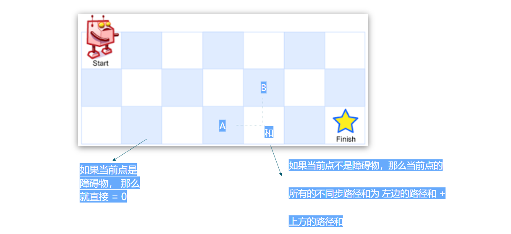
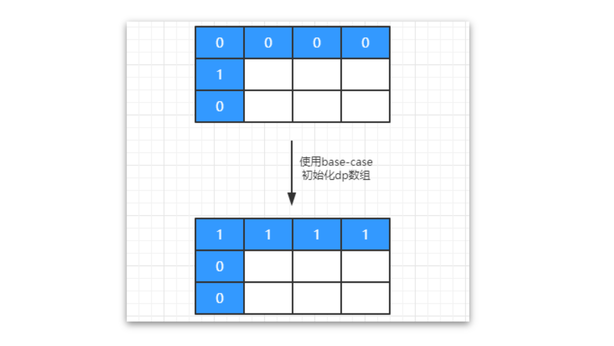

[题目地址](https://leetcode-cn.com/problems/unique-paths-ii/)


- :slightly_smiling_face: 第一次练习 2020年4月18日 这个有一个障碍物的问题，就导致按照第一个问题的做法的话不能倒退会有特殊值处理问题，这个时候就需要正向处理了。我丢。。。。
- :smile: 第二次练习 2020年7月6日 每日一题


### 动态规划

- 定义状态

  

- 状态转移方程

   

- 基础情况

  

```java
class Solution {
    /**
     * 不同路径
     * @param obstacleGrid
     * @return
     */
    public int uniquePathsWithObstacles(int[][] obstacleGrid) {
        /**
         * 定义状态 dp[i][j] -> 到达这个点共有多少种不同的路径
         * 状态转移
         *  - 如果当前点为 1， 那么就没有办法到达这个点那么 dp[i][j] = 0
         *  - 如果当前点为0， 因为机器人每次只能向右或向下移动，所以 dp[i][j] 等于其左侧和上侧的和 dp[i - 1][j] + dp[i][j - 1]
         *
         *  处理 Base
         *      第一行 和 第一列 不为1 的部分，都是只有一种情况
         */

        int X = obstacleGrid.length;
        int Y = obstacleGrid[0].length;

        int[][] dp = new int[X][Y];

        // 第一行
        for (int i = 0; i < X; i++) {
            if (obstacleGrid[i][0] == 0) {
                dp[i][0] = 1;
            } else {
                break;
            }
        }

        // 第一列
        for (int i = 0; i < Y; i++) {
            if (obstacleGrid[0][i] == 0) {
                dp[0][i] = 1;
            } else {
                break;
            }
        }

        for (int i = 1; i < X; i++) {
            for (int j = 1; j < Y; j++) {
                if (obstacleGrid[i][j] != 1) {
                    dp[i][j] = dp[i - 1][j] + dp[i][j - 1];
                }
            }
        }

        return dp[X - 1][Y - 1];
    }
}
```


### 此题可优化，下会分解。


### 易错点

- 易错项 1 
