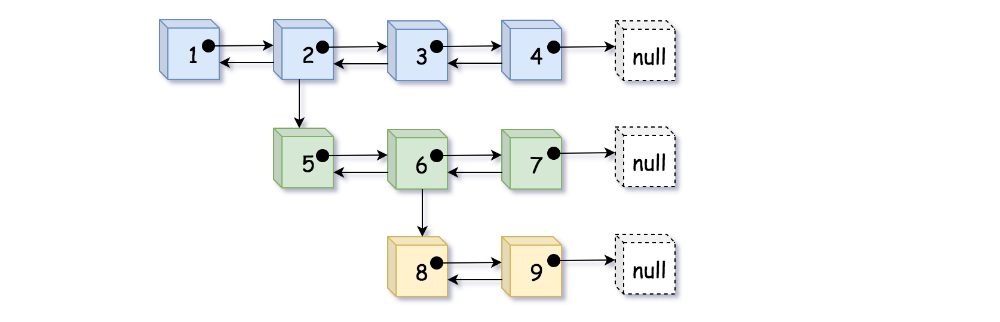

[题目地址](https://leetcode-cn.com/problems/flatten-a-multilevel-doubly-linked-list/)


- :slightly_smiling_face: 第一次练习 2020年5月14日 这个题目感觉还是比较有意思，解法 dfs 的想法也比较有意思
- :smile: 第二次练习 




### 递归 DFS

解题代码

```java
class Solution {
    public Node flatten(Node head) {
        if(head == null) {
            return head;
        }

        // 定义虚拟头结点
        Node dummyHead = new Node(0, null, head, null);
        flattenDfs(dummyHead, head);
        // 将虚拟头节点和原节点分开
        dummyHead.next.prev = null;
        return dummyHead.next;
    }

    public Node flattenDfs(Node prev, Node curr) {
        if (curr == null) {
            return prev;
        }

        curr.prev = prev;
        prev.next = curr;
        Node tempNext = curr.next;
        Node tail = flattenDfs(curr, curr.child);
        curr.child = null;

        return flattenDfs(tail, tempNext);
    }
}
```


### 易错点

- 易错项 1 
