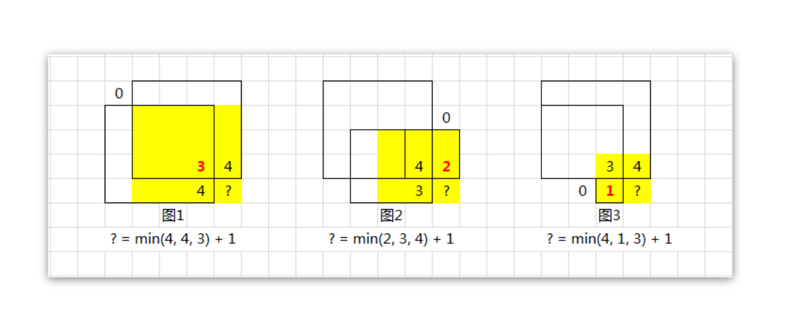
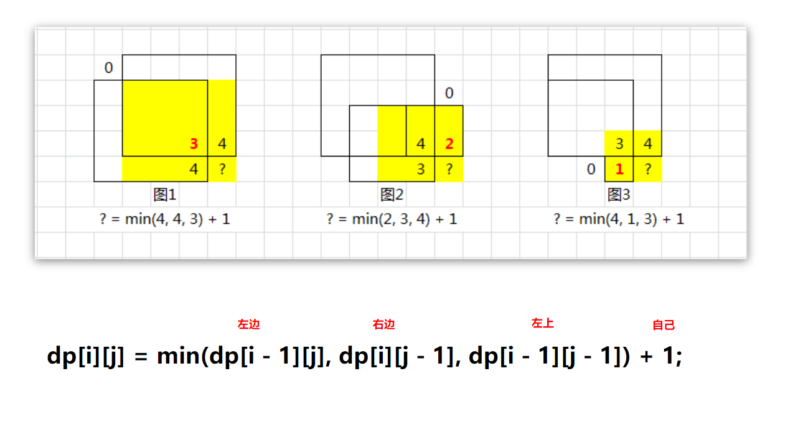

[题目地址](https://leetcode-cn.com/problems/maximal-square/)


- :slightly_smiling_face: 第一次练习 2020年5月9日 我丢。。。。 leetcode 有病，我昨天早上看的时候没有看到每日一题，后面就忘记做了。。。然后今天就做不了。我丢。。。。。。。。。
- :smile: 第二次练习 


### 动态规划

[优秀题解](https://leetcode-cn.com/problems/maximal-square/solution/li-jie-san-zhe-qu-zui-xiao-1-by-lzhlyle/)

- 子问题

  - 当前【点】的最大边等于以这个【点】为右下的正方形的【左上边】【左边】【右边】三个值得最小值

    

    需要理解到这张图的含义，一定要去三个位置的最小值才能得到当前【点】的最小值

- 状态

  - `dp[i][j]` 表示以 `i, j` 为下标的点的能表示的正方形的最大边 `maxSide`

- base case

  - 第一行和第一列 所有的为1 边为1，为0的为0

- 状态转移方程

  - `dp[i][j] = min(dp[i - 1][j], dp[i][j - 1], dp[i - 1][j - 1]) + 1`
  - 

解题代码

```java
public int maximalSquare(char[][] matrix) {
    if (matrix == null || matrix.length < 1 || matrix[0].length < 1) return 0;

    int m = matrix.length, n = matrix[0].length, maxSide = 0;

    // dp[i][j] 表示以此点为右下角的正方形的最大边
    int[][] dp = new int[m + 1][n + 1];
    for (int i = 0; i < m; i++) {
        for (int j = 0; j < n; j++) {
            if (matrix[i][j] == '1') {
                dp[i + 1][j + 1] = min(dp[i][j + 1], dp[i + 1][j], dp[i][j]) + 1;
                maxSide = Math.max(maxSide, dp[i + 1][j + 1]);
            }
        }
    }

    return maxSide * maxSide;
}

```


### 易错点

- 上方的题解其实还是有很多的技术处理在里面，在每次初始化的时候，多初始化了一行和一列

  ```java
  int[][] dp = new int[m + 1][n + 1];
  ```

  这样就可以直接跳过处理 `basecase` 了

  这样在处理每一个元素的时候就  `i + 1,  j + 1` 需要变化一下，这里还是算一个编程技巧

  ```java
  dp[i + 1][j + 1] = min(dp[i][j + 1], dp[i + 1][j], dp[i][j]) + 1;
  ```

  
