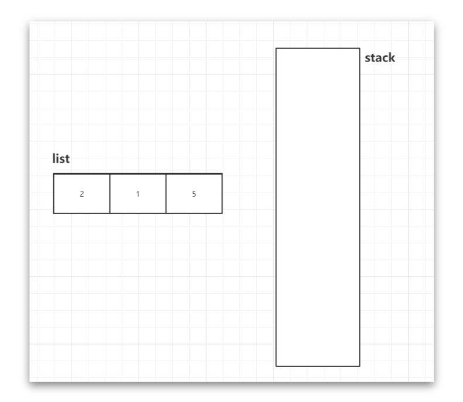

[题目地址](https://leetcode-cn.com/problems/next-greater-node-in-linked-list/)


- :slightly_smiling_face: 第一次练习 2020年5月20日  主要是利用栈的这种思路，理解了就非常好懂了
- :smile: 第二次练习 


### 单调栈



- 如上图所示

- 将链表中的元素添加到 集合中，元素 5 就是链表的最后一个元素，所以我们在遍历的时候就可以从元素的最后一个倒序遍历

- 最开始看栈中是否有元素存在，如果没有元素存在那么就代表当前节点后面没有更大的元素，就为0， 然后当前元素入栈

  

解题代码

```java
public int[] nextLargerNodes(ListNode head) {
    if (head == null)
        return null;

    List<Integer> list = new ArrayList<>();
    ListNode p = head;
    while(p != null) {
        list.add(p.val);
        p = p.next;
    }

    Stack<Integer> stack = new Stack<>();
    int[] answer = new int[list.size()];
    for(int i = list.size() - 1; i >= 0; i --) {
        while(!stack.empty() && list.get(i) >= stack.peek())
            stack.pop();
        answer[i] = stack.isEmpty() ? 0 : stack.peek().intValue();
        stack.push(list.get(i));
    }

    return answer;
}

```


### 易错点

- 易错项 1 
