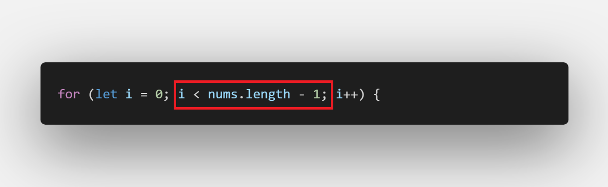
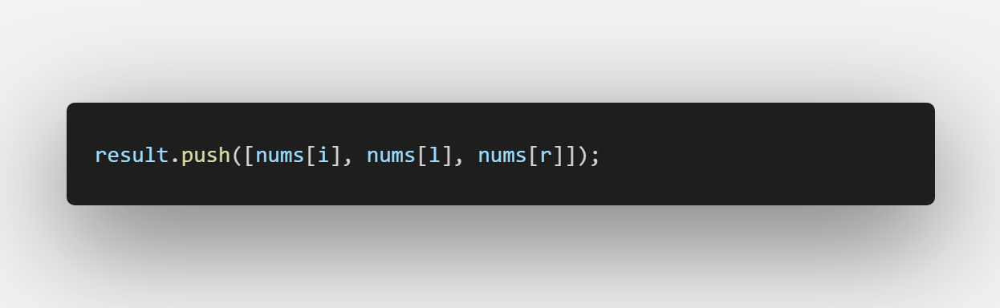

[题目地址](https://leetcode-cn.com/problems/3sum/submissions/)


- :cry: 第一次刷题 2020年3月9日 
- 😒 第二次刷题 2020年3月10日
- :joy: 第三次刷题 2020年3月11日 整体思路有了，不过写代码太粗心，代码错误太多了
- 🙄 第四次刷题 2020年 6 月 11 还是比较熟悉 只是比较。。


### 利用双指针

:::warning

正常人都想不到的解法，直接看题解 👻

:::


```java
    public static List<List<Integer>> threeSum(int[] nums) {
        List<List<Integer>> retList = new ArrayList<>();

        if(nums.length < 3) {
            return retList;
        }
        Arrays.sort(nums);

        for (int i = 0; i < nums.length; i++) {
            if (nums[i] > 0) {
                break;
            }

            if (i > 0 &&  nums[i] == nums[i - 1]) {
                continue;
            }
            int left = i + 1;
            int right = nums.length - 1;
            while(left < right) {
                int sum = nums[i] + nums[left] + nums[right];
                if (sum == 0) {
                    ArrayList<Integer> sublist = new ArrayList<>();
                    sublist.add(i);
                    sublist.add(left);
                    sublist.add(right);
                    retList.add(sublist);

                    while(left < right && nums[left] == nums[left + 1]) {
                        left ++;
                    }
                    while(left < right && nums[right] == nums[right - 1]) {
                        right --;
                    }

                    left ++;
                    right --;
                } else if (sum > 0) {
                    right --;
                }  else if (sum < 0) {
                    left ++;
                }
            }
        }
        return retList;
    }

```


### 错误集锦

- for 循环终止条件写成 `nums.length` 正确应是 `nums.length - 1` 粗心导致 :grimacing:

  

- 找到满足条件的结果，添加到结果数组时`没有写数组` 粗心导致 :grimacing:

  