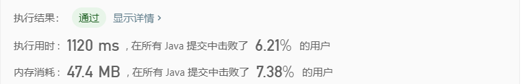

[题目地址](https://leetcode-cn.com/problems/sort-an-array/)


- :slightly_smiling_face: 第一次练习 

  这个题，应该是可以直接用冒泡排序，不过提示超时，说明就需要用更高效的排序。

- :smile: 第二次练习 


### 冒泡排序

解题代码

```java
class Solution {
    public int[] sortArray(int[] nums) {
        for(int i = 0 ; i < nums.length ; i ++) {
            for (int j = 0; j < nums.length; j ++) {
                if (nums[i] < nums[j]) {
                    int t = nums[i];
                    nums[i] = nums[j];
                    nums[j] = t;
                }
            }
        }

        return nums;
    }
}
```


### 选择排序



勉强可过, 但是排序的知识已经忘得差不多了，还要恶补一下才行。

```java
class Solution {
    public int[] sortArray(int[] nums) {
        for (int i = 0; i < nums.length; i ++) {
            int idx = 0;
            int min = Integer.MAX_VALUE;
            for (int j = i; j < nums.length ; j ++) {
                if (nums[j] < min) {
                    idx = j;
                    min = nums[j];
                }
            }
            nums[idx] = nums[i];
            nums[i] = min;
        }
        return nums;
    }
}
```


### 插入排序

执行用时 :716 ms, 在所有 Java 提交中击败了11.51%的用户

内存消耗 :47.5 MB, 在所有 Java 提交中击败了7.38%的用户

```java
class Solution {
    public int[] sortArray(int[] nums) {
        for (int i = 1; i < nums.length; i++) {
            int value = nums[i];

            int j = i - 1;
            for (; j >= 0; j--) {
                if (nums[j] > value) {
                    nums[j + 1] = nums[j];
                } else {
                    break;
                }
            }
            nums[j + 1] = value;
        }

        return nums;
    }
}
```


### 易错点

- 易错项 1 
