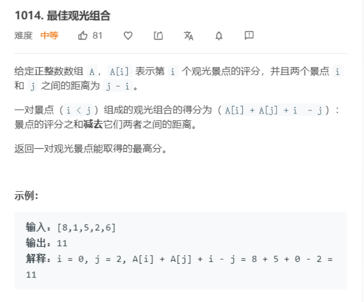

[题目地址](https://leetcode-cn.com/problems/best-sightseeing-pair/)



- :slightly_smiling_face: 第一次练习 2020-06-17 没什么思路，但是官方题解 感觉很精妙。牛逼
- :smile: 第二次练习


### 遍历

解题代码

```java
class Solution {
    public int maxScoreSightseeingPair(int[] A) {
        int ans = 0, mx = A[0] + 0;
        for (int i = 1; i < A.length; i++) {
            ans = Math.max(ans, mx + A[i] - i);
            // 边遍历边维护
            mx = Math.max(mx, A[i] + i);
        }
        return ans;
    }
}
```


### 易错点

- 易错项 1

