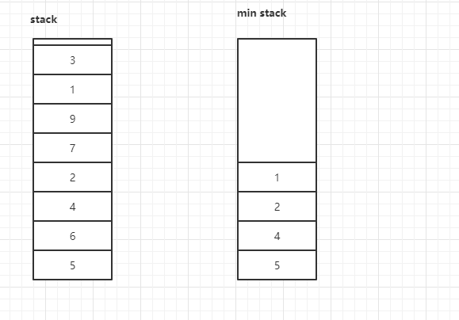
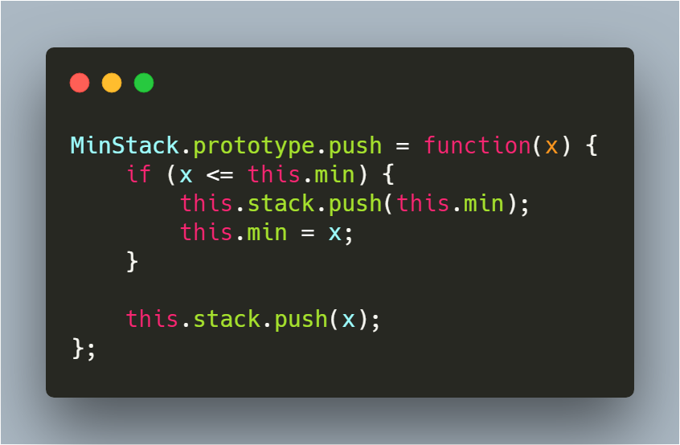

[题目地址](https://leetcode-cn.com/problems/linked-list-cycle/)


- :grin: 第一次练习  2020年3月17日 五毒神掌
- :shit: 第二次练习 2020年5月12日 过了一个月，思路还是记得，以前是用 JavaScript 做的 现在用 Java 实现，不过需要注意Java 有 equals 问题。 两次入栈法也用 Java 实现了一次


### 利用两个栈



查看上图，需要理解当 Stack 中入栈元素为 `5、6、4、2、7、9、1、3` 最小栈中对应元素为 `5、4、2、1`

```javascript
class MinStack {
    private Stack<Integer> stack;
    private Stack<Integer> minStack;
    /** initialize your data structure here. */
    public MinStack() {
        stack = new Stack<>();
        minStack = new Stack<>();
    }
    
    public void push(int x) {
        stack.push(x);
        if (minStack.isEmpty() || minStack.peek() >= x) {
            minStack.push(x);
        }
    }
    
    public void pop() {
        if (stack.isEmpty()) {
            return;
        }

        if (stack.pop().equals(minStack.peek())) {
            minStack.pop();
        }
    }
    
    public int top() {
        return stack.peek();
    }
    
    public int getMin() {
        return minStack.peek();
    }
}
```


### 两次入栈法

通过变量 min 存储当前最小的元素 `Number.MAX_VALUE` ，每次入栈的时候，如果发现当前元素比 `min` 小，就先将 min 入栈，而后在将元素入栈，这样在最小元素出栈的时候就出两次栈，这样就可以保证 `min` 变量存储的始终是最小的元素

```javascript
class MinStack {
    private Stack<Integer> stack;
    private Integer min;
    /** initialize your data structure here. */
    public MinStack() {
        stack = new Stack<>();
        min = Integer.MAX_VALUE;
    }
    
    public void push(int x) {
        if (x <= min) {
            this.stack.push(min);
            min = x;
        }
        this.stack.push(x);
    }
    
    public void pop() {
        if (stack.isEmpty()) {
            return;
        }

        if (stack.pop().equals(min)) {
            min = stack.pop();
        }
    }
    
    public int top() {
        return stack.peek();
    }
    
    public int getMin() {
        return this.min;
    }
}
```


### 易错点

- 需要注意，在判断元素大小的时候，需要考虑到等于的情况。
- 注意条件判断问题。
- 使用一个栈的方法时需要注意，需要先处理最小值问题，在入栈本来的元素，顺序不可颠倒
