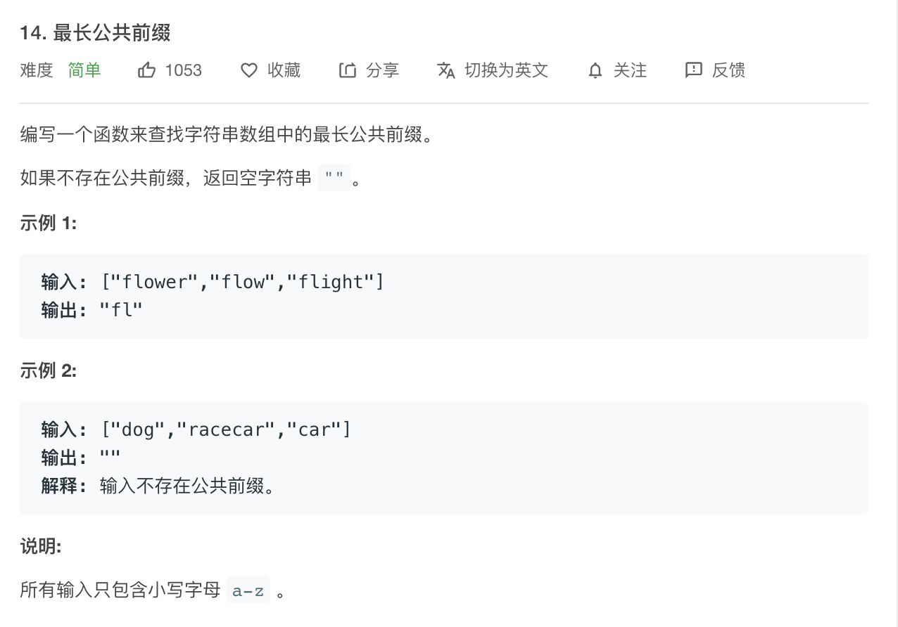

[题目地址](https://leetcode-cn.com/problems/longest-common-prefix/)



- :slightly_smiling_face: 第一次练习 2020-06-15 这个题目用比较笨的方法循环的
- :smile: 第二次练习


### 循环

解题代码

```java
   public static String longestCommonPrefix(String[] strs) {
        if (strs.length == 0) {
            return "";
        }
        int max = 0;
        int n = strs.length;
        int maxLen = findMinWord(strs);
        loop: for (int i = 0; i < maxLen; i++) {
            for (int j = 1; j < strs.length; j++) {
                if (strs[j].charAt(i) != strs[j - 1].charAt(i)){
                    break loop;
                }
            }
            max = i + 1;
        }
        System.out.println(max);
        return strs[0].substring(0, max);
    }

    private static int findMinWord(String[] strs) {
        int min = Integer.MAX_VALUE;
        for (String str : strs) {
            min = Math.min(str.length(), min);
        }
        return min;
    }
```


### 易错点

- 易错项 1

