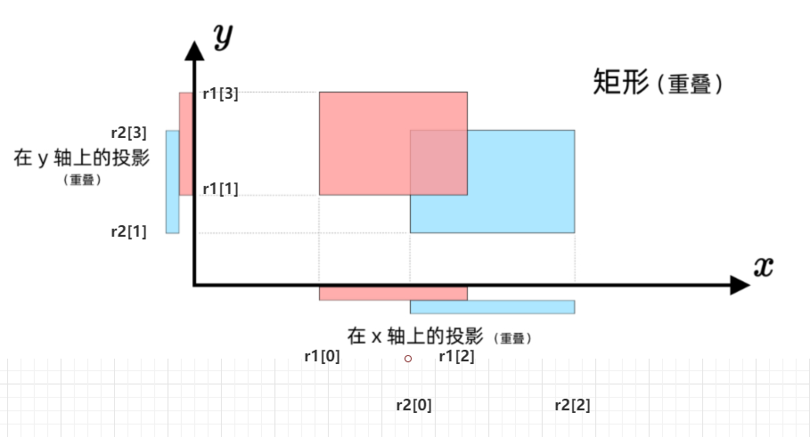

[题目地址](https://leetcode-cn.com/problems/rectangle-overlap/)


- :fire: 第一次练习 2020年3月18日 看题解，其实思路还是挺简单，不过需要配合图来看。这样思路清晰一些
- :shit: 第二次练习 


### 解题方法



看上图，最终将二维问题转换为1维问题

```javascript
/**
 * @param {number[]} rec1
 * @param {number[]} rec2
 * @return {boolean}
 */
var isRectangleOverlap = function(rec1, rec2) {
    return !(rec2[3] <= rec1[1] || rec2[1] >= rec1[3]) && !(rec1[0] >= rec2[2] || rec1[2] <= rec2[0]);
};
```


### 易错点

- 需注意是判断是否相交，而不是不相交
- X 轴 Y 轴，条件需要同时满足
