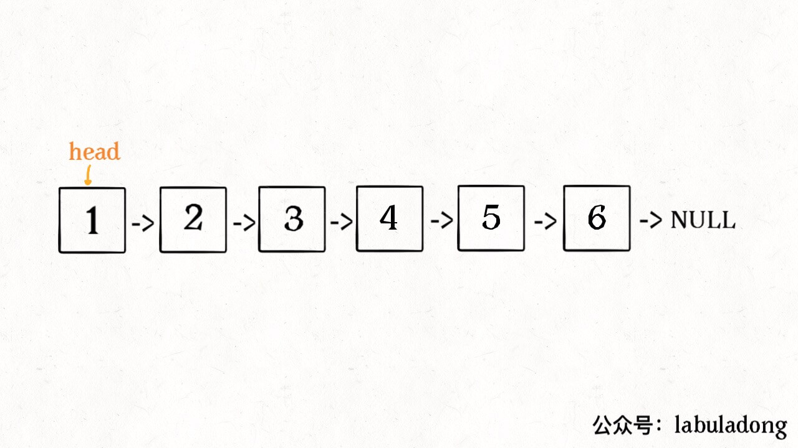
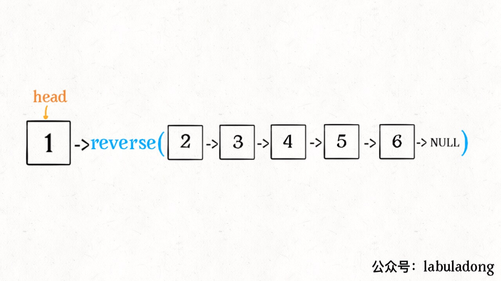
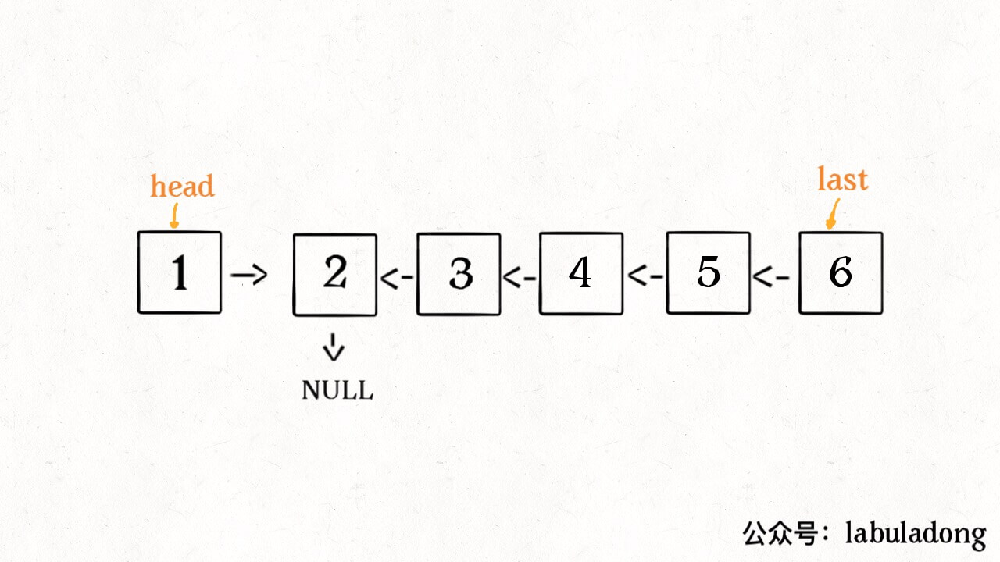
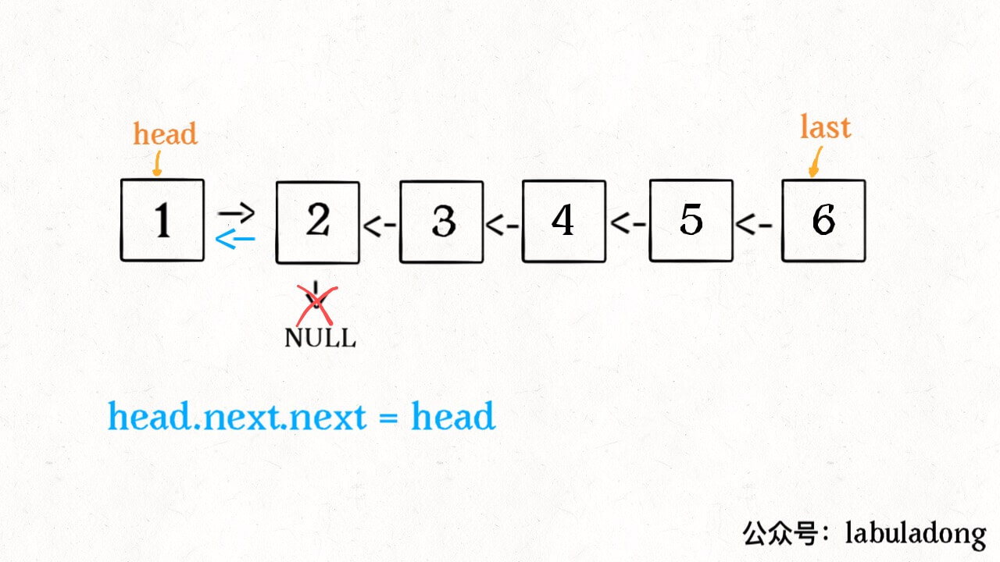
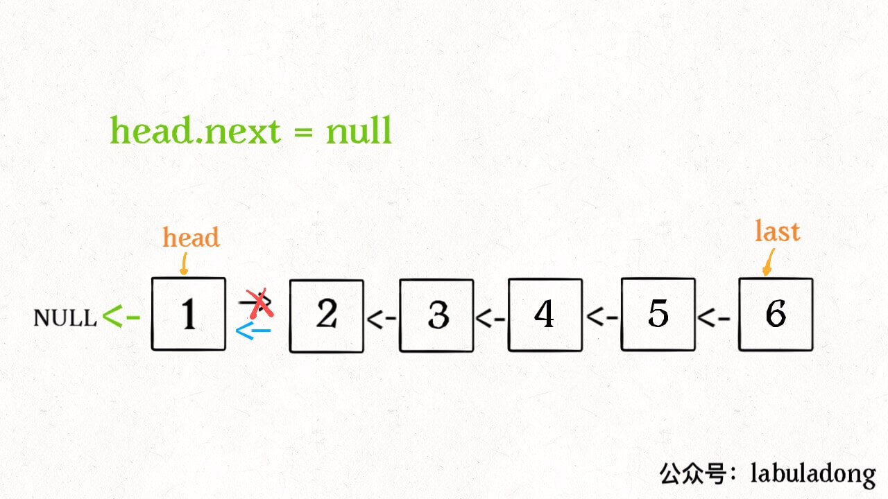

[题目地址](https://leetcode.com/problems/reverse-linked-list/)


- 🤬 第一次练习 2020年3月10日
- :smiley: 第二次练习 2020年3月14日 第一次练习还是很懵的，参考了人家的[题解](https://github.com/labuladong/fucking-algorithm/blob/master/%E9%AB%98%E9%A2%91%E9%9D%A2%E8%AF%95%E7%B3%BB%E5%88%97/k%E4%B8%AA%E4%B8%80%E7%BB%84%E5%8F%8D%E8%BD%AC%E9%93%BE%E8%A1%A8.md)，加上反复练习，终于还是比较清晰了
- :+1: 第三次练习 2020年3月17日 差点忘记，最后记起双指针，才写出来。
- :+1: 第四次练习 2020年5月18日 再次回顾递归


**对于递归算法，最重要的就是明确递归函数的定义**。具体来说，我们的 `reverse` 函数定义是这样的：

**输入一个节点 `head`，将「以 `head` 为起点」的链表反转，并返回反转之后的头结点**。

明白了函数的定义，在来看这个问题。比如说我们想反转这个链表：



那么输入 `reverse(head)` 后，会在这里进行递归：

```java
ListNode last = reverse(head.next);
```

不要跳进递归（你的脑袋能压几个栈呀？），而是要根据刚才的函数定义，来弄清楚这段代码会产生什么结果：



这个 `reverse(head.next)` 执行完成后，整个链表就成了这样：



并且根据函数定义，`reverse` 函数会返回反转之后的头结点，我们用变量 `last` 接收了。

现在再来看下面的代码：

```java
head.next.next = head;
```



接下来：

```java
head.next = null;
return last;
```



神不神奇，这样整个链表就反转过来了！递归代码就是这么简洁优雅，不过其中有两个地方需要注意：

1、递归函数要有 base case，也就是这句：

```java
if (head.next == null) return head;
```

意思是如果链表只有一个节点的时候反转也是它自己，直接返回即可。

2、当链表递归反转之后，新的头结点是 `last`，而之前的 `head` 变成了最后一个节点，别忘了链表的末尾要指向 null：

```java
head.next = null;
```


### 双指针解法

::: warning

我居然看到自己以前通过过，但是现在一点理解不到。💀

:::

```javascript
/**
 * Definition for singly-linked list.
 * function ListNode(val) {
 *     this.val = val;
 *     this.next = null;
 * }
 */
/**
 * @param {ListNode} head
 * @return {ListNode}
 */
var reverseList = function(head) {
    /**
     * 定义三个变量  prev, cur, next
     * prev 执行已经翻转的链表部分
     * cur, next 指向即将要翻转链表部分的头节点
     * loop next = cur.next; cur.next = prev; // 翻转链表之后
     * 更新指针, prev, cur 都向前移动
     * prev = cur;
     * cur = next;
     **/

     let prev = null, cur = head, next = head;
     while(cur != null) {
         next = cur.next;
         cur.next = prev;
         prev = cur;
         cur = next;
     }

     return prev;
};
```


### 递归写法

```javascript
public ListNode reverseList(ListNode head) {
    /**
         * 递归求解
         * 1. 处理 base base | if head.next == null return
         * 2. 翻转后的链表 指向现有的头节点
         * 3. 现有头节点 next 置空
         */

    if (head == null || head.next == null) {
        return head;
    }

    ListNode last = reverseList(head.next);
    head.next.next = head;
    head.next = null;

    return last;
}
```


### 利用 ES6 的另类写法，不过内存占用较高:ox:

```javascript
/*
 * @lc app=leetcode.cn id=206 lang=javascript
 *
 * [206] 反转链表
 */

// @lc code=start
/**
 * Definition for singly-linked list.
 * function ListNode(val) {
 *     this.val = val;
 *     this.next = null;
 * }
 */
/**
 * @param {ListNode} head
 * @return {ListNode}
 */
var reverseList = function(head) {
  let [prev, curr] = [null, head];

  while (curr) {
    [curr.next, prev, curr] = [prev, curr, curr.next];
  }

  return prev;
};
// @lc code=end

```

