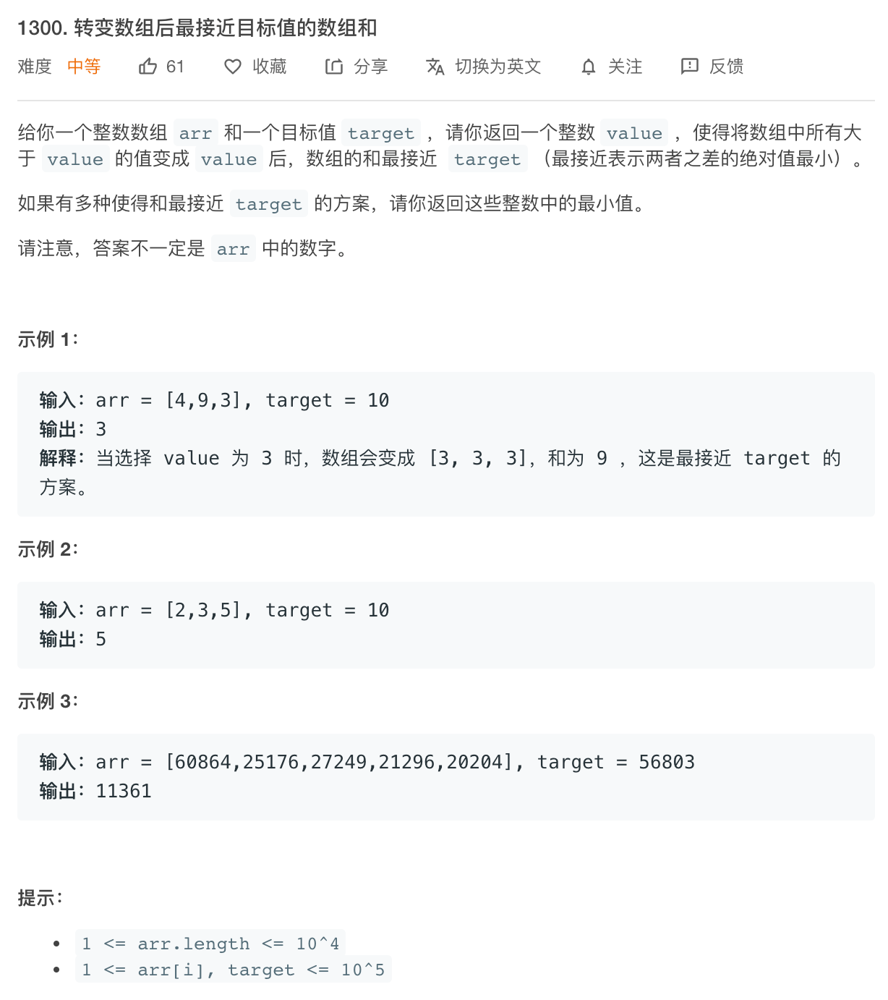

[题目地址](https://leetcode-cn.com/problems/sum-of-mutated-array-closest-to-target/)




- :slightly_smiling_face: 第一次练习 2020-06-14 ？？？？？？？？？
- :smile: 第二次练习


### 解题方法

解题代码

```java
class Solution {
	public int findBestValue(int[] arr, int target) {

    int sum = 0;
    int bigElement = arr[0];
    //初始化求和数,和最大元素值
    for (int i : arr) {
      sum += i;
      if (bigElement < i) {
        bigElement = i;
      }
    }
    //如果总和比目标值小,直接返回元素最大值
    if (sum <= target) {
      return bigElement;
    }

    int value = target / arr.length;
    //sum = value; 原来这里有,不知道有啥用,删除不影响
    while (true) { //从平分后的目标值起手
      //一次算两个相邻的值
      int next_sum = getSum(arr, value + 1);
      sum = getSum(arr, value);
      //判断何时结束循环,如果目标值target在sum和next_sum之中,就...
      if (next_sum > target && sum <= target) {
        if(next_sum - target < target - sum){ //还是不要用内部的math方法了
          value++;
        }
        break;
      }
      value++;
    }
    return value;
  }
  //求和方法,比value小的原封不动加,比value大的按照value加
  public int getSum(int[] arr, int value) {
    int sum = 0;
    for (int i = 0; i < arr.length; i++) {
      if (arr[i] > value) {
        sum += value;
      } else {
        sum += arr[i];
      }
    }
    return sum;
  }
}
```


### 易错点

- 易错项 1

