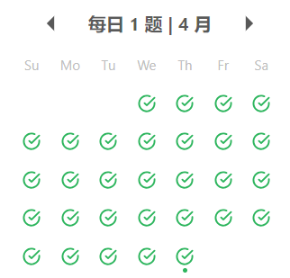
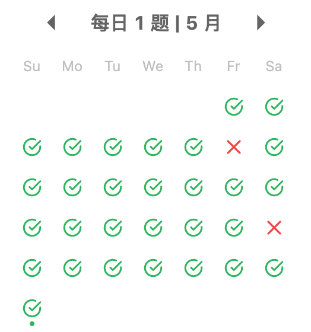
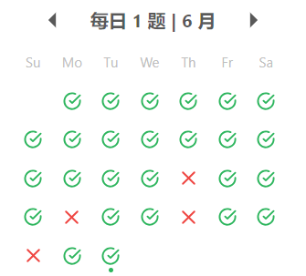

[[TOC]]


### LeetCode 打卡

- 四月

  
  
- 五月

  

- 六月

  


### 五毒神掌 :ox::beers:


- 1️⃣  5 分钟 读题 + 思考 
- 2️⃣ 直接看解法：注意！多解法，比较解法优劣
- 默写
  - 马上自己写 -> `leetcode` 提交
  - 多解法比较
- 3️⃣ 背诵和默写好解法
- 4️⃣ 过了一天之后再重复练习
- 5️⃣ 过了一周之后再重复练习


### 数据结构


- 一维数据结构

  - 基础：数组 array(string)，链表 linked list
  - 高级：栈 stack，队列 queue，双端队列 deque，集合 set，映射 map，
- 二维数据结构

  - 基础：树 tree，图 graph
  - 高级：二叉搜索树 binary search tree，红黑树 red-black tree，AVL，堆 heap，并查集 disjoin set，字典树 Trie
- 特殊的数据结构

  - 位运算 Bitwise，布隆过滤器 BloomFilter
  - LRU Cache
- 搜索
  - [A*](https://sbfkcel.github.io/fast-astar/)


#### 切题四件套

- 切题 Clarification
- 想所有可能的解法 Possible solutions
- Coding （多写）
- Test cases (测试样例)


### 算法开源项目汇总

- [leetcode](https://github.com/azl397985856/leetcode)
- [LeetCodeAnimation](https://github.com/MisterBooo/LeetCodeAnimation)
- [fucking-algorithm](https://github.com/labuladong/fucking-algorithm)
- [awesome-java-leetcode](https://github.com/Blankj/awesome-java-leetcode)


### 问题汇总

- 什么是背包问题？


### 编程技巧

- 判断一个数字是否为奇数

  ```java
  if ((num & 1) == 1) {
  	// is odd
  }
  ```

  
  
- 元素是否存在

  ```java
  if (!~arr.indexOf(i)) {
  	// 不存在
  }
  ```


- Java 实现 repeat 方法

  ```java
  new String(new char[cur_multi]).replace("\0", res)
  ```

  


