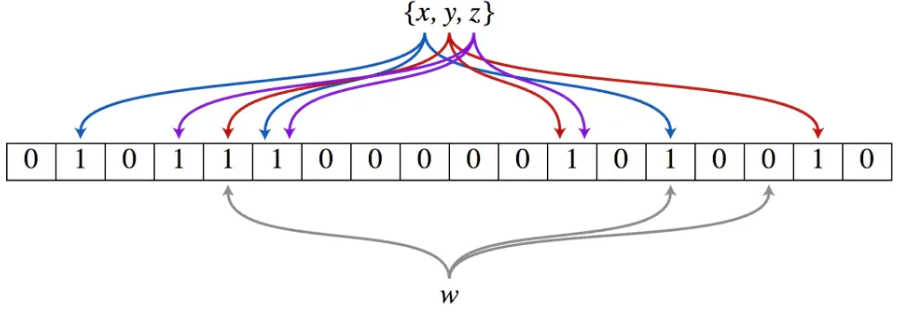

以上图为例，具体的操作流程：假设集合里面有3个元素{x, y, z}，哈希函数的个数为3。首先将位数组进行初始化，将里面每个位都设置位0。对于集合里面的每一个元素，将元素依次通过3个哈希函数进行映射，每次映射都会产生一个哈希值，这个值对应位数组上面的一个点，然后将位数组对应的位置标记为1。查询W元素是否存在集合中的时候，同样的方法将W通过哈希映射到位数组上的3个点。如果3个点的其中有一个点不为1，则可以判断该元素一定不存在集合中。反之，如果3个点都为1，则该元素可能存在集合中。注意：此处不能判断该元素是否一定存在集合中，可能存在一定的误判率。可以从图中可以看到：假设某个元素通过映射对应下标为4，5，6这3个点。虽然这3个点都为1，但是很明显这3个点是不同元素经过哈希得到的位置，因此这种情况说明元素虽然不在集合中，也可能对应的都是1，这是误判率存在的原因。

:::tip

核心就是解决，查看一个元素是否在【数据库】是否存在。

如果【布隆过滤器】判断元素不存在，那么元素就一定不存在，如果【布隆过滤器】判断元素存在的话，则元素可能存在。因为存在误判的可能

:::

### Java 实现布隆过滤器

。。。。。。