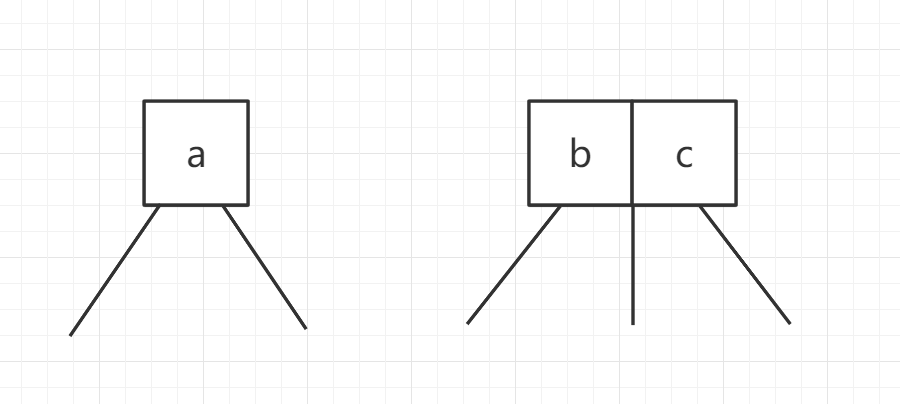
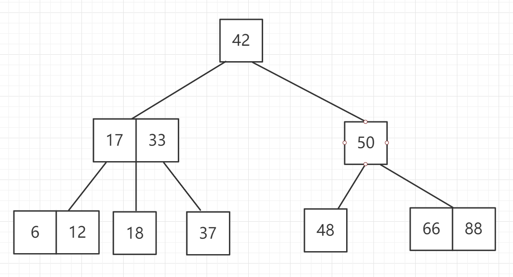

:::tip

每个节点有两个孩子或三个孩子    **二三树**

:::

满足二分搜索树的基本性质

节点可以存放一个元素或者两个元素

一个节点可以存放一个元素分别有两个孩子，还有一种可以存放两个元素，有三个孩子。

有两个孩子的称为二节点，有三个孩子的称为三节点

:::warning

注意上图中的23树，满足二分搜索树的基本性质

:::

**2-3树是一种绝对平衡的树**

什么是绝对平衡树呢，对于任意节点，它的左右子树的高度一定是相等的。

**那么 2-3 是怎样维护这种绝对平衡的呢？**

