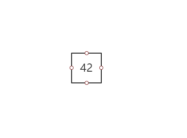
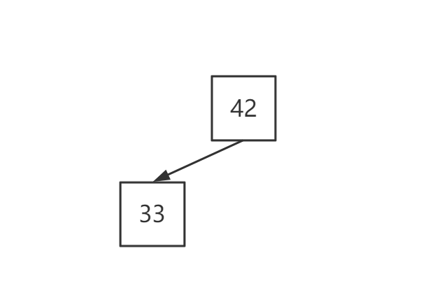
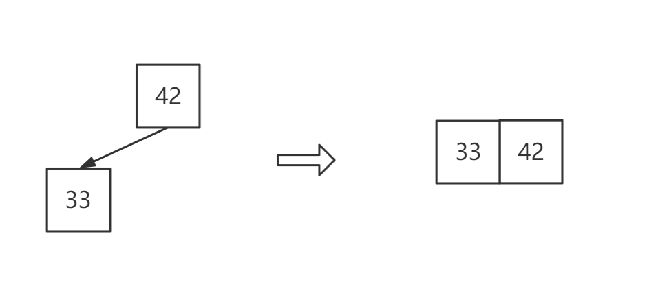
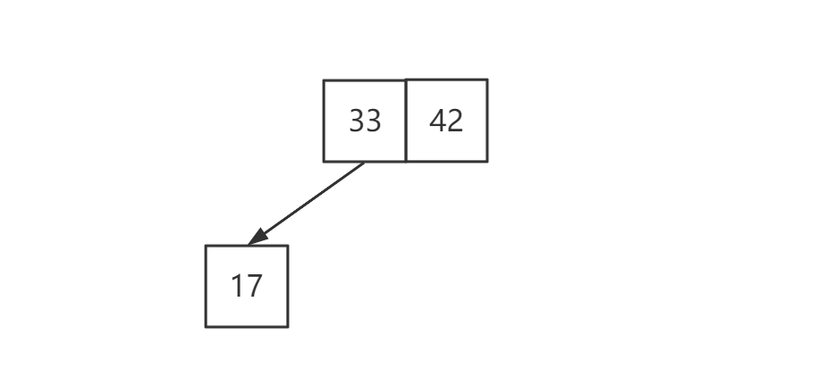
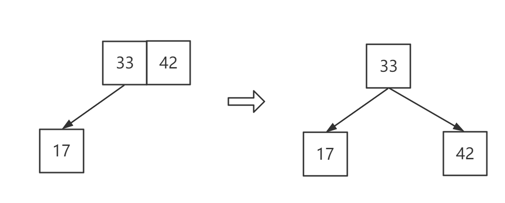
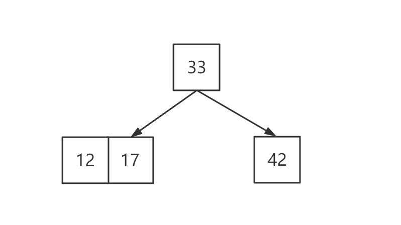

:::tip

每个节点有两个孩子或三个孩子    **二三树**

:::

满足**二分搜索树**的基本性质

节点可以存放一个元素或者两个元素

一个节点可以存放一个元素分别有两个孩子，还有一种可以存放两个元素，有三个孩子。

有两个孩子的称为二节点，有三个孩子的称为三节点

:::warning

注意上图中的23树，满足二分搜索树的基本性质

:::

**2-3树是一种绝对平衡的树**

什么是绝对平衡树呢，对于任意节点，它的左右子树的高度一定是相等的。

**那么 2-3 是怎样维护这种绝对平衡的呢？**

模拟一下 二三树的添加节点

- **添加第一个节点**

  

  添加第一个元素很简单，就是直接添加即可

  

- **添加第二个元素**

  因为 二三树 满足二叉搜索树的性质，所以按常理来说应该是下面这个样子的

  

  但是如果是这样的话，就不满足是一颗绝对平衡树了，所以在这个时候这两个节点就需要发生合并

  

  当合并之后，这样就同事满足，【二分搜索树】和【绝对平衡】的二叉树了，在这样的情况下，如果再添加第三个元素会发生怎样呢
  
  
  
- **添加第三个元素**

  正常情况应该是这样的

  

  但是如果这样的话就和之前遇到的问题一样了，就是不满足【满二叉树】的性质了，所以此时也需要发生改变

  

  经过上方的转变之后呢就又维系了【二分搜索树】和【满二叉树】的性质了
  
  接下来的过程就是类似的了。
  
  
  
- 添加第四个元素

  

- 

