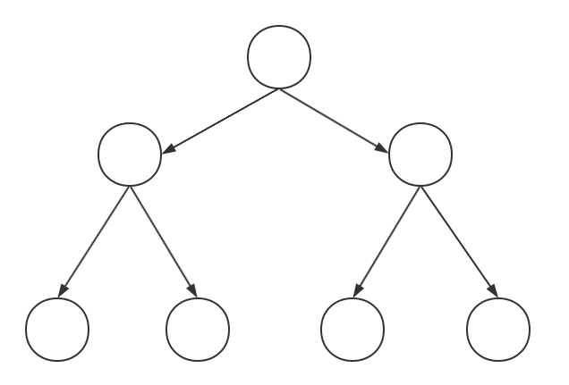
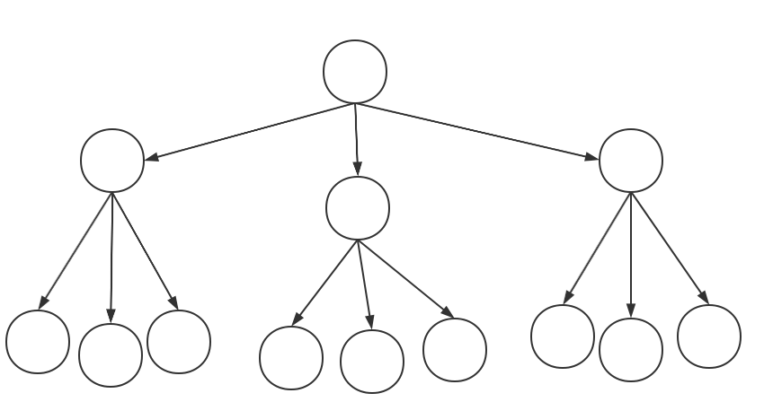
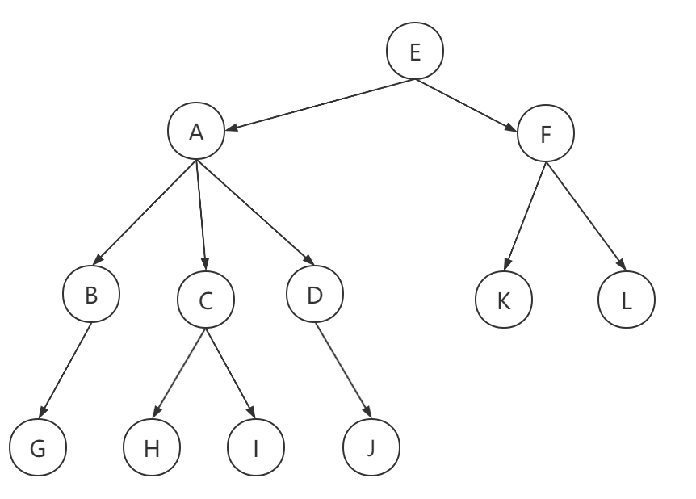
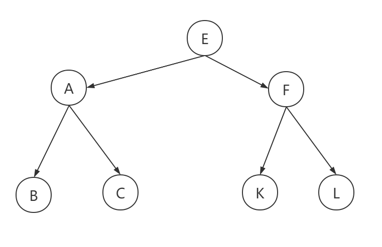
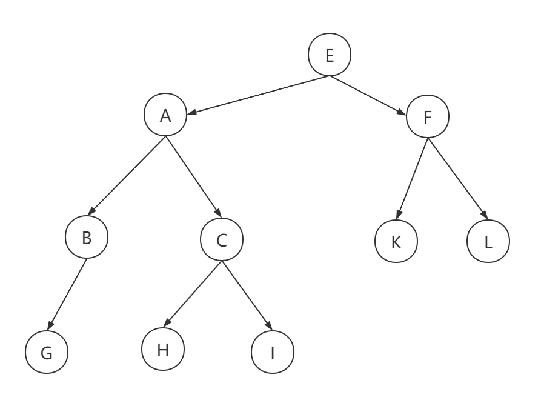
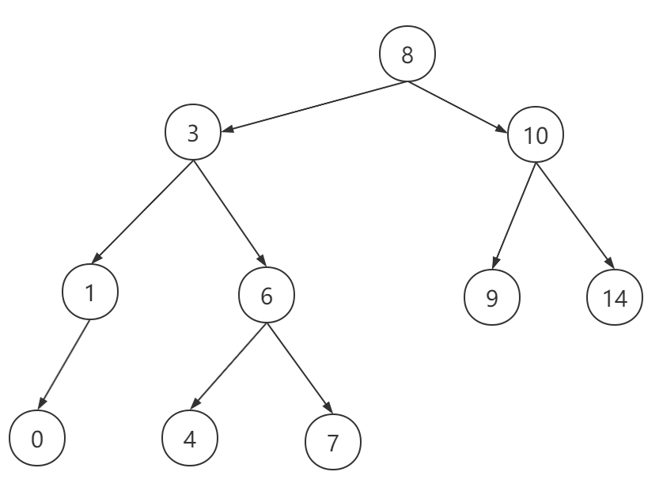
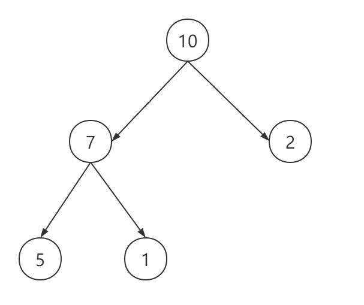

- :fire: 什么是二叉树:grey_question:

  我也不知道怎么描述二叉树，有一个根节点 :red_circle: 向下扩展两个子节点 :red_circle: 两个子节点又可以向下扩展。类似于这样的结构成为二叉树

  

  上面这种就够就是二叉树，当然有二叉树就有三叉树、四叉树。

  

- 树中相应节点的概念

  

  - A 节点是 B 节点的【**父节点**】
  - B 节点是 A 节点的【**子节点**】
  - B、C、D 这三个节点的父亲节点是同一个节点，所以他们之间互称为【**兄弟节点**】
  - E 节点没有父亲节点，所以我们把它称为【**根节点**】
  - G、H、I、J、K、L 没有子节点，所以我们把它称为【**叶子节点**】
  - 节点的高度：节点到叶子节点的最长路径
  - 节点的深度：根节点到这个节点所经历的节点个数
  - 节点的层数：节点的深度 + 1

  

- **二叉树的种类**

  在二叉树之上，具备各种各样的其他属性，就会衍生出其他的树结构。

  - **满二叉树**

    

    叶子节点全都在最底层，除叶子节点外，每个节点都有两个子节点，这种二叉树叫做【**满二叉树**】。

    

  - **完全二叉树**

    

    叶子节点都在最底下两层，最后一次的叶子节点都靠左排列，并且除了最后一层，其他层的节点个数都要达到最大，这种二叉树叫做【**完全二叉树**】

    

  - **二分搜索树**

    

    若任意节点的左子树不为空，则左子树上所有节点的值均小于它的根节点的值；

    若任意节点的右子树不为空，则右子树上所有节点的值均大于或等于它的根节点的值；

    任何左子树或右子树也都为二分搜索树。

    

  - 堆

    

    堆就是用数组实现的二叉树，所以它没有使用父指针或子指针。堆根据堆属性来排序。

    

    **堆的常用方法**

    构建优先队列、支持堆排序、支持找出一个集合中最小值（或者最大值）

    堆分为两种：最大堆和最小堆，两者的差别在于节点的排序方式。

    在最大堆中，父节点的值每一个子节点的值都要大。在最小堆中，父节点的值比每一个子节点的值都要小。这就是所谓的“堆属性”，并且这个属性对堆中的每一个节点都成立。

    

  - AVL

  - 红黑树
  
  - 线段树
  
  - 字典树
  
  - 并查集

