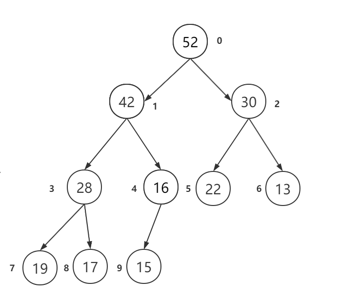
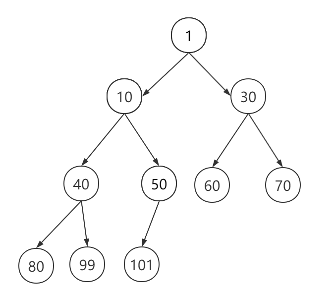

:::tip

Heap：可以迅速找到一数中的最大或者最小值的数据结构。

:::

将根节点最大的堆叫做 【大顶堆】或【大根堆】，根节点最小的堆叫做【小顶堆】或【小根堆】常见的堆有 [二叉堆](./数据结构 - 二叉堆.md)

大顶堆，最大的元素再根节点

小顶堆，最小的元素再根节点

Heap 可以解决什么样的问题？

- 实现优先队列 PriorityQueue
- 堆排序
- Top K 问题

堆的实现： [二叉堆](./数据结构 - 二叉堆.md)

