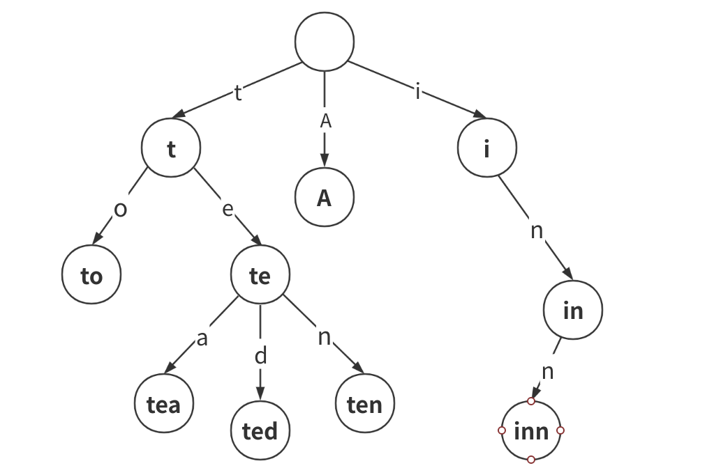
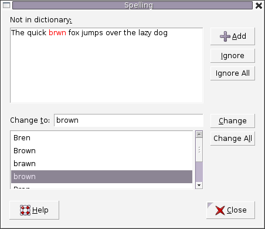

字典树，即 Trie 树，又称单词查找树或键树，是一种树形结构。典型应用是用于统计和排序大量的字符串（单不限于字符串），所以经常被搜索引擎系统用于文本词频统计。

有点：最大限度的减少无畏的字符串比较，查询效率比哈希表高。



### Trie 应用场景

- **自动补全**

  

- **拼写检查**

  

- **IP 路由（最长前缀匹配）**

  

- **T9（九宫格）打字预测**

  s

- **单词游戏**

  

### Trie 实现

节点类

```java
public class TrieNode {
    private TrieNode[] links;

    private final int R = 26;

    private boolean isEnd;

    public TrieNode() {
        links = new TrieNode[R];
    }

    /**
     * 判断是否已经包含了某个字符
     * @param ch 传入的字符
     * @return 存在 -> true, 不存在 -> false
     */
    public boolean containsKey(char ch) {
        return links[ch - 'a'] != null;
    }

    public TrieNode get(char ch) {
        return links[ch - 'a'];
    }

    public void put(char ch, TrieNode node) {
        links[ch - 'a'] = node;
    }

    public void setEnd() {
        isEnd = true;
    }

    public boolean isEnd() {
        return isEnd;
    }
}

```

Trie 类实现

```java
/**
 * 自己实现字典树
 */
public class Trie {

    private TrieNode root;

    public Trie() {
        root = new TrieNode();
    }

    /**
     * 添加单词到字典数中
     * @param word 单词
     */
    public void insert(String word) {
        TrieNode node = this.root;
        for (int i = 0; i < word.length(); i++) {
            char c = word.charAt(i);
            if (!node.containsKey(c)) {
                node.put(c, new TrieNode());
            }
            node = node.get(c);
        }
        node.setEnd();
    }

    /**
     * 找到以 word 为前缀的数
     * @param word 单词
     * @return 字典树
     */
    private TrieNode searchPrefix(String word) {
        TrieNode node = root;
        for (int i = 0; i < word.length(); i++) {
            char c = word.charAt(i);
            if (node.containsKey(c)) {
                node = node.get(c);
            } else {
                return null;
            }
        }
        return node;
    }

    /**
     * 搜索是否有这课单词的字典树
     * @param word 单词
     * @return 是否存在
     */
    public boolean search(String word) {
        TrieNode node = searchPrefix(word);
        return node != null && node.isEnd();
    }

    /**
     * 是否以某一个前缀开始
     * @param prefix 前缀
     * @return 是否存在
     */
    public boolean startWith(String prefix) {
        return searchPrefix(prefix) != null;
    }
}

```
