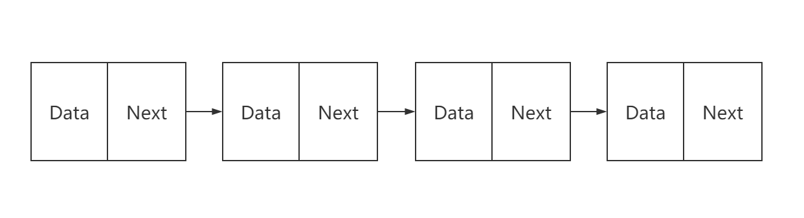

相比于数组，链表是一种稍微复杂一点的数据结构。

单链表其实就是一个 data 加上一个 next 指针。由于一个节点只通过 next 指针 保存了它的下一个节点，失去了它的前驱节点信息，因此几乎所有的单链表题目都在**前驱节点**做文章。

同时，单链表数据结构通常长度未知，很多题目也会在长度上做文章。基本上思考链表的题目就这么两个思路。


### 链表的常见问题:question:

- 翻转链表
- 删除倒数第N个节点
- 合并排序链表
- 链表中环的检测
- 求链表的中间节点


### 链表的常用套路 :100:

- :fire: 虚拟头结点

  ```java
  ListNode dummyHead = new ListNode(-1);
  dummyHead.next = head;
  
  ListNode cur = dummyHead;
  return dummyHead.next;
  ```

  在最开始定义一个【虚拟头结点】，让他的 `next` 指针指向 头结点，而后新建 `cur` 节点指向 `dummyHead` ，整个操作过程中链表的变换都是使用 `cur` 指针，等到操作结束后，就可以返回 `dummyHead.next` 因为虚拟头结点一直指向的是头部的位置

   **通常用来处理【头节点】为空的边界情况。**

  

- :fire: 快慢指针

  ```java
  ListNode slow = head;
  ListNode fast = head.next;
  while(slow != fast) {
  	if (fast == null && fast.next == null ) {
  		// 一种情况
  	}
  	slow = slow.next;
  	fast = fast.next.next;
  }
  // 循环完毕，又是另外一种情况
  ```

  定义快指针【fast】和满指针【slow】，fast 一次走两步，slow 一次走一步。

  **常用来处理问题 【链表是否有环】、【寻找链表的中间节点】。**

  

  ```java
  ListNode slow, fast -> head, N -> x;
  loop N
  	fast -> fast.next
  while fast != null
  	slow -> slow.next
  	fast = fast.next.next
  ```

  定义两个节点，快指针先走N步后，快满指针同时走，当快指针到达尾结点满指针刚好到达倒数第N个节点。

  **常用来处理问题 【寻找第N个节点】【删除第N个节点】。**

  

- :fire: 前后指针

  ```java
  prev -> null, cur = head, next = head;
  while cur != null
      next = cur.next;
  	cur.next = prev;
  	prev = cur;
  	cur = next;
  ```

  定义三个节点 `prev、cur、next`处理节点的指针变动为题。

  **常用来处理 【翻转链表问题】【分隔链表】【奇偶链表】【重排链表】。**

  

### 数据与链表的区别?🕵️‍♀️ 🕵️‍♂️


数据需要一块连续的内存空间来存储，对内存的要求比较高。如果我们申请一个 100MB 大小的数组，当内存中没有连续的，足够大的存储空间时，几遍内存的剩余总可用空间大于 100MB，仍然会申请失败。

而链表恰恰相反，它并不需要一块连续的内存空间，它通过“指针”将一组零散的内存块串联起来使用，所以我们申请 100MB 大小的链表，根本没有问题


链表通过指针将一组零散的内存块串联在一起。

其中，我们把内存块称为链表的“结点”。为了将所有的结点串起来，每个链表的结点除了存储数据之外，还需要记录链上的下一个结点的地址。如图所示，我们把这个记录下个结点地址的指针叫作后继指针 next。


相比于数组，链表是一种稍微复杂一点的数据结构。


### 数据与链表的区别?


数据需要一块连续的内存空间来存储，对内存的要求比较高。如果我们申请一个 100MB 大小的数组，当内存中没有连续的，足够大的存储空间时，几遍内存的剩余总可用空间大于 100MB，仍然会申请失败。

而链表恰恰相反，它并不需要一块连续的内存空间，它通过“指针”将一组零散的内存块串联起来使用，所以我们申请 100MB 大小的链表，根本没有问题


链表通过指针将一组零散的内存块串联在一起。

其中，我们把内存块称为链表的“结点”。为了将所有的结点串起来，每个链表的结点除了存储数据之外，还需要记录链上的下一个结点的地址。如图所示，我们把这个记录下个结点地址的指针叫作后继指针 next。


