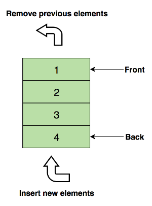

队列，是先进先出（FIFO, First-In-First-Out）的线性表。在具体应用中通常用链表或者数组来实现。队列只允许在后端（称为rear）进行插入操作，在前端（称为front）进行删除操作。

结构就是像上面这样的结构，元素从队尾进入，从队首出去。

**定义简单，但是基于队列的扩展以及相关的应用倒是很多。**

**双端队列** `Deque`

Queue 是队列，只能一头进，另一头出，如果把条件放宽松一点，允许两头进，两头出，这种队列叫双端队列`Deque`。

在实际环境使用中，也是推荐使用双端队列而不是直接使用队列，毕竟还是太局限了。

**优先队列** `Priority Queue`

在原本的队列的入队出队的基础之上添加了【权重】的概念，队列里面的元素都有了优先级，入队操作不变。但是出队操作却是按照元素的优先级大小出队，优先级高的队列先出队。

生活中的例子
- 比如医院救治病人时，重症患者优先

- 游戏里面的优先自动攻击最近的目标

  

向上面的例子，元素是动态增长的，并不是一个固定的大小，元素具有优先级

- 循环队列
- 阻塞队列
- 并发队列