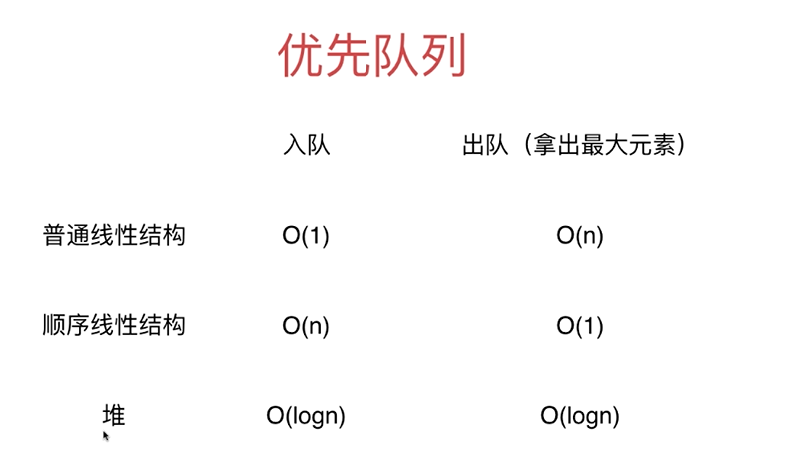

- :fire: 什么是队列:grey_question:

  先来先出，添加删除结尾O(1)

- :fire: 什么样的问题适合用队列来解决

  

- :fire: 队列的应用场景
  
  - 多线程下队列阻塞

- :fire: 队列的实现
  - 双端队列 Deque

  - 优先队列 Priorty Queue

    

    数据是动态的，队列中的元素是动态变化的。

    

  - 循环队列

  - 阻塞队列

  - 并发队列