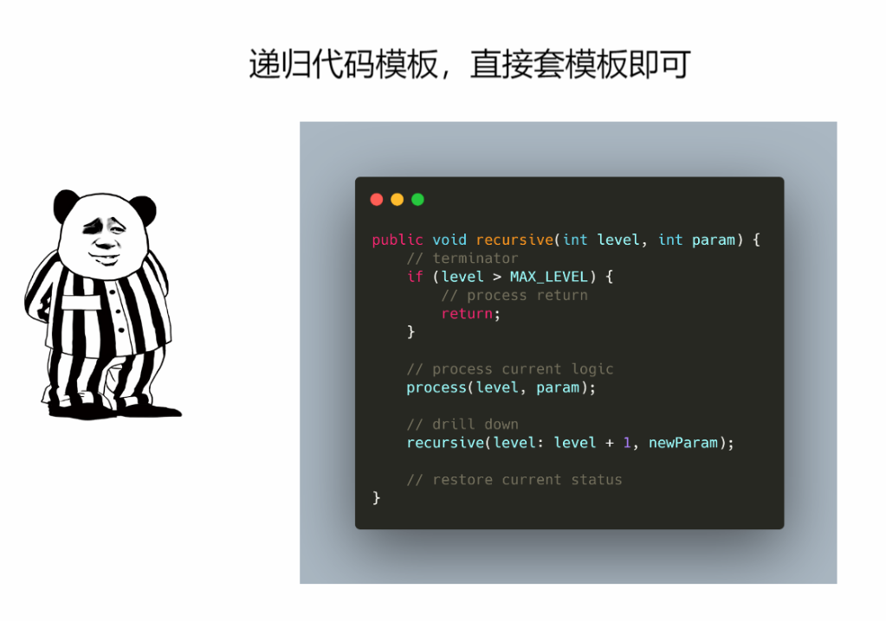

### 递归代码模板

```java
public void recursive(int level, int param) {
	// terminator 
    if (level > MAX_LEVEL) {
        // process return 
        return;
    }
    
    // process current logic
    process(level, param);
    
    // drill down
    recursive(level: level + 1, newParam);
    
    // restore current status
}
```


- 找最近的重复子问题
- 有终止条件
- 将大问题转换为小问题，往往一个大问题的结果的可以由若干个小问题的记过求得