## 简介

Charles 是在 PC 端常用的网络封包截取工具，在做移动开发时，我们为了调试与服务器端的网络通讯协议，常常需要截取网络封包来分析。除了在做移动开发中调试端口外，Charles 也可以用于分析第三方应用的通讯协议。配合 Charles 的 SSL 功能，Charles 还可以分析 Https 协议。

Charles 通过将自己设置成系统的网络访问代理服务器，使得所有的网络访问请求都通过它来完成，从而实现了网络封包的截取和分析。

**Charles 主要的功能包括：**

- 截取 Http 和 Https 网络封包。
- 支持重发网络请求，方便后端调试。
- 支持修改网络请求参数。
- 支持网络请求的截获并动态修改。
- 支持模拟慢速网络。

同类型的工具还有 大名鼎鼎的 [Fidder](https://www.baidu.com/link?url=KHPLyXqL5dGzd4oFEiw0wYCgETfkbYxnJPxNWC-UztUTNoGK8HFXxHIzf2Dk7iDs&wd=&eqid=c14c1c59004fdce8000000035f5382da)

## 使用背景

在与公司 App 端📱同事 **调试接口** 时，有的时候可能会出现一些非常 **莫名其妙** 的问题。有的时候可能难以定位这个问题到底是属于**前端展示 Bug** :bug: 还是说接口 **数据异常**。

通常这个时候，可能后端就需要去服务端看**日志** 然后结合日志数据进行排查。但是限于工具 网络等等复杂的情况，这样的方式其实真的蛮低效的。

这个时候就需要这样的一个工具，可以实时的看运行 App 的接口返回情况。结合前端 视图 展示，能在很短的时间内找到问题出现的原因。这样就可以快速的修复问题了。

## 下载、破解

官网下载地址。 [地址](https://www.charlesproxy.com/download/)

Charles 是收费软件，可以免费试用 30 天。试用期过后，未付费的用户仍然可以继续使用，但是每次使用时间不能超过 30 分钟，并且启动时将会有 10 秒种的延时。因此，该付费方案对广大用户还是相当友好的，即使你长期不付费，也能使用完整的软件功能。

但是，我选择破解 😂，我用 Charles 是来提升排查问题的时间的。结果你给我搞这些东西 我就受不了了。。。。主要还是破解比较容易 💩。哈哈哈哈

[破解网站](https://www.zzzmode.com/mytools/charles/)

选择当前 自己的版本 下载一个 Jar 包就可以了。

### Charles 配置

当 Charles 安装好之后，这个时候就可以抓取 Http 的包了，但是我们为 App 提供的接口 一般都是 Https 的。所以我们需要安装证书。

**安装证书**

`Help -> SSL Proxying ->Install Charles Root Certificate`

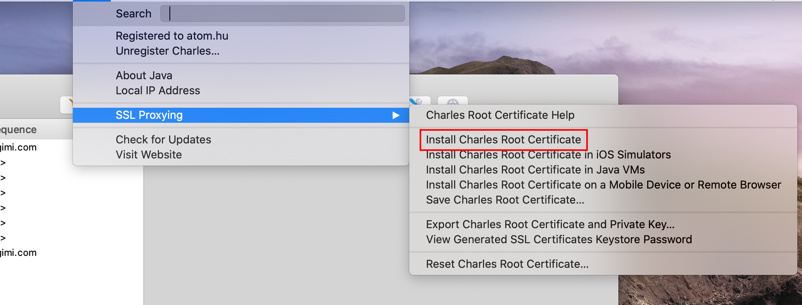

证书安装好之后，还需要信任一下。就可以了

**Https 抓取配置**

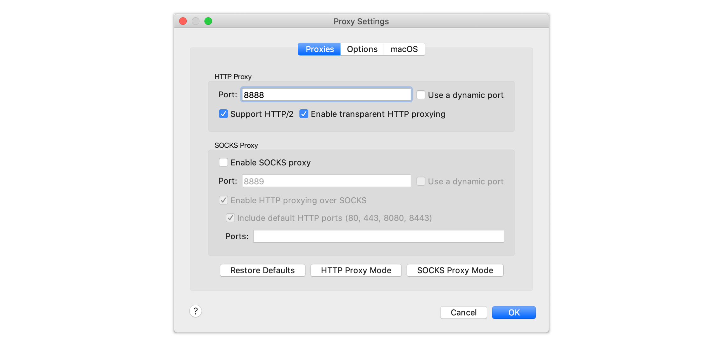

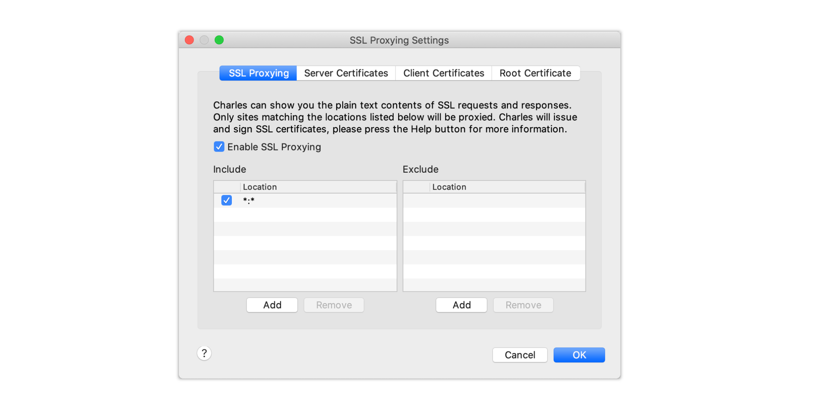

## iPhone 抓包配置

这里为什么是 iPhone 抓包配置，主要是因为 Android 抓包配置太麻烦了。然后 iPhone 就只需要简单的安装证书就可以了。

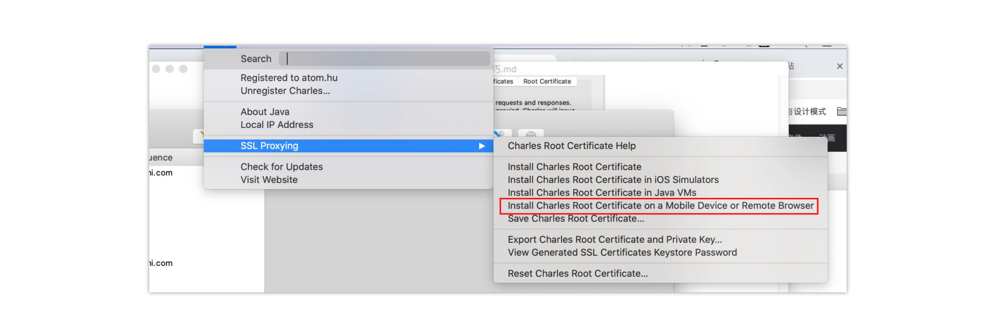

如上图，点击 **Install Charles Root Certificate on a Mobile Device Or Remote Browser**

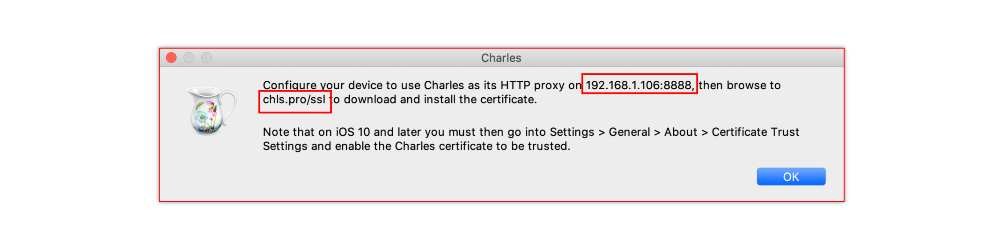

点击之后的提示框中 192.168.1.106:8888 为手机将要设置网络代理的地址。chls.pro/ssl 为手机下载证书地址。

确认手机和 电脑 在同一个网络下，访问 chls.pro/ssl 下载并安装证书。而后信任证书。

**安装证书**

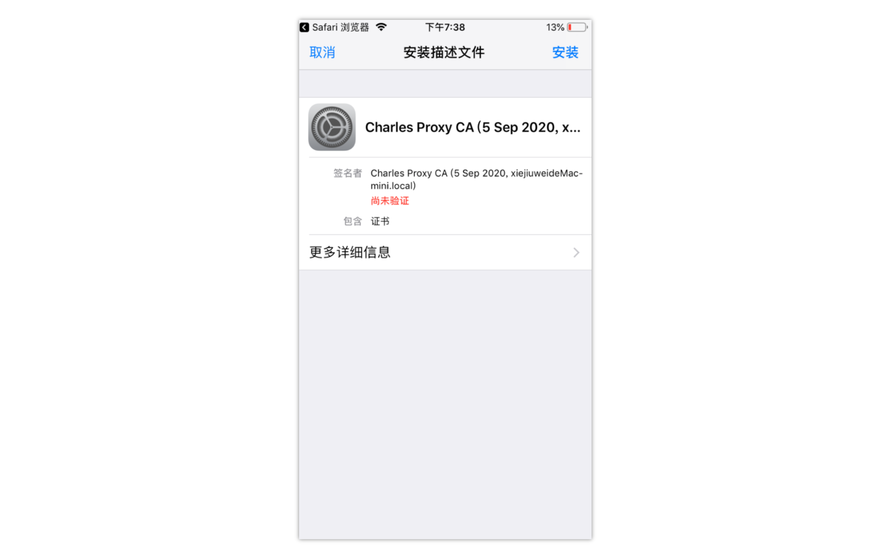

**信任证书**

设置 - 通用 - 关于本机 - 证书信任设置 - 勾选安装的证书

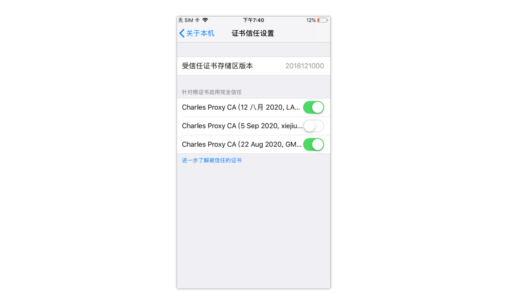

**手机配置代理**

在将 WIFI 的代理配置成 192.168.1.106. 这样就可以顺利抓取到 手机的 Https 的包了。

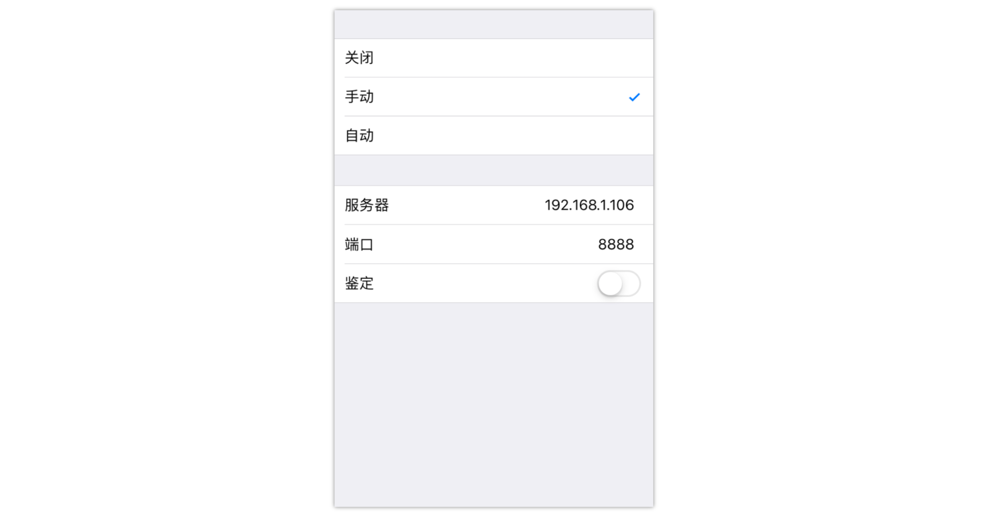

完成 上诉设置后，iPhone 就可以抓包了。

## Chrome 抓包配置

Chrome 抓包配置和 手机差不多，也是需要安装插件，然后配置代理。

配置代理，在 设置 - 高级 - 代理配置中。配置为 Charles 代理。

## 功能介绍

**Repeat**

将已执行过的请求重复执行。

应用场景，**服务器压力测试**。

**Compose**

临时修改一些请求的参数，点击 Execute 就可以已修改后的请求发送。

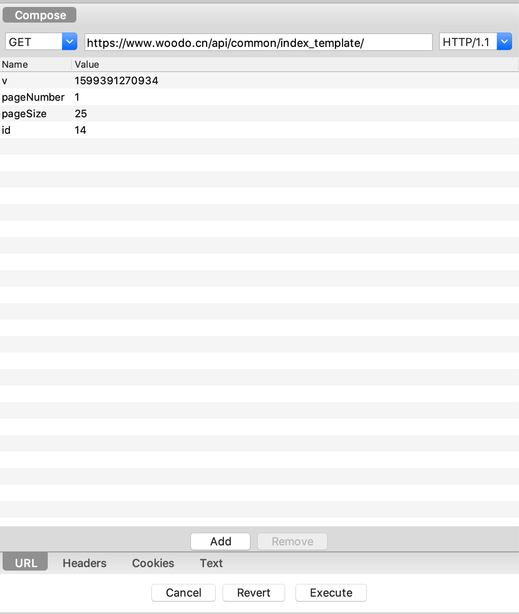

**Rewrite**

Rewrite 功能功能适合对某一类网络请求进行一些正则替换，以达到修改结果的目的

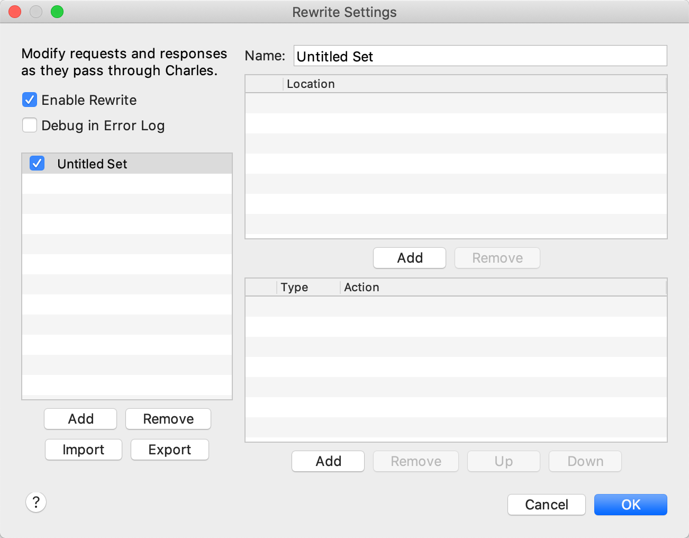

**Map Remote Config**

地址从定向，将访问 A 服务器的请求 代理到 访问 B 服务器

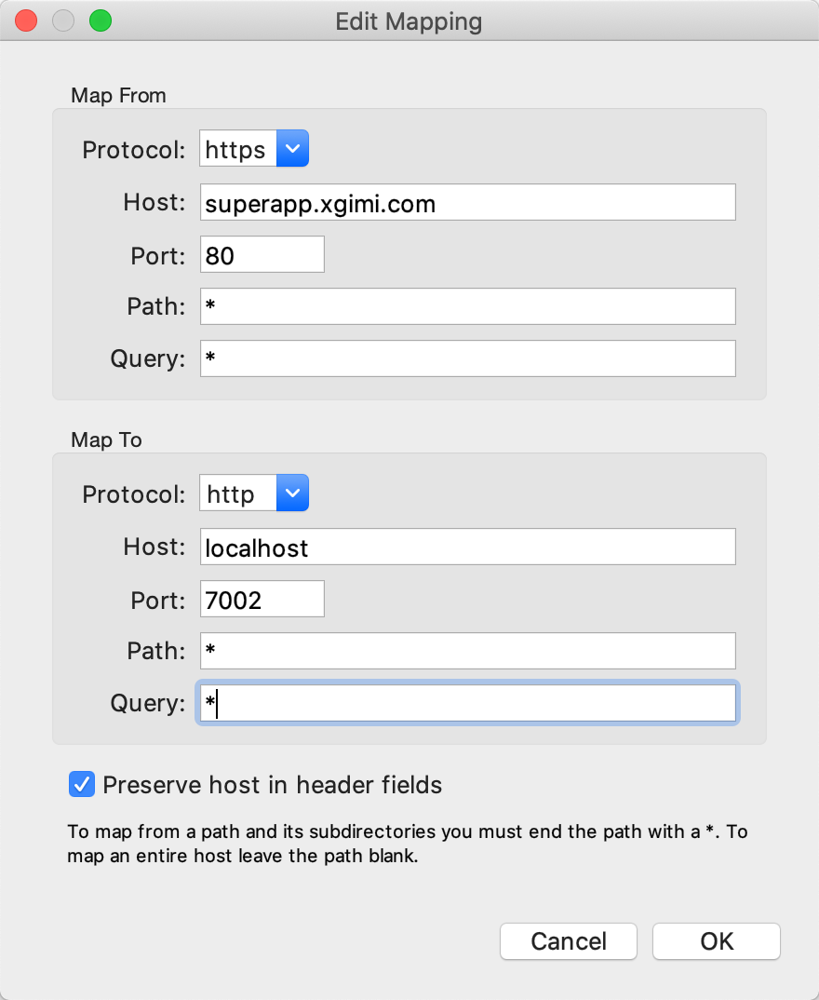

**Map Local Config**

将指定请求的 响应 替换为 本地文件

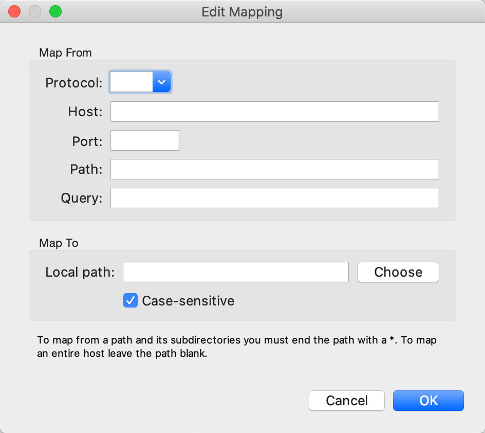

