### 前景

参考市面上通维度的 App 产品，**蔚来** **理想**，对其消息系统进行抓包分析。得到比较适合我们自己的**消息系统设计**。


### **理想 ONE**

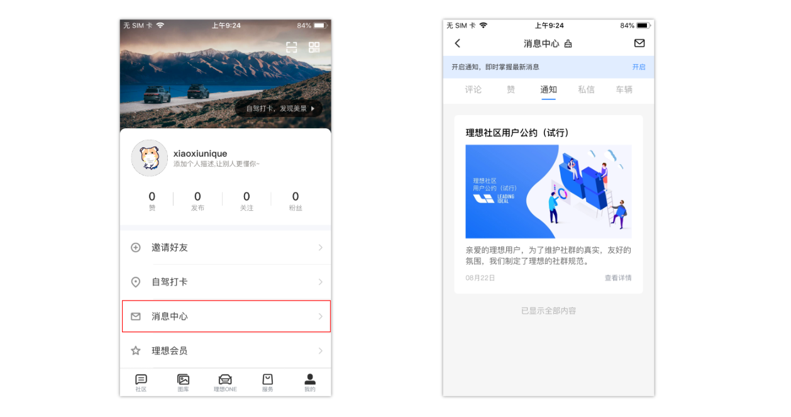

理想的消息系统设计师一种集中式的设计，将所有的消息集中管理，**评论、赞、通知、私信、车辆**。


在消息中心拉去通知类消息

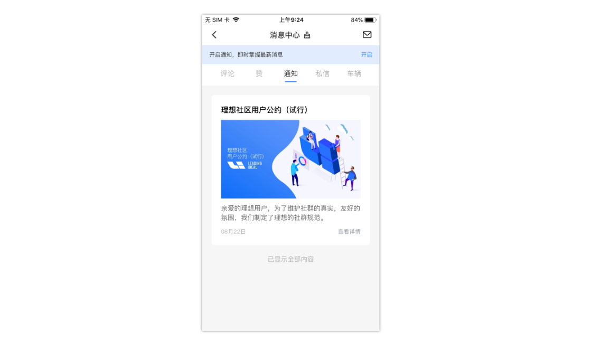

对接口进行抓包如下。

```
https://api-app.lixiang.com/mms-api/v1-0/message?status=3&pageNumber=0&appId=chj_app_m01&channelType=1&pageSize=20&category=notice
```

接口设计上 通过 `category` 来区分是哪个渠道上的消息，现在我们请求的是通知 类型的消息，所以 category 为 notice。


接口的**响应参数**如下

```json
{
	"success": true,
	"code": 0,
	"msg": "SUCCESS",
	"data": {
		"pageSize": 20,
		"pageNumber": 0,
		"numberOfElements": 1,
		"totalPages": 1,
		"totalElements": 1,
		"elements": [{
			"requestId": "rC21P1A80H2DJJQIGR00",
			"messageId": "C21P1A80H2DJJQIGR0000000",
			"appId": "chj_app_m01",
			"recipient": "3250332467430584322",
			"sender": null,
			"title": "理想社区用户公约（试行）",
			"summary": "亲爱的理想用户，为了维护社群的真实，友好的氛围，我们制定了理想的社群规范。",
			"contentId": null,
			"action": "{\"accountId\":0,\"avatar\":\"\",\"comment\":\"\",\"commentId\":0,\"commentType\":1,\"createTime\":1598072448536,\"level\":1,\"messageType\":\"notice\",\"nickName\":\"\",\"productId\":754,\"surfacePlot\":\"https://p.ampmake.com/lixiangzhizao_app/pc_push_system/787334842102195.jpg\",\"type\":1}",
			"tag": ["[Ljava.lang.String;@474616fd"],
			"category": "notice",
			"status": 1,
			"encryption": null,
			"sendOn": 1598072449000,
			"receiveOn": 0,
			"createdOn": 1598072448000,
			"updatedOn": 1599009229000
		}]
	}
}
```


我们将返回值和界面放在一起对比一下

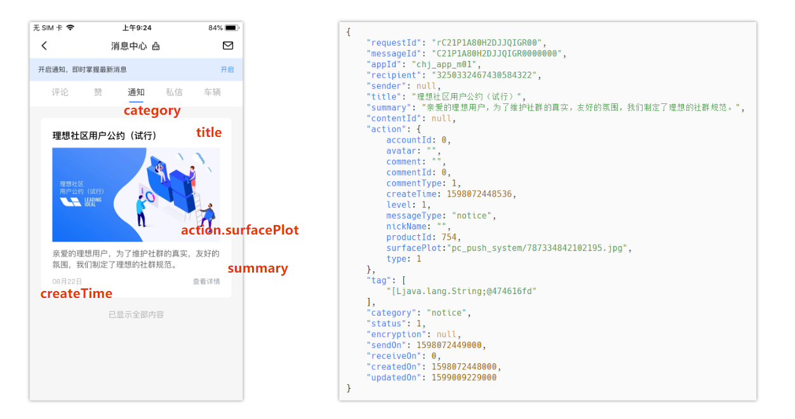

对比之后，界面元素的各个字段就比较清晰了。**action** 对象中，用来控制 **查看详情** 按钮，具体根据不同的 category 来控制不同的行为，因为现在的通知消息为一篇 **文章**，所以 **点击** 查看详情，就是拉去对应文章的信息，action  中 **productId** 就是指向的文章的主键 Id

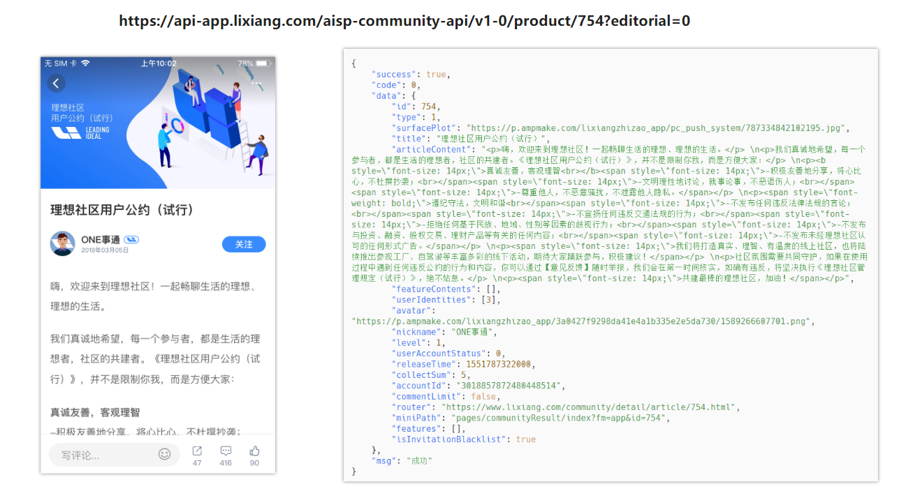

点击跳转至 **详情页**，上方展示了 【**详情页页面**】 【**接口 URL 地址**】 【**接口详情**】。可以看到对应的 productId 就是 754.


**理想** 消息分类

- 评论 comment 

  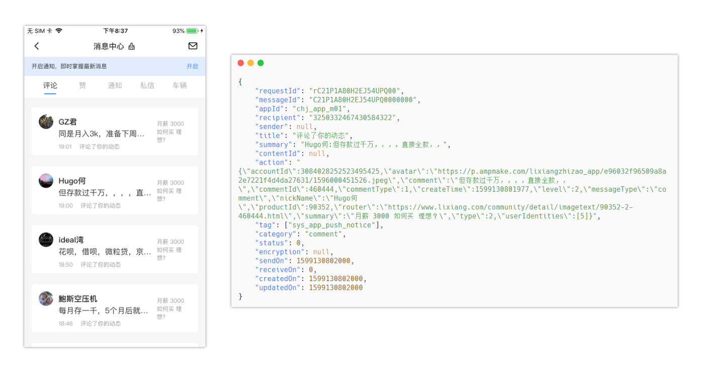

- 点赞 favour

  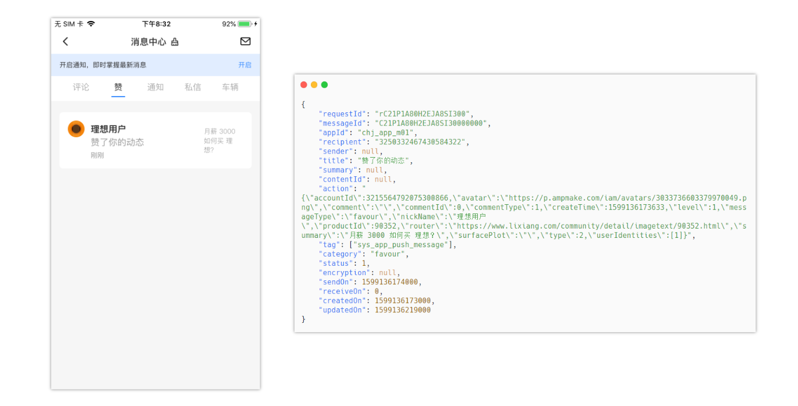

- 通知 notice 

- 车辆 vehicle


### **蔚来 NIO**

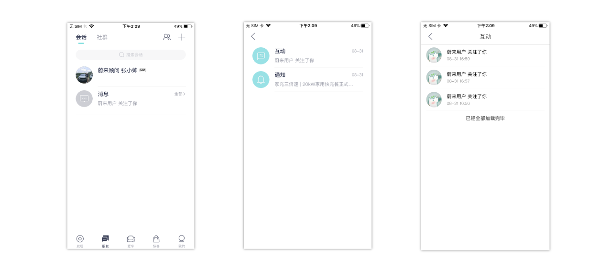

蔚来的消息入口是放在 IM 中的一个会话，和理想的设计不太一样，消息点击进入之后 分为 **互动** 和 **通知**，对互动消息列表的抓包结果如下。

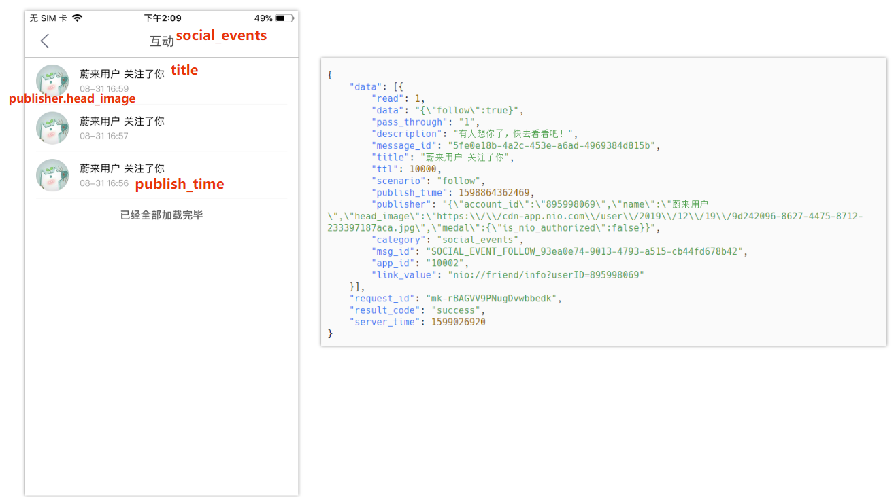

- 


在抓包时发现，在每次请求消息列表 这个接口的时候，还会附带一个 **history_read** 的一个接口

```
/api/1/message/history_read?app_id=10002&app_ver=4.4.0&device_id=2c0d36fa578c45c6819e0567399b8704&lang=zh-cn&region=cn&timestamp=1599026946&sign=4be15ff9fa6e02e2fe5b24bb06c74a03
```

猜测应该是控制当前用户已经读取过当前时间之前的消息。下次进入系统就不会再提示了。

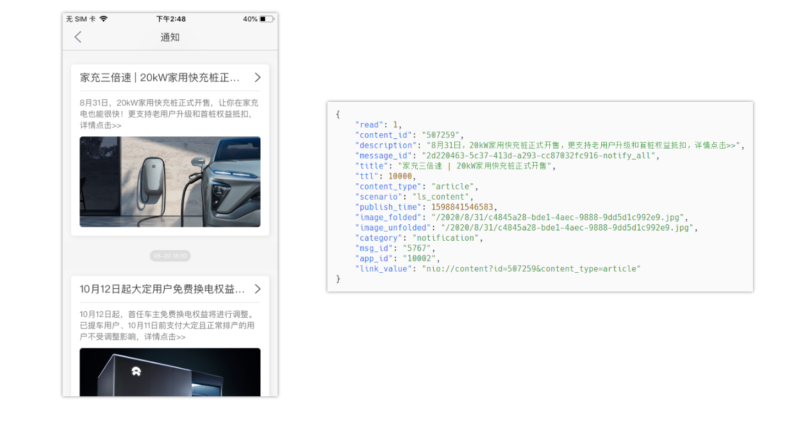

在对比 通知里面的消息结构。基本的消息结构就比较明确了。


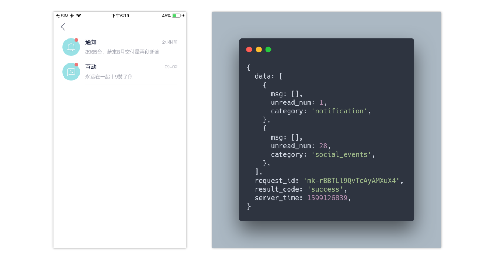

上图是在 **蔚来** 发表了一条 **说说** 之后，获取得到了 11 个点赞，28个评论后，第一次登陆时的在主界面 调用 **history_info** 接口，拉去消息列表。可以看到在 **notification** 分类下有 1 条未读消息，在 **social_events** 分类下有 28 条未读消息。

在 data.msg 数组中，每个类型下都有一条消息。结合界面可以发现，这一条消息就是用来在界面最外面展示的。

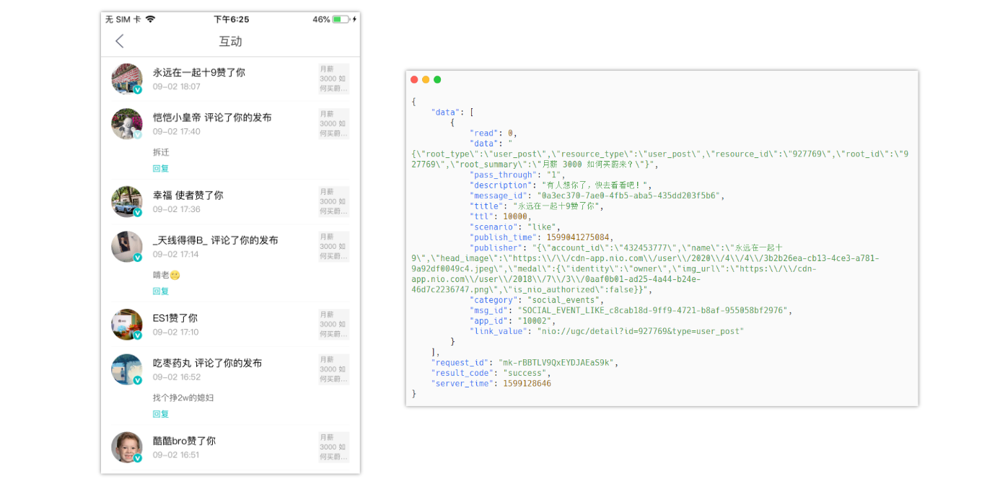

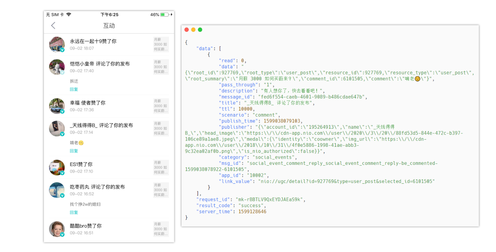

第一张图是 **点赞** 消息对应的 消息结构，第二张图是 **评论** 对应的消息接口。

基本可以确定 **蔚来 NIO** 的消息结构里面主要包括

- **read** 是否已读。
- **data** 内容信息，博客信息和点赞评论信息。
- **description** 消息描述，这个字段应该是用于 **消息推送** 的时候的内容。
- **title** 在 App 消息列表中呈现的标题。
- **scenario** 场景，当前场景为关注，**点赞**、**收藏**，都在这里面。 like 点赞，comment 收藏
- **category** 类别，应该用来区分 **互动类通知** 和 **系统类通知。**
- **msg_id** 消息ID，因为这样的操作可能会触发消息推送，所以每条需要添加 唯一 ID。
- **link_value** 需要跳转到对应的地址 nio:// 这种形式 应该是 客户端的一种方式。