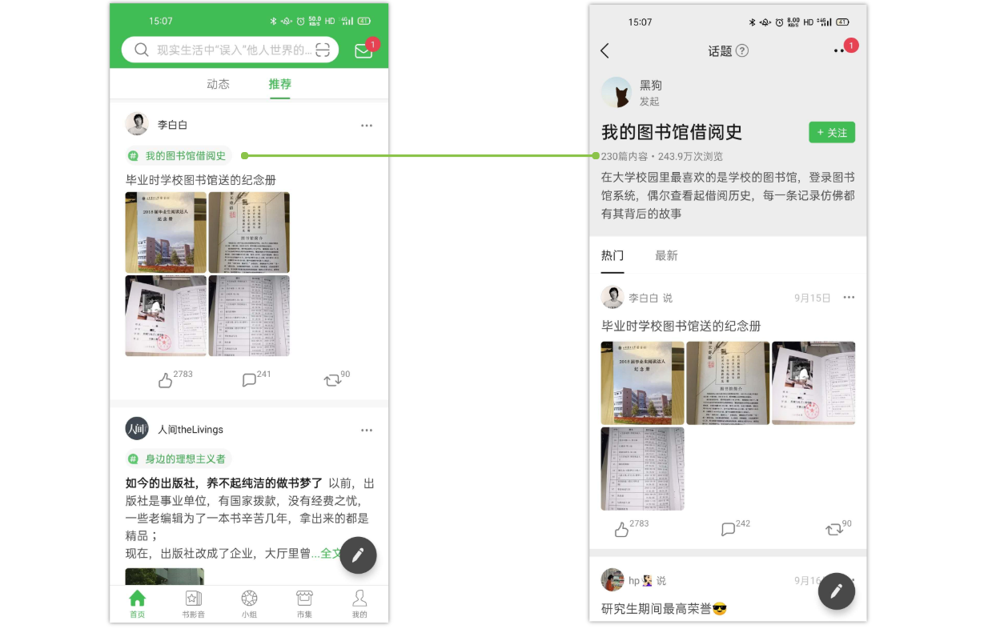
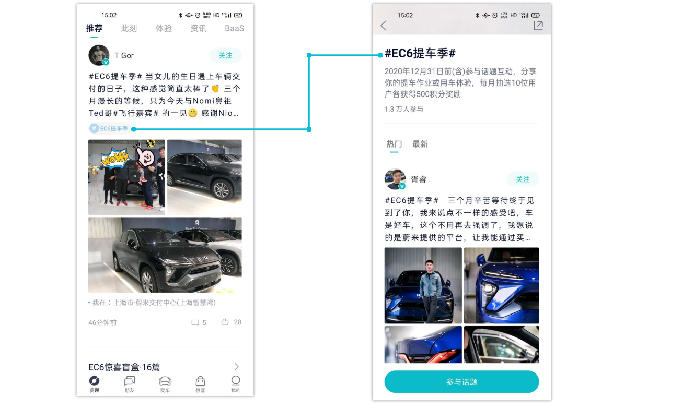
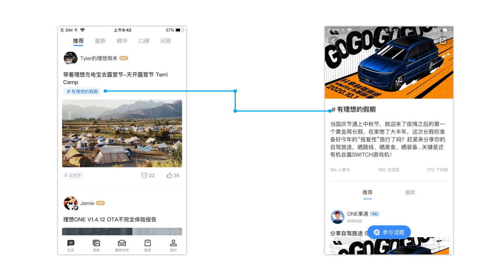
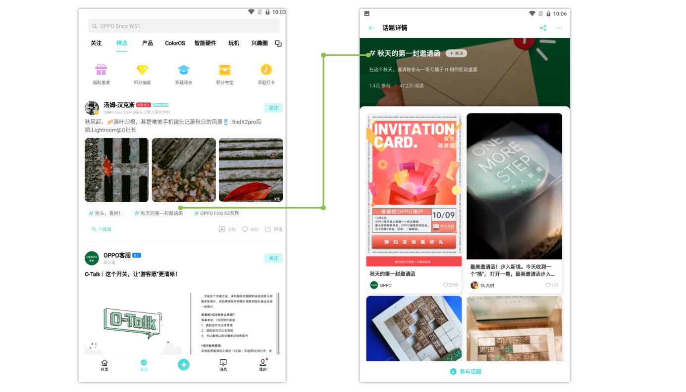
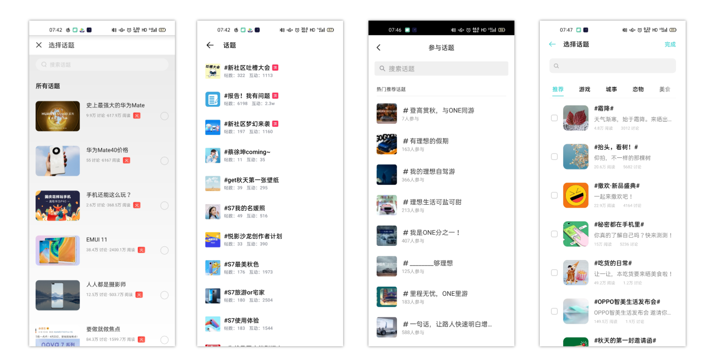

## 背景

App 目前没有运营引导工具对用户内容进行合理引导，需要增加话题运营工具。提供 App 社区内容质量和每天 UGC 量级。


## 参考

社区帖子添加标签是一个很常用的功能，大部分的社区 App 都有实现，诸如 微博，豆瓣，Oppo社区，理想，蔚来。真正在进入次需求之前，最好了解下相关平台的产品。


以上分别是 **豆瓣、蔚来、Oppo社区、理想汽车** 的 Tag 展示方案。

- Tag 可以支持一个或者多个


开始抓包 分析接口


后面所贴出的 返回结果针对 Topic 部分 JSON 其他 部分省略。


### 豆瓣




豆瓣列表 展示

```json
{
    "topic_label_bg_color":"#F7F7F7",
    "topic_label_bg_img":"",
    "name":"读书时写的有趣批注",
    "topic_icon_large":"",
    "url":"https://www.douban.com/gallery/topic/164512/",
    "uri":"douban://douban.com/gallery/topic/164512",
    "topic_icon":"",
    "topic_label_hashtag_color":"#5DC66F",
    "topic_label_text_color":"#39A94C",
    "type":"gallery_topic",
    "id":"164512"
}
```


**豆瓣主题详情**

```json
{
    "subscription_count": 1267,
    "creator": null,
    "is_subscribed": false,
    "invite_type": "",
    "screenshot_title": "分享海报",
    "screenshot_url": "douban://partial.douban.com/screenshot/gallery/topic/164512/_content",
    "guests": [],
    "card_subtitle": "88篇内容・164.1万次浏览",
    "screenshot_type": "rexxar",
    "id": "164512",
    "is_closed": false,
    "focused_subject": null,
    "topic_label_bg_color": "#F7F7F7",
    "topic_label_bg_img": "",
    "has_create_button": true,
    "group": null,
    "topic_tabs": [],
    "post_count": 88,
    "name": "读书时写的有趣批注",
    "label": "",
    "topic_label_hashtag_color": "#5DC66F",
    "ad_monitor_urls": [],
    "is_ad": false,
    "unpublic_reason": "",
    "participant_count": 92,
    "tags": [],
    "subject_card": null,
    "cover_url": "",
    "introduction": "今天重翻了我从前看的书，对于自己写的批注感到好笑，虽然很多是无厘头的碎碎念，但也很有趣不是么？让我看看你们写的吧，一起分享这快乐！",
    "content_type": 6,
    "is_public": true,
    "topic_label_text_color": "#39A94C",
    "sharing_url": "https://www.douban.com/doubanapp/dispatch?uri=/gallery/topic/164512/",
    "wechat_timeline_share": "url",
    "topic_icon_large": "",
    "click_track_urls": [],
    "uri": "douban://douban.com/gallery/topic/164512",
    "create_button_text": "",
    "topic_icon": "",
    "mask_color": "",
    "mask_type": ""
}
```


**核心信息**：类型、跳转地址、名称、文字背景色、文字颜色、文字背景图片、图标，描述，文章发布数


### 蔚来



**帖子列表**

```json
{
    "name": "EC6提车季",
	"topic_id": "20872"
}
```


**帖子详情**

```json
{
    "topic_id": 20872,
    "topic_name": "EC6提车季",
    "img_url": "https://cdn-app.nio.com/user/2020/9/24/419faa45-35eb-412b-86c1-d4a3cfd33a36.jpeg",
    "summary": "2020年12月31日前(含)参与话题互动，分享你的提车作业或用车体验，每月抽选10位用户各获得500积分奖励",
    "create_user_id": "660135565",
    "create_type": 1,
    "sort_id": 77,
    "ugc_count": 256,
    "attend_user_count": 12640,
    "new_hot_tag": 0,
    "create_time": 1600962984,
    "update_time": 1600997614,
}
```

蔚来的 Tag 显示逻辑是，在文章列表页 只是显示比较简单的 Topic 名称和 ID，只是作为展示使用。当进入 Topic 专题页时 拉取当前 Topic 详细信息。

**核心信息**：名称，图片、描述、文章 UGC 数量，参与人数。


### 理想



帖子列表 （右）

```json
{
    "productId": 95830,
    "name": "有理想的假期",
    "browseNum": 0,
    "participantsNum": 0,
    "contentNum": 0,
    "type": 1,
    "topicMark": 1
}
```


帖子详情（左）

```json
{
	"success": true,
	"code": 0,
	"data": {
		"productId": 95830,
		"name": "有理想的假期",
		"type": 1,
		"description": "当国庆节遇上中秋节，就迎来了疫情之后的第一个黄金周长假，在家憋了大半年，这次长假你准备好今年的“报复性”旅行了吗？赶紧来分享你的自驾旅途，晒路线、晒美食、晒装备...关键是还有机会赢SWITCH游戏机！",
		"image": "https://p.ampmake.com/aisp/community/aisp/community/6ece59aa-7604-4f52-bcc3-2577f9a9f678.jpg",
		"imageRes": "1600*900",
		"browseNum": 650,
		"participantsNum": 164,
		"contentNum": 273,
		"router": "https://www.lixiang.com/community/detail/topic/95830.html",
		"createdAt": 1601012653000,
		"topicMark": 1
	},
	"msg": "成功"
}
```

在进入帖子详情时，会拉取 Tag 详细信息。随后获取当前 Tag 下的帖子。从返回结果 router 字段 可以看出  **理想汽车** 主题实现是通过 H5 进行实现的。

**核心信息：** H5，浏览数，发布数，内容，类型，描述，图片，图片大小


### Oppo 社区



帖子列表

```json
[{
    "id": 970,
    "name": "抬头，看树！"
}]
```


帖子详情

```json
{
    "id":941,
    "name":"我怎么这么好看",
    "weight":1029,
    "status":1,
    "related":0,
    "perm":1,
    "style":0,
    "type":"",
    "guide":"发出你的自拍吧！",
    "description":"发出你的自拍吧！",
    "small_img":"https://imgfs.oppo.cn/uploads/topic/2020/07/31/17315884601.jpg",
    "pc_img":"https://imgfs.oppo.cn/uploads/topic/2020/07/31/17320924401.jpg",
    "big_img":"https://imgfs.oppo.cn/uploads/topic/2020/07/31/17320396101.jpg",
    "insert_time":1596187981,
    "insert_by":15122500992,
    "compere_ids":"",
    "category_id":1,
    "category_name":"人像",
    "group_id":"",
    "related_topic":"",
    "reply":"1.2万",
    "follower":64,
    "thread":"1.3万",
    "read":"33.3万",
    "is_follow":0,
    "username":[

    ]
}
```

抓包发现，Oppo 社区 部分接口 采用的是 protobuf 协议。不太好抓。对应 的[网页](oppo.cn) 是 Json 的形式

**关键信息：** H5，名称，图片，地址，类型，回复量，参与量，读取，状态。


## 话题选择页



可以看出大致的都差不多可能需要关注的几个点

- 话题有热门非热门的区分
- 话题具备类型


| 功能                    | Oppo 社区 | 蔚来 | 理想汽车 | 豆瓣       |
| ------------------  | --------- | ---- | -------- | ---------- |
| 名称                   | ✔️         | ✔️    | ✔️        | ✔️          |
| 描述                   | ✔️         | ✔️    | ✔️        | ✔️          |
| H5                     | ✔️         | ✔️    | ✔️      |:question:|
| 状态                  | ✔️         | :question: | :question: | :question: |
| 话题列表展示参与数      | ✔️         | ✔️    |     ✔️    | ✔️        |
| 阅读 |     ✔️ | ✔️ | ✔️ | ✔️ |
| 讨论 |      ✔️ | ✔️ | ✔️ | ✔️ |
| Label 可以配置 |   ✔️ |    ✔️  | ✔️ |            ✔️|
| 图片 | ✔️ | ✔️ | ✔️ | ✔️ |


## 设计

在我们社区话题的需求中，还有另外一个子需求就是 话题详情中的文章可以支持单独的排序配置。


