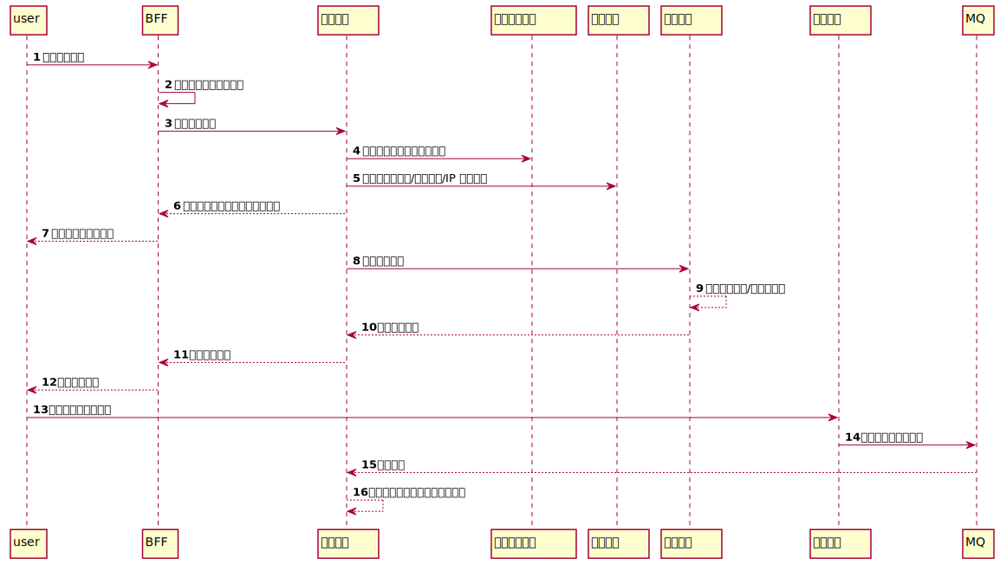

### 背景

9月20日 是公司一年一度的粉丝节，一般公司都会发起一些活动 为公司的粉丝带来一些福利。

今年的 粉丝节 恰迎 App 上线，公司品牌部 策划趁着 粉丝节 来临，不仅给用户提供了福利，还能达到为 App **引流**的作用。

于是 联合公司 各个部分 一起策划了 一场秒杀活动。品牌预估 20 万粉丝参加。而后 **中台** 拍板 我们需要提供 10000 QPS 的服务。


**过程整体概览如下**

- 需求分析
- 技术方案
- 风控策略
- B端提测
- C 端提测
- 线上压测 case
- 扩容需求
- checklist
- 运维成本核算
- 复盘


### 需求分析

- 商品 1 元 秒杀，秒杀商品不直接调用 商城 SKU，单独录入独立商品。

- 秒杀专场结束标志？

  商品被秒完。

  结束时间到了，每一场秒杀时间为 1 小时。

  付款时间为 15 分钟，超过 15 分钟 未付款，则自动释放秒杀资格。

- 发货方式？

  活动结束后，统一发货。可对订单再次检测，避免羊毛党。

- 一个用户单专场只能购买一次。（**此地有坑**）

- 接口限流，对专场商品库存 * 20 进行限流

- 手机号权限等级限制（接入阿里交易风控体系）


### 技术方案

整体架构图





整体上 中台 提供**秒杀，支付，风控能力**，由前置 **业务后台** 聚合调用。

**库设计**

::: detail 秒杀活动库表设计

```sql
## 秒杀活动场次ID

CREATE TABLE `seckill_promotion_session` (
  `id` bigint(20) NOT NULL AUTO_INCREMENT COMMENT '编号',
  `name` varchar(200) DEFAULT NULL COMMENT '场次名称',
  `start_time` time DEFAULT NULL COMMENT '每日开始时间',
  `end_time` time DEFAULT NULL COMMENT '每日结束时间',
  `status` int(1) NOT NULL DEFAULT '0' COMMENT '启用状态：0->启用；1->不启用',
  `deleted` int(1) NOT NULL DEFAULT '0' COMMENT '启用状态：0->未删除；1->删除',
  `created_by` varchar(64) DEFAULT '' COMMENT '创建人',
  `created_at` bigint(20) NOT NULL DEFAULT '0' COMMENT '创建时间',
  `updated_at` bigint(20) NOT NULL DEFAULT '0' COMMENT '创建时间',
  `updated_by` varchar(64) DEFAULT '' COMMENT '更新人',
  PRIMARY KEY (`id`),
  UNIQUE KEY `uk_name_deleted` (`name`,`deleted`)
) ENGINE=InnoDB AUTO_INCREMENT=1 DEFAULT CHARSET=utf8 COMMENT='秒杀场次表';

## 活动场次关联表

CREATE TABLE `seckill_promotion_product_relation` (
  `id` bigint(20) NOT NULL AUTO_INCREMENT COMMENT '编号',
  `product_name` varchar(64) NOT NULL DEFAULT '' COMMENT '商品名称',
  `product_sn` varchar(32) NOT NULL DEFAULT '' COMMENT '商品编码',
  `product_img` varchar(256) NOT NULL DEFAULT '' COMMENT '商品图片',
  `seckill_promotion_no` varchar(32) DEFAULT NULL COMMENT '秒杀活动编号',
  `seckill_promotion_session_id` bigint(20) DEFAULT NULL COMMENT '秒杀session编号',
  `seckill_promotion_original_price` bigint(20) NOT NULL DEFAULT '0' COMMENT '秒杀活动原价',
  `seckill_promotion_price` bigint(20) NOT NULL DEFAULT '0' COMMENT '限时秒杀活动价格',
  `seckill_promotion_show_inventory` int(11) NOT NULL DEFAULT '0' COMMENT '展示活动商品数量',
  `seckill_promotion_actual_inventory` int(11) NOT NULL DEFAULT '0' COMMENT '实际库存购数量',
  `seckill_promotion_lock_inventory` int(11) NOT NULL DEFAULT '0' COMMENT '锁定库存数量',
  `sort` int(11) NOT NULL DEFAULT '0' COMMENT '排序',
  `deleted` int(1) NOT NULL DEFAULT '0' COMMENT '启用状态：0->未删除；1->删除',
  `created_by` varchar(64) DEFAULT '' COMMENT '创建人',
  `updated_at` bigint(20) NOT NULL DEFAULT '0' COMMENT '创建时间',
  `created_at` bigint(20) NOT NULL DEFAULT '0' COMMENT '创建时间',
  `updated_by` varchar(64) DEFAULT '' COMMENT '更新人',
  PRIMARY KEY (`id`),
  UNIQUE KEY `uk_pspd` (`seckill_promotion_no`,`seckill_promotion_session_id`,`product_sn`,`deleted`),
  KEY `idx_sp_no` (`seckill_promotion_no`),
  KEY `idx_sps_id` (`seckill_promotion_session_id`)
) ENGINE=InnoDB AUTO_INCREMENT=1 DEFAULT CHARSET=utf8 COMMENT='秒杀限时购与商品关系表';

## 秒杀商品活动关联

CREATE TABLE `seckill_order_info` (
  `id` bigint(20) NOT NULL AUTO_INCREMENT COMMENT '订单id',
  `order_sn` varchar(64) NOT NULL DEFAULT '' COMMENT '订单编号',
  `user_id` bigint(20) NOT NULL DEFAULT '0' COMMENT '用户ID',
  `user_name` varchar(64) NOT NULL DEFAULT '' COMMENT '用户名',
  `product_sn` varchar(32) NOT NULL DEFAULT '' COMMENT '商品sn',
  `product_name` varchar(64) NOT NULL DEFAULT '' COMMENT '商品名',
  `seckill_promotion_no` varchar(32) DEFAULT NULL COMMENT '秒杀活动编号',
  `seckill_promotion_name` varchar(32) DEFAULT NULL COMMENT '秒杀活动名称',
  `seckill_promotion_session_id` bigint(20) NOT NULL DEFAULT '0' COMMENT '活动场次ID',
  `seckill_promotion_session_name` varchar(32) NOT NULL DEFAULT '0' COMMENT '活动场次名称',
  `total_amount` bigint(20) NOT NULL DEFAULT '0' COMMENT '订单总金额',
  `pay_amount` bigint(20) NOT NULL DEFAULT '0' COMMENT '应付金额（实际支付金额）',
  `pay_type` tinyint(1) NOT NULL DEFAULT '1' COMMENT '支付方式',
  `status` tinyint(1) NOT NULL DEFAULT '0' COMMENT '订单状态：1->待付款；2->已支付；3->已取消；4->已完成',
  `deleted` tinyint(1) NOT NULL DEFAULT '0',
  `delivery_company` varchar(64) DEFAULT '' COMMENT '物流公司',
  `delivery_sn` varchar(64) DEFAULT '' COMMENT '物流单号',
  `delivery_status` tinyint(1) DEFAULT '0' COMMENT '物流状态,1:已发货，2:已签收,3:已完成',
  `receiver_name` varchar(100) NOT NULL DEFAULT '' COMMENT '收货人姓名',
  `receiver_phone` varchar(32) NOT NULL DEFAULT '' COMMENT '收货人电话',
  `receiver_post_code` varchar(32) NOT NULL DEFAULT '' COMMENT '收货人邮编',
  `receiver_province` varchar(32) NOT NULL DEFAULT '' COMMENT '省份/直辖市',
  `receiver_city` varchar(32) NOT NULL DEFAULT '' COMMENT '城市',
  `receiver_region` varchar(32) NOT NULL DEFAULT '' COMMENT '区',
  `receiver_detail_address` varchar(256) NOT NULL DEFAULT '' COMMENT '详细地址',
  `payment_time` datetime DEFAULT NULL COMMENT '支付时间',
  `delivery_time` datetime DEFAULT NULL COMMENT '发货时间',
  `receive_time` datetime DEFAULT NULL COMMENT '确认收货时间',
  `created_by` varchar(64) DEFAULT '' COMMENT '创建人',
  `created_at` bigint(20) NOT NULL DEFAULT '0' COMMENT '创建时间',
  `updated_at` bigint(20) NOT NULL DEFAULT '0' COMMENT '创建时间',
  `updated_by` varchar(64) DEFAULT '' COMMENT '更新人',
  PRIMARY KEY (`id`),
  UNIQUE KEY `uk_order_sn` (`order_sn`),
  KEY `idx_sn` (`product_sn`),
  KEY `idx_sp_no` (`seckill_promotion_no`),
  KEY `idx_uid` (`user_id`)
) ENGINE=InnoDB AUTO_INCREMENT=1 DEFAULT CHARSET=utf8 COMMENT='订单表';
```

:::


缓存设计

```
1. 活动相关
     sp_%d
2. 活动场次相关
    1. sps_%d
3. 活动产品相关
    1. list: sppr_%d_%d
    2. string: sppr_info_%d
    3. string: sppr_stock_%s_%d_%s
    4. string: sppr_user_limit_%d_%d_%d
4. 订单相关
    1. string: soi_%d
```


在技术方案阶段，需要结合开发，品牌，运维，测试 需要确认各个环节的时间节点。以保证 项目按时交付。


### 风控策略

 9.20粉丝节为`宠粉`进行到底，我司将做一系列的活动为粉丝谋求福利，但同时也要避免一些的羊毛党、黄牛党，刷子们的攻击，降低用户体验，影响我们的`宠粉`活动，故此需要进行分控体系对接。

主要结合阿里风控模块，对参与用户的手机号码，收货地址进行进行判断 这个用户是否为 “正常用户”。


### 提测

主要需要注意各个时间节点，应该本来计划提出的时候，时间就很少了。所以一定要对各个节点需要交付到测试的东西 时间上都要得到保证。

加上此次为**秒杀**活动，除了传统的 功能测试 之外，还需要压测。已满足活动当天的用户请求量。


### 压测

QA 需要根据实际业务场景，分析出秒杀时 大流量接口，从而使用 jmeter 对相关接口进行压测，压测顺序为 从内向外依次压测。

压测时服务器部署，需要满足压测场景，尽量一个服务器只部署单个应用。这个可以通过压测查看 单台服务器的 QPS 极限。从而根据我们的业务目标 在前两天对正式环境进行扩容。


### 扩容

主要是根据 QA 给出的压测报告，以及结合 需求方 给出的用户数据，然后对服务器进行扩容。需要注意的是，当运维对服务器扩容完毕之后，一定需要检查一下，通过日志查看 是否将流量分摊到 对应的服务器集群。


### 复盘

次步骤分散在 整个项目的各个环节中，开发，测试，部署，运行。在各个阶段都需要小范围复盘，及时发现问题，调整方向。

