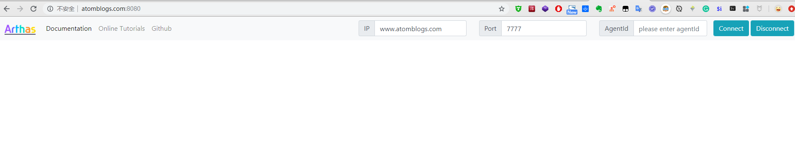

[[TOC]]

### 简介

Arthas目前支持Web Console，用户在attach成功之后，可以直接访问：http://127.0.0.1:3658/。

可以填入IP，远程连接其它机器上的arthas。


::: warning

默认情况下，`arthas`只 `listen 127.0.0.1`，所以如果想从远程连接，则可以使用 `--target-ip`参数指定listen的IP，更多参考`-h`的帮助说明。 注意会有安全风险，考虑下面的tunnel server的方案。

:::


### 安装

```shell
### 下载jar 包
wget https://github.com/alibaba/arthas/releases/download/arthas-all-3.1.7/arthas-tunnel-server-3.1.7.jar

### 运行
java -jar arthas-tunnel-server-3.1.7.jar

### 应用默认启动到 8080 端口
curl http://localhost:8080
```

`http://localhost:8080`

