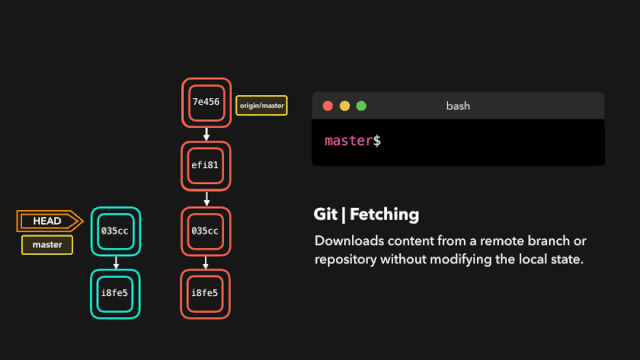
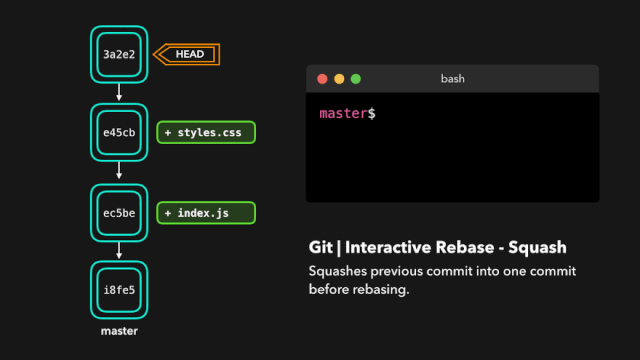

[TOC]

基本涵盖了在开发中用到的git命令，能满足日常需求。

## 配置
```bash
# 查看全局配置列表
git config -l
# 查看局部配置列表
git config --local --list

# 查看已设置的全局用户名/邮箱
git config --global --get user.name
git config --global --get user.email

# 设置全局用户名/邮箱
git config --global user.name "xiejiahe"
git config --global user.email "example@example.com"

# 设置本地当前工作区仓库用户名/邮箱
git config --local user.name "xiejiahe"
git config --local user.email "example@example.com"

# 删除配置
git config --unset --global user.name
git config --unset --global user.email

# 将默认文本编辑器设置为 emacs
git config --global core.editor emacs

# 将默认差异化分析工具设置为 vimdiff
git config --global merge.tool vimdiff
```


## 生成SSH_Key
```bash
# 1、粘贴以下命令，替换为您的GitHub电子邮件地址
ssh-keygen -t rsa -b 4096 -C "your_email@example.com"

# 2、当提示“输入要在其中保存密钥的文件”时，按Enter。接受默认文件位置。
> Enter a file in which to save the key (/Users/you/.ssh/id_rsa): [Press enter]

# 3、在提示符下，键入一个安全密码。
> Enter passphrase (empty for no passphrase): [Type a passphrase]
> Enter same passphrase again: [Type passphrase again]
```

最后需要将生成的 SSH Key 添加到 `ssh config` 中
```bash
# 1、编辑
vim ~/.ssh/config

# 2、粘贴下面到 config 文件中
Host *
  AddKeysToAgent yes
  UseKeychain yes
  IdentityFile ~/.ssh/id_rsa
```


## 初始化仓库
`git init` 创建一个空的Git仓库或重新初始化一个现有的仓库
```bash
# 会在当前目录生成.git
git init

# 以安静模式创建，只会打印错误或警告信息
git init -q

# 创建一个裸仓库, 通常情况下用不上
git init --bare
```

## 文件状态
```bash
# 完整查看文件状态
git status

# 以短格式给出输出
git status -s

# 忽略子模块
git status --ignore-submodules
```

## 日志
```bash
# 查看完整历史提交记录
git log

# 查看前N次提交记录 commit message
git log -2

# 查看前N次提交记录，包括diff
git log -p -2

# 搜索关键词
git log -S Java

# 只显示合并日志
git log --merges

# 以图形查看日志记录, --oneline 可选
git log --graph --oneline

# 列出提交者贡献数量, 只会打印作者和贡献数量
git shortlog -sn

# 以提交贡献数量排序并打印出message
git shortlog -n

# 采用邮箱格式化的方式进行查看贡献度
git shortlog -e

# 查看 README.md 文件的修改历史记录，包括时间、作者以及内容
git blame README.md
```


## 克隆
```bash
# https 协议
git clone https://github.com/xjh22222228/git-manual.git

# SSH协议
git clone git@github.com:xjh22222228/git-manual.git

# 克隆某个分支， -b 指定分支名字
git clone -b master https://github.com/xjh22222228/git-manual.git

# 递归克隆，如果项目包含子模块就非常有用
git clone --recursive git@github.com:xjh22222228/git-manual.git

# 克隆深度为1, 不会把历史的记录也克隆，这样可以节省克隆时间
git clone --depth=1 https://github.com/xjh22222228/git-manual.git
```


----


## 查看分支
```bash
# 查看所有分支
git branch -a

# 查看本地分支
git branch

# 查看远端分支
git branch -r

# 查看本地分支所关联的远程分支
git branch -vv

# 查看本地 master 分支创建时间
git reflog show --date=iso master
```

## 切换分支
```bash
# 2种方法，切换到master分支
git checkout master
git switch master

# 切换上一个分支
git checkout -

# 切换远端分支
git checkout -t origin/dev
```

## 创建分支
```bash
# 创建develop本地分支
git branch develop

# 创建本地develop分支并切换
git checkout -b develop

# 创建远程分支, 实际上创建本地分支然后推送
git checkout -b develop
git push origin develop


# 创建一个空的分支, 不继承父分支，历史记录是空的，一般至少需要执行4步
git checkout --orphan develop
# 这一步可选，如果你真的想创建一个没有任何文件的分支
git rm -rf .
# 添加并提交，否则分支是隐藏的 （执行这一步之前需要注意当前工作区必须保留一个文件，否则无法提交）
git add -A && git commit -m "提交"
# 推送到远程
git push --set-upstream origin develop
```


## 删除分支
```bash
# 删除本地分支
git branch -d <branchName>

# 删除远程分支
git push origin :<branchName>
```

## 重命名分支
```bash
# 重命名当前分支, 通常情况下需要执行3步
# 1、修改分支名称
# 2、删除远程旧分支
# 3、将重命名分支推送到远程
git branch -m <branchName>
git push origin :old_branch
git push -u origin new_branch


# 重命名指定分支
git branch -m old_branch new_branch
```

----

## 代码合并


合并代码，处理冲突


```bash
# 两步法, 将 feature/v1.0.0 分支代码合并到 develop
git checkout develop
git merge feature/v1.0.0

# 或者一步法
git merge feature/v1.0.0 develop

# 以安静模式合并, 把develop分支合并到当前分支并不输出任何信息
git merge develop -q
```


## 暂存
```bash
# 暂存所有
git add -A

# 暂存某个文件
git add ./README.md

# 暂存当前目录所有改动文件
git add .

# 暂存一系列文件
git add 1.txt 2.txt ...
```

## 删除
git add 的反向操作
```bash
# 删除1.txt 文件
git rm 1.txt

# 删除当前所有文件, 与rm -rf 命令不同的是不会删除 .git 目录
git rm -rf .

# 清除当前工作区缓存，但不会删除文件，通常用于修改文件名不生效问题
git rm -r --cached .
```

## 提交
```bash
# -m 提交的信息
git commit -m "changes log"

# 只提交某个文件
git commit README.md -m "message"

# 提交并显示diff变化
git commit -v

# 允许提交空消息，通常必须指定 -m 参数
git commit --allow-empty-message

# 重写上一次提交信息，确保当前工作区没有改动
git commit --amend -m "新的提交信息"
```

## 推送
```bash
# 推送内容到主分支
git push -u origin master

# 本地分支推送到远程， 本地分支:远程分支
git push origin <branchName>:<branchName>

# 简写，默认推送当前分支
git push

# 强制推送, -f 是 --force 缩写
git push -f
```

----

## 拉取最新内容




```bash
# 推荐，因为不会做自动合并
git fetch origin master

# 相当于git fetch 然后 git merge
git pull

# 后面的意思是： 远程分支名:本地分支名
git pull origin master:master

# 如果是要与本地当前分支合并，则冒号后面的<本地分支名>可以不写
git pull origin master
```


----

## 查看文件的改动
```bash
# 查看所有文件改动
git diff

# 查看具体文件的改动
git diff README.md

# 查看某个版本的改动, 后面那一窜是commitId， git log后就能看到
git diff d68a1ef2407283516e8e4cb675b434505e39dc54

# 查看某个文件的历史修改记录
git log README.md
git show d68a1ef2407283516e8e4cb675b434505e39dc54 README.md
```

----

## 回滚版本
```bash
# 回滚上一个版本
git reset --hard HEAD^

# 回滚上两个版本
git reset --hard HEAD^^

# 回退到指定版本，git log 就能看到commit id了
git reset --hard 'commit id'

# 回滚版本是不保存在 git log，如果想查看使用
git reflog
```


----

## 撤销
```bash
# 撤销当前目录下所有文件的改动
git checkout -- .

# 撤销指定文件修改
git checkout -- README.md

# 暂存区回到工作区, 指定 ./README.md 文件从暂存区回到工作区
git reset HEAD ./README.md

# 撤销commit, 回到工作区, 一般commit id 是前一个
git reset <commit_id>

# 撤销commit, 并且把修改同时撤销
git reset --hard <commit_id>
```


## 标签
```bash
# 列出本地所有标签
git tag

# 列出远程所有标签
git ls-remote --tags origin

# 按照特定模式查找标签, `*` 模板搜索
git tag -l "v1.0.0*"

# 创建带有附注标签
git tag -a v1.1.0 -m "标签描述"

# 创建轻量标签, 不需要带任何参数
git tag v1.1.0

# 后期打标签, 假设之前忘记打标签了，可以通过git log查看commit id
git log
git tag -a v1.1.0 <commit_id>

# 推送到远程，默认只是本地创建
git push origin v1.1.0

# 一次性推送所有标签到远程
git push origin --tags

# 删除标签, 你需要再次运行 git push origin v1.1.0 才能删除远程标签
git tag -d v1.1.0

# 删除远程标签
git push origin --delete v1.1.0

# 检查标签
git checkout v1.1.0

# 查看本地某个标签详细信息
git show v1.1.0
```


## Rebase
`git rebase` 主要作用可以将多个commit记录合并为一条
```bash
# 操作最近4次提交
git rebase -i HEAD~4
# 或者以 commit_id 进行操作
git rebase -i e88835de905ad396f61a0dc8c040a8ac8a34f3f8


# 放弃 git rebase 操作
git rebase --abort

# 此命令主要用于解决冲突后继续执行
git rebase --continue
```

参考：[git rebase将多次commit合并为一条](https://www.xiejiahe.com/blog/detail/5d550e8553d11b2c3ca05cbe)


git rebase 会将当前分支的提交复制到指定的分支之上。


交互式变基（Interactive Rebase）

在为提交执行变基之前，我们可以修改它们！我们可以使用交互式变基来完成这一任务。交互式变基在你当前开发的分支上以及想要修改某些提交时会很有用。

在我们正在 rebase 的提交上，我们可以执行以下 6 个动作：

- reword：修改提交信息；
- edit：修改此提交；
- squash：将提交融合到前一个提交中；
- fixup：将提交融合到前一个提交中，不保留该提交的日志消息；
- exec：在每个提交上运行我们想要 rebase 的命令；
- drop：移除该提交。

很棒！这样我们就能完全控制我们的提交了。如果你想要移除一个提交，只需 drop 即可。


如果你想把多个提交融合到一起以便得到清晰的提交历史，那也没有问题！




## GitFlow

Git Flow 不是内置命令，需要单独安装

**初始化** 每个仓库都必须初始化一次
```bash
# 通常直接回车以完成默认设置
git flow init
```

**功能**
```bash
# 开启新的功能
git flow feature start v1.1.0

# 推送到远程, 在团队协作中这一步少不了
git flow feature publish v1.1.0

# 完成功能, 会将当前分支合并到 develop 然后删除分支，回到 develop
git flow feature finish v1.1.0
```


**打补丁**

hotfix是针对 `master` 进行打补丁的
```bash
# 开启新的 hotfix
git flow hotfix start v1.1.0_hotifx

# 推送到远程
git flow hotfix publish v1.1.0_hotifx

# 完成新的hotfix, 将当前分支合并到 master 和 develop，然后删除分支，回到 develop
git flow hotfix finish v1.1.0_hotifx
```

**发布**
```bash
# 开启新的 release
git flow release start v1.1.0

# 推送到远程
git flow release publish v1.1.0

# 完成, 将当前分支合并到 master 和 develop，删除当前分支然后回到 develop
git flow release finish v1.1.0
```

#### Git flow schema


---


## 子模块
具体使用还可以看这里 [git submodule子模块使用教程](https://www.xiejiahe.com/blog/detail/5dbceefc0bb52b1c88c30853)
```bash
# 添加子模块
git submodule add https://github.com/xjh22222228/git-manual.git

# 更新，有2种方法
# 一步到位
git submodule update --remote
# 或者进入到子模块项目再拉取
git pull

# 修复子模块分支指向 detached head
git submodule foreach -q --recursive 'git checkout $(git config -f $toplevel/.gitmodules submodule.$name.branch || echo master)'

# 删除子模块 common 为子模块名称，一般删除需要三部
git submodule deinit <common>
# 清除子模块缓存
git rm --cached common
# 提交代码并推送
git commit -am "Remove a submodule" && git push
```


## 帮助
```bash
# 详细打印所有git命令
git help

# 打印所有git命令, 此命令不会有详细信息，更清晰一些
git help -a

# 列出所有可配置的变量
git help -c
```


## 清空commit历史
假设当前分支是 `develop`
```bash
# 1、新建一个新分支
git checkout --orphan new_branch
# 2、暂存所有文件并提交
git add -A && git commit -m "First commit"
# 3、删除本地 develop 分支
git branch -D develop
# 4、再将 new_branch 分支重命名为 develop
git branch -m develop
# 5、强制将 develop 分支推送到远程
git push -f origin develop
```


## Reflog

每个人都会犯错，但犯错其实没啥！有时候你可能感觉你把 git repo 完全搞坏了，让你想完全删了了事。


git reflog 是一个非常有用的命令，可以展示已经执行过的所有动作的日志。包括合并、重置、还原，基本上包含你对你的分支所做的任何修改。


如果你犯了错，你可以根据 reflog 提供的信息通过重置 HEAD 来轻松地重做！

假设我们实际上并不需要合并原有分支。当我们执行 git reflog 命令时，我们可以看到这个 repo 的状态在合并前位于 HEAD@{1}。那我们就执行一次 git reset，将 HEAD 重新指向在 HEAD@{1} 的位置。


## 其他
```bash
# 查看git版本
git --version

# 查看远程仓库地址
git remote -v

# 记住提交账号密码
git config --global credential.helper store

# 清除git已保存的用户名和密码
# windows
git credential-manager uninstall
# mac linux
git config --global credential.helper ""
# 或者
git config --global --unset credential.helper

# 清除本地git缓存
git rm -r --cached .
```


## 回到远程仓库的状态

抛弃本地所有的修改，回到远程仓库的状态。
```sh
git fetch --all && git reset --hard origin/master
```

## 重设第一个 commit

也就是把所有的改动都重新放回工作区，并**清空所有的 commit**，这样就可以重新提交第一个 commit 了

```sh
git update-ref -d HEAD
```

## 查看冲突文件列表

展示工作区的冲突文件列表
```sh
git diff --name-only --diff-filter=U
```
## 展示工作区和暂存区的不同

输出**工作区**和**暂存区**的 different (不同)。

```sh
git diff
```

还可以展示本地仓库中任意两个 commit 之间的文件变动：
```sh
git diff <commit-id> <commit-id>
```

## 展示暂存区和最近版本的不同

输出**暂存区**和本地最近的版本 (commit) 的 different (不同)。
```sh
git diff --cached
```

## 展示暂存区、工作区和最近版本的不同

输出**工作区**、**暂存区** 和本地最近的版本 (commit) 的 different (不同)。

```sh
git diff HEAD
```

## 快速切换到上一个分支

```sh
git checkout -
```

## 删除已经合并到 master 的分支

```sh
git branch --merged master | grep -v '^\*\|  master' | xargs -n 1 git branch -d
```

## 展示本地分支关联远程仓库的情况
```sh
git branch -vv
```

## 关联远程分支

关联之后，`git branch -vv` 就可以展示关联的远程分支名了，同时推送到远程仓库直接：`git push`，不需要指定远程仓库了。
```sh
git branch -u origin/mybranch
```

或者在 push 时加上 `-u` 参数
```sh
git push origin/mybranch -u
```

## 列出所有远程分支

-r 参数相当于：remote
```sh
git branch -r
```

## 列出本地和远程分支

-a 参数相当于：all
```sh
git branch -a
```

## 查看远程分支和本地分支的对应关系

```sh
git remote show origin
```

## 远程删除了分支本地也想删除

```sh
git remote prune origin
```

## 创建并切换到本地分支
```sh
git checkout -b <branch-name>
```

## 从远程分支中创建并切换到本地分支

```sh
git checkout -b <branch-name> origin/<branch-name>
```

## 删除本地分支

```sh
git branch -d <local-branchname>
```

## 删除远程分支

```sh
git push origin --delete <remote-branchname>
```

或者

```sh
git push origin :<remote-branchname>
```

## 重命名本地分支

```sh
git branch -m <new-branch-name>
```

## 查看标签

```sh
git tag
```
展示当前分支的最近的 tag

```sh
git describe --tags --abbrev=0
```

## 查看标签详细信息

```sh
git tag -ln
```

## 本地创建标签

```sh
git tag <version-number>
```

默认 tag 是打在最近的一次 commit 上，如果需要指定 commit 打 tag：
```sh
$ git tag -a <version-number> -m "v1.0 发布(描述)" <commit-id>
```

## 推送标签到远程仓库

首先要保证本地创建好了标签才可以推送标签到远程仓库：

```sh
git push origin <local-version-number>
```

一次性推送所有标签，同步到远程仓库：

```sh
git push origin --tags
```

## 删除本地标签

```sh
git tag -d <tag-name>
```

## 删除远程标签

```sh
git push origin --delete tag <tagname>
```

## 切回到某个标签

一般上线之前都会打 tag，就是为了防止上线后出现问题，方便快速回退到上一版本。下面的命令是回到某一标签下的状态：
```sh
git checkout -b branch_name tag_name
```

## 放弃工作区的修改
```sh
git checkout <file-name>
```

放弃所有修改：
```sh
git checkout .
```

## 恢复删除的文件
```sh
git rev-list -n 1 HEAD -- <file_path> #得到 deleting_commit

git checkout <deleting_commit>^ -- <file_path> #回到删除文件 deleting_commit 之前的状态
```

## 以新增一个 commit 的方式还原某一个 commit 的修改

```sh
git revert <commit-id>
```

## 回到某个 commit 的状态，并删除后面的 commit

和 revert 的区别：reset 命令会抹去某个 commit id 之后的所有 commit

```sh
git reset <commit-id>  #默认就是-mixed参数。

git reset  -- mixed HEAD^  #回退至上个版本，它将重置HEAD到另外一个commit,并且重置暂存区以便和HEAD相匹配，但是也到此为止。工作区不会被更改。

git reset -- soft HEAD~3  #回退至三个版本之前，只回退了commit的信息，暂存区和工作区与回退之前保持一致。如果还要提交，直接commit即可  

git reset -- hard <commit-id>  #彻底回退到指定commit-id的状态，暂存区和工作区也会变为指定commit-id版本的内容
```

## 修改上一个 commit 的描述

如果暂存区有改动，同时也会将暂存区的改动提交到上一个 commit

```sh
git commit --amend
```

## 查看 commit 历史
```sh
git log
```

## 查看某段代码是谁写的

blame 的意思为‘责怪’，你懂的。

```sh
git blame <file-name>
```

## 显示本地更新过 HEAD 的 git 命令记录

每次更新了 HEAD 的 git 命令比如 commint、amend、cherry-pick、reset、revert 等都会被记录下来（不限分支），就像 shell 的 history 一样。
这样你可以 reset 到任何一次更新了 HEAD 的操作之后，而不仅仅是回到当前分支下的某个 commit 之后的状态。

```sh
git reflog
```

## 修改作者名

```sh
git commit --amend --author='Author Name <email@address.com>'
```

## 修改远程仓库的 url

```sh
git remote set-url origin <URL>
```

## 增加远程仓库

```sh
git remote add origin <remote-url>
```

## 列出所有远程仓库

```sh
git remote
```

## 查看两个星期内的改动
```sh
git whatchanged --since='2 weeks ago'
```

## 把 A 分支的某一个 commit，放到 B 分支上

这个过程需要 `cherry-pick` 命令，[参考](http://sg552.iteye.com/blog/1300713#bc2367928)

```sh
git checkout <branch-name> && git cherry-pick <commit-id>
```

## 给 git 命令起别名

简化命令

```sh
git config --global alias.<handle> <command>

比如：git status 改成 git st，这样可以简化命令

git config --global alias.st status
```

## 存储当前的修改，但不用提交 commit

详解可以参考[廖雪峰老师的 git 教程](http://www.liaoxuefeng.com/wiki/0013739516305929606dd18361248578c67b8067c8c017b000/00137602359178794d966923e5c4134bc8bf98dfb03aea3000)
```sh
git stash
```

## 保存当前状态，包括 untracked 的文件

untracked 文件：新建的文件
```sh
git stash -u
```

## 展示所有 stashes
```sh
git stash list
```

## 回到某个 stash 的状态
```sh
git stash apply <stash@{n}>
```

## 回到最后一个 stash 的状态，并删除这个 stash

```sh
git stash pop
```

## 删除所有的 stash

```sh
git stash clear
```

## 从 stash 中拿出某个文件的修改
```sh
git checkout <stash@{n}> -- <file-path>
```

## 展示所有 tracked 的文件
```sh
git ls-files -t
```

## 展示所有 untracked 的文件
```sh
git ls-files --others
```

## 展示所有忽略的文件

```sh
git ls-files --others -i --exclude-standard
```

## 强制删除 untracked 的文件

可以用来删除新建的文件。如果不指定文件文件名，则清空所有工作的 untracked 文件。`clean` 命令，**注意两点**：
1. clean 后，删除的文件无法找回
2. 不会影响 tracked 的文件的改动，只会删除 untracked 的文件

```sh
git clean <file-name> -f
```

## 强制删除 untracked 的目录

可以用来删除新建的目录，**注意**:这个命令也可以用来删除 untracked 的文件。详情见上一条

```sh
git clean <directory-name> -df
```

## 展示简化的 commit 历史
```sh
git log --pretty=oneline --graph --decorate --all
```

## 把某一个分支到导出成一个文件
```sh
git bundle create <file> <branch-name>
```

## 从包中导入分支

新建一个分支，分支内容就是上面 `git bundle create` 命令导出的内容

```sh
git clone repo.bundle <repo-dir> -b <branch-name>
```

## 执行 rebase 之前自动 stash

```sh
git rebase --autostash
```

## 从远程仓库根据 ID，拉下某一状态，到本地分支

```sh
git fetch origin pull/<id>/head:<branch-name>
```

## 详细展示一行中的修改

```sh
git diff --word-diff
```

## 清除 gitignore 文件中记录的文件

```sh
git clean -X -f
```

## 展示所有 alias 和 configs

**注意：** config 分为：当前目录（local）和全局（golbal）的 config，默认为当前目录的 config

```sh
git config --local --list (当前目录)
git config --global --list (全局)
```

## 展示忽略的文件
```sh
git status --ignored
```

## commit 历史中显示 Branch1 有的，但是 Branch2 没有 commit
```sh
git log Branch1 ^Branch2
```

## 在 commit log 中显示 GPG 签名
```sh
git log --show-signature
```

## 删除全局设置

```sh
git config --global --unset <entry-name>
```

## 新建并切换到新分支上，同时这个分支没有任何 commit

相当于保存修改，但是重写 commit 历史

```sh
git checkout --orphan <branch-name>
```

## 展示任意分支某一文件的内容

```sh
git show <branch-name>:<file-name>
```

## clone 下来指定的单一分支
```sh
git clone -b <branch-name> --single-branch https://github.com/user/repo.git
```

## clone 最新一次提交

只会 clone 最近一次提交，将减少 clone 时间

```sh
git clone --depth=1 https://github.com/user/repo.git
```

## 忽略某个文件的改动

关闭 track 指定文件的改动，也就是 Git 将不会在记录这个文件的改动

```sh
git update-index --assume-unchanged path/to/file
```

恢复 track 指定文件的改动

```sh
git update-index --no-assume-unchanged path/to/file
```

## 忽略文件的权限变化

不再将文件的权限变化视作改动

```sh
git config core.fileMode false
```

## 以最后提交的顺序列出所有 Git 分支

最新的放在最上面

```sh
git for-each-ref --sort=-committerdate --format='%(refname:short)' refs/heads/
```

## 在 commit log 中查找相关内容

通过 grep 查找，given-text：所需要查找的字段


```sh
git log --all --grep='<given-text>'
```

## 把暂存区的指定 file 放到工作区中

不添加参数，默认是 `-mixed`

```sh
git reset <file-name>
```

## 强制推送

```sh
git push -f <remote-name> <branch-name>
```

## git 配置 http 和 socks 代理

```sh
git config --global https.proxy 'http://127.0.0.1:8001'   # 适用于 privoxy 将 socks 协议转为 http 协议的 http 端口
git config --global http.proxy 'http://127.0.0.1:8001'
git config --global socks.proxy "127.0.0.1:1080"
```

## git 配置 ssh 代理

```sh
$ cat ~/.ssh/config
Host gitlab.com
ProxyCommand nc -X 5 -x 127.0.0.1:1080 %h %p    # 直接使用 shadowsocks 提供的 socks5 代理端口

Host github.com
ProxyCommand nc -X 5 -x 127.0.0.1:1080 %h %p    
```


## 一图详解


## 优雅的提交Commit信息

使用[Angular团队提交规范](https://github.com/angular/angular.js/blob/master/DEVELOPERS.md#-git-commit-guidelines)

主要有以下组成

* 标题行: 必填, 描述主要修改类型和内容
* 主题内容: 描述为什么修改, 做了什么样的修改, 以及开发的思路等等
* 页脚注释: 放 Breaking Changes 或 Closed Issues

常用的修改项

* type: commit 的类型
* feat: 新特性
* fix: 修改问题
* refactor: 代码重构
* docs: 文档修改
* style: 代码格式修改, 注意不是 css 修改
* test: 测试用例修改
* chore: 其他修改, 比如构建流程, 依赖管理.
* scope: commit 影响的范围, 比如: route, component, utils, build...
* subject: commit 的概述
* body: commit 具体修改内容, 可以分为多行
* footer: 一些备注, 通常是 BREAKING CHANGE 或修复的 bug 的链接.
