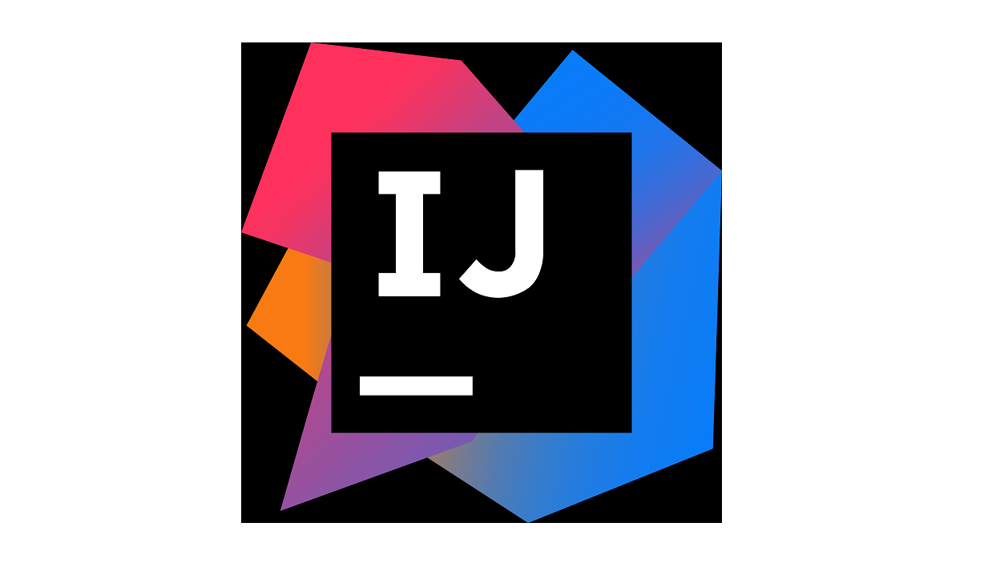

## 技术文章

| [Java 面试](https://segmentfault.com/a/1190000016172470)     | [算法套路解析 labuladong](https://labuladong.gitbook.io)     | [彻底搞懂epoll高效运行的原理](https://www.jianshu.com/p/31cdfd6f5a48) |
| ------------------------------------------------------------ | ------------------------------------------------------------ | ------------------------------------------------------------ |
| [一次Java线程池误用引发的血案和总结](https://blog.csdn.net/jiankunking/article/details/79253053) | [一篇文章搞定Github API 调用 (v3）](https://segmentfault.com/a/1190000015144126) | [leetcode 解题教程](http://lucifer.ren/leetcode/)            |
| [LeetCode 教程](https://liweiwei1419.gitee.io/leetcode-algo/) | [ 这一次，彻底弄懂 JavaScript 执行机制](https://juejin.im/post/59e85eebf265da430d571f89) | [[译] JavaScript 如何工作：对引擎、运行时、调用堆栈的概述](https://juejin.im/post/5a05b4576fb9a04519690d42) |
| [一片文章看懂 Docker](https://zhuanlan.zhihu.com/p/53260098?utm_source=wechat_session&utm_medium=social&utm_oi=794623637738123264) | [最详细的 Spring 核心 IOC 的源码分析(每次看都有不同的感悟)](https://blog.csdn.net/nuomizhende45/article/details/81158383) | [Thinking in Ramda](https://zhuanlan.zhihu.com/p/27473549)   |
| [一次弄懂 Event Loop（彻底解决此类面试问题](https://juejin.im/post/5c3d8956e51d4511dc72c200) | [TCP 的那些事儿（上）](https://coolshell.cn/articles/11564.html) | [Windows 中的键盘快捷方式](https://support.microsoft.com/zh-cn/help/12445/windows-keyboard-shortcuts) |
| [史上最简单的 SpringCloud 教程 \| 终章](https://blog.csdn.net/forezp/article/details/70148833/) | [动图演示23个鲜为人知的VSCode快捷键](https://juejin.im/post/5e2024485188254df874102b) | [jvm 指令集](https://en.wikipedia.org/wiki/Java_bytecode_instruction_listings) |
| [Vue render](https://www.jianshu.com/p/7508d2a114d3)         | [VuePress 配置指南](https://segmentfault.com/a/1190000017953711) | [JavaScript 实现装饰器模式](https://www.cnblogs.com/coolslider/p/8459729.html) |
| [ES6 Top Tips](https://gitee.com/-/ide/project/xiaoxiunique/atom-blog/edit/master/-/README.md) | [Vue 的26个技巧](https://michaelnthiessen.com/26-time-saving-tips/) | [给老婆解释，什么是Restful Api](https://zhuanlan.zhihu.com/p/30396391) |
| [RESTful API 设计指南](http://www.ruanyifeng.com/blog/2014/05/restful_api.html) | [emoji 表情展示网站😎](https://getemoji.com/)                 | [markdown 表情代码展示地址](https://www.webfx.com/tools/emoji-cheat-sheet/) |
| [面试最常考的20个链表问题](https://www.geeksforgeeks.org/top-20-linked-list-interview-question/) | [微博计数器设计](https://blog.cydu.net/weidesign/2012/09/09/weibo-counter-service-design-2/) | [MongoDB 索引](https://zhuanlan.zhihu.com/p/77971681)        |
| [算法动画演示](https://visualgo.net/zh)                      | [MSDN 下载](https://msdn.itellyou.cn/)                       | [设计模式](https://refactoringguru.cn/)                      |
| [Git 规范](https://juejin.im/post/5b4328bbf265da0fa21a6820#heading-4) | [Node Buffer](https://livecodestream.dev/post/2020-06-06-a-complete-introduction-to-node-buffers/) | [AES 加密算法](https://blog.csdn.net/zxh2075/article/details/80630296) |
| [Git 代码表情提交](https://gitmoji.carloscuesta.me/)         | [揭秘前端文件上传](https://cloud.tencent.com/developer/article/1500791) |                                                              |

## 网站

- [Squoosh](https://squoosh.app/)
- [Java](https://www.pdai.tech/md/java/basic/java-basic-lan-basic.html)

## 工具软件

| [PicGo](https://github.com/Molunerfinn/PicGo)                | [Snipaste](https://zh.snipaste.com/)                         | [IDM](https://www.internetdownloadmanager.com/)              | [pandownload](pandownload.com)                               | [火柴](http://huochaipro.com/)                               |
| ------------------------------------------------------------ | ------------------------------------------------------------ | ------------------------------------------------------------ | ------------------------------------------------------------ | ------------------------------------------------------------ |
| [Terminus](https://github.com/Eugeny/terminus/releases/tag/v1.0.77) | [ScreenToGif](https://www.screentogif.com/?l=zh_cn)          | [QQ 影音](http://player.qq.com/)                             | [Free Download Manager](https://www.freedownloadmanager.org/zh/) | [Teamviewer](https://www.teamviewer.cn/cn/?pid=google.tv.teamviewer_exact.s.cn&gclid=Cj0KCQjw_r3nBRDxARIsAJljleE_tA4zSLrXlKrM7044Whu4T7O1X9HViDMCYvR3_duf7CuYmh3Rx6oaAvR1EALw_wcB) |
| [Typora](https://www.typora.io/#windows)                     | [Ditto](https://ditto-cp.sourceforge.io/)                    | [天若OCR](https://tianruoocr.cn/server/index.php)            | [Quicker](https://getquicker.net/)                           | [Seer](http://www.1218.io/seer.html)                         |
| [Source Tree](https://www.sourcetreeapp.com/)                | [AnotherRedisDesktopManager](https://github.com/qishibo/AnotherRedisDesktopManager/releases) | [Uninstall-Tool](https://www.3987.com/xiazai/1/17/1043.html) | [Mac 下载工具](https://github.com/yangshun1029/aria2gui)     |                                                              |

## Chrome 插件

- 广告终结者
- 开发工具箱
- Wappalyzer
- AdBlock
- FireShot
- 掘金
- EverNote
- OctoTree
- 谷歌翻译插件
- Tampermonkey
- Talent API Tester
- Dark Reader
- Enable LiveReload
- Css Used
- Grammarly
- Secure Shell Extension 
- 扩展管理器
- Vimium
- Autopagerize for Chrome
- IDM Integration Module
- 沙拉查词
- Cliboard History Pro
- JSON Formatter
- 增强复制

### VsCode 扩展

- aiXcoder
- Alibaba Cloud Toolkit
- any-rule
- Auto Close Tag
- Auto Rename Tag
- Awesome Flutter Snippets
- Beautify
- Bracket Pair Colorizer
- CodeIf
- Color Highlight
- Console Log
- Debugger for Chrome
- Docker
- Document This
- EditorConfig for VS Code
- ESLint
- Form Generator Plugin
- Git Blame
- Git History
- GitLens
- Gulp Snippets
- Gulp Tasks
- Js Refactor
- LeetCode
- Local History
- Lodash
- Lodash Snippets
- Markdown all in one
- npm intellisense
- Open file From Path
- Path Autocomplate
- Prettier
- Settings Sysc
- SFTP
- stylus
- todo
- TODO Highlight
- TODO Tree
- Vetur
- Vue2 Snippets
- Code Runner

### Github stars

- nprogress
- clipboard
- vuetify
- element-ui
- lodash
- moment
- goaccess
- arthas
- hutool
- ramda
- minio
- docker
- k8s
- draw.io
- arya 在线 markdown 编辑器
- form-generator
- clean -code-js
- clean-code-javascript
- xxl-job
- You-Dont-Know-JS
- [nginxconfig.io](http://nginxconfig.io/)
- 12306
- JustAuth
- AnotherRedisDesktopManager
- learn-regex
- Daily-Interview-Question
- git-tips
- PicGo
- node-in-debugging
- nodebestpractices
  node 的最佳实践
-  litemall
  spring boot + vue 商城项目
- devdocs
- go-github

### IDEA 插件

- Alibaba Cloud ToolKit
- Alibaba Java Coding Guidelines
- Translation
- Free Mybatis Plugin
- IntelliJ Lombok plugin
- GenAllSetter
- GenDaoCode
- CodeGlance
- RestfulToolkit
- Grep Console
- MyBatis Log Plugin
- GsonFormat
- VisualVm Launcher
- jclasslib bytecode viewer
- Codota
- Auto filling Java call arguments
- Rainbow Brackets
- SequenceDiagram
- Java Stream Debugger
- Arthas Idea
- easy code
- AceJump