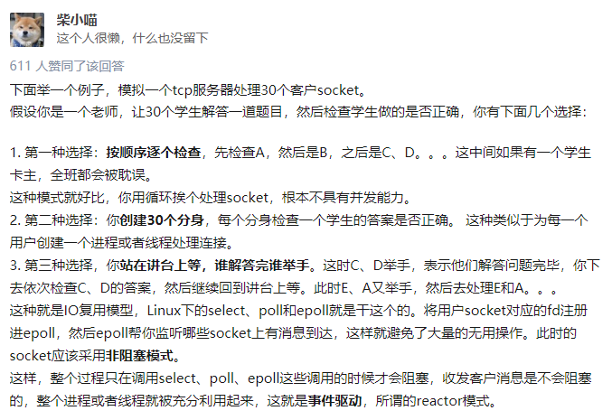
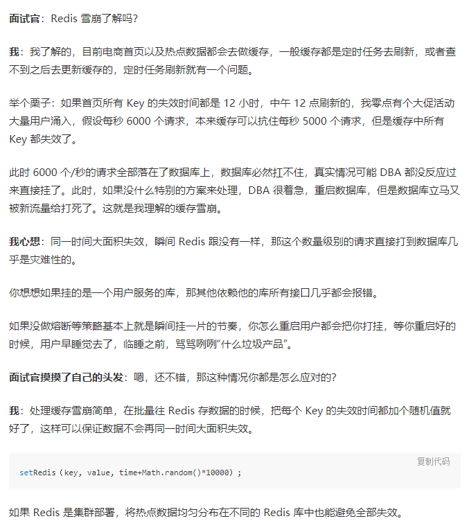
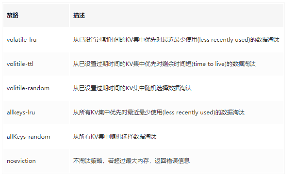

### 通俗的理解 IO 多路复用



### Redis 基本数据类型

- string

  <!--  -->

- hash

- list

  

- set

  - hash table

- zset

  - hashMap + skip list

### Redis 缓存雪崩



### 缓存穿透

### 缓存击穿

缓存击穿不同的是缓存击穿是指一个 Key 非常热点，在不停地扛着大量的请求，大并发集中对这一个点进行访问，当这个 Key 在失效的瞬间，持续的大并发直接落到了数据库上，就在这个 Key 的点上击穿了缓存。

解决：缓存数据永不过期，使用互斥锁解决

```java
public static String getData(String key) throws InterruptedException {
    //从Redis查询数据
    String result = getDataByKV(key);
    //参数校验
    if (StringUtils.isBlank(result)) {
        try {
            //获得锁
            if (reenLock.tryLock()) {
                //去数据库查询
                result = getDataByDB(key);
                //校验
                if (StringUtils.isNotBlank(result)) {
                    //插进缓存
                    setDataToKV(key, result);
                }
            } else {
                //睡一会再拿
                Thread.sleep(100L);
                result = getData(key);
            }
        } finally {
            //释放锁
            reenLock.unlock();
        }
    }
    return result;
}

```

### Redis 淘汰策略



=======