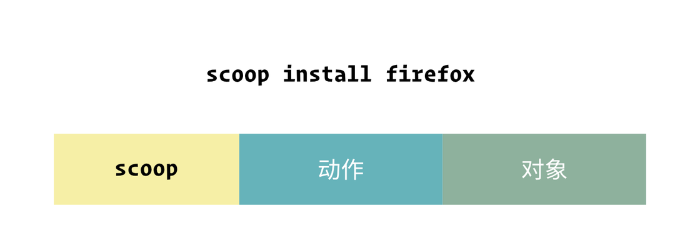

### Sqoop

在 PowerShell 中输入下面内容，保证允许本地脚本的执行：

```powershell
set-executionpolicy remotesigned -scope currentuser
```

然后执行下面的命令安装 Scoop：指定环境变量

```powershell
$env:SCOOP='D:\Applications\Scoop'
[Environment]::SetEnvironmentVariable('SCOOP', $env:SCOOP, 'User')
iex (new-object net.webclient).downloadstring('https://get.scoop.sh')
```


```powershell
sqoop help
```


源包

```json
{
    "main": "https://github.com/ScoopInstaller/Main",
    "extras": "https://github.com/lukesampson/scoop-extras",
    "versions": "https://github.com/ScoopInstaller/Versions",
    "nightlies": "https://github.com/ScoopInstaller/Nightlies",
    "nirsoft": "https://github.com/kodybrown/scoop-nirsoft",
    "php": "https://github.com/ScoopInstaller/PHP",
    "nerd-fonts": "https://github.com/matthewjberger/scoop-nerd-fonts",
    "nonportable": "https://github.com/TheRandomLabs/scoop-nonportable",
    "java": "https://github.com/ScoopInstaller/Java",
    "games": "https://github.com/Calinou/scoop-games",
    "jetbrains": "https://github.com/Ash258/Scoop-JetBrains"
}
```


本地添加源

```powershell
scoop bucket add extras
```


