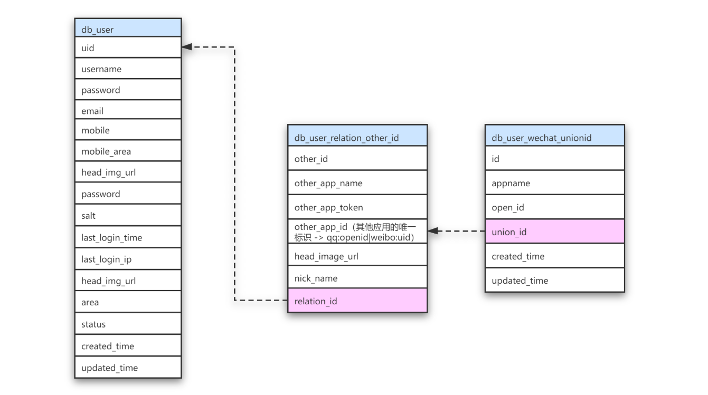
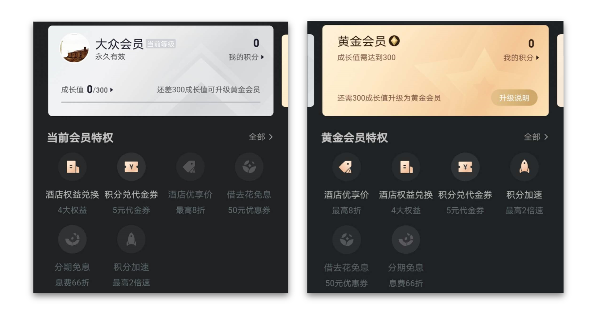
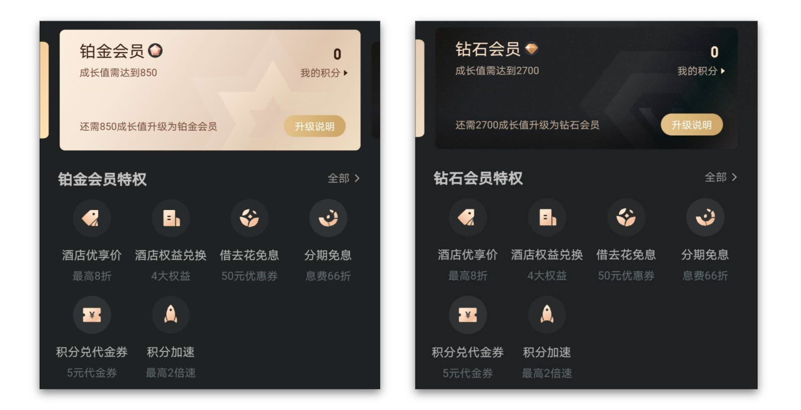
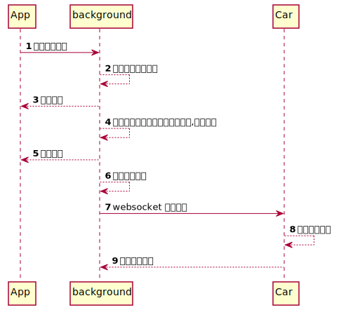

### 第三方登录数据库设计

在这里我们需要为微信多创建一张表，用来维护 union_id 和 open_id 之间的关系，因为在微信中同一个用户的 union_id 是一样的，但是在不同平台的 open_id 不一样。所以在第三方登录关联表中，存储的是微信的 union_id。

### App 积分设计

考虑会有哪些表？

| 表名                                | 描述                                                         |
| ----------------------------------- | ------------------------------------------------------------ |
| 规则表（mcenter_honor_rule)         | 记录添加积分会有哪些规则，例如：有的操作是只触发一次，有的操作可以多次触发 |
| 积分等级表（mcenter_member_level）  | 记录当前系统会员有哪些等级（大众会员、黄金会员、铂金会员、钻石会员） |
| 积分记录表（mcenter_score_record)   | 记录会员的加分记录，什么时间 因为什么操作 加了 多少分        |
| 积分记录表（mcenter_score_collect） | 记录会员的总分                                               |

### 车辆网 车辆诊断 流程图

### 车辆网 架构图

