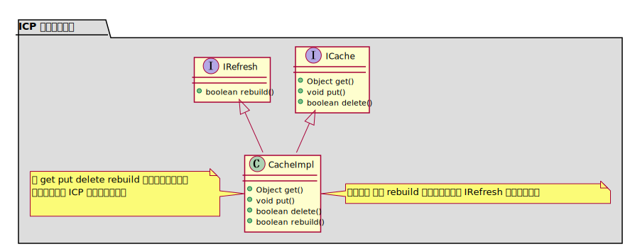

[[TOC]]


### 设计原则指导思想


书写良好程序的总体思想都是为实现 **高内聚低耦合** 而服务的。

**设计原则是指导思想**，从思想上给我们指明程序设计的正确方向，是我们开发设计过程中应该尽力遵守的准则。

**设计模式是实现手段**，所以设计模式也需要遵守 **设计原则**，要达到的目标就是 **高内聚低耦合**

经典的设计原则包括 SOLID、KISS、YAGNI、DRY、LOD。


### Tips

- 设计模式要做的事就是解耦。
- **创建型模式**是将创建和使用代码解耦。
- **结构型模式**是将不同功能解耦。
- **行为型模式**是将不同的行为解耦。


:::warning

遵守设计原则是好，但是过犹不及，在实际项目中我们不要刻板遵守，需要根据实际情况灵活运用。

:::


### SRP 单一职责原则

定义：一个类只负责完成一个职责或功能，不要设计**大而全**的类，要**设计粒度小，功能单一**的类。**单一职责原则**是为了实现代码高内聚、低耦合，提高代码的复用性、可读性、可维护性。


**如何判断类的职责是否单一？**

- 类中的代码行数、函数或者属性过多。

- 类依赖的其他类过多，或者依赖类的其他类过多。

- 私有方法过多。

- 比较难起一个合适的名字。

- 类中大量的方法都是操作类中的某个属性。

	

评价一个类的职责是否足够单一，我们并没有一个非常明确的、可以量化的标准，可以说，这是件非常主观、仁者见仁智者见智的事情。实际上，在真正的软件开发中，我们也没必要过于未雨绸缪，过度设计。所以，**我们可以先写一个粗粒度的类，满足业务需求。随着业务的发展，如果粗粒度的类越来越庞大，代码越来越多，这个时候，我们就可以将这个粗粒度的类，拆分成几个更细粒度的类。这就是所谓的持续重构**


### OCP 开放封闭原则

定义：软件实体（模块、类、方法）应该对 **扩展开放，对修改关闭**。

这个描述比较简略，如果我们详细表述一下，那就是，添加一个新的功能应该是，在已有代码基础上扩展代码（新增模块、类、方法等），而非修改已有代码（修改模块、类、方法等）。


**为了深入理解 OCP 原则，这里结合程序案列查看。**


这是一段 API 接口监控告警的代码。其中，AlertRule 存储告警规则，可以自由设置。Notification 是告警通知类，支持邮件、短信、微信、手机等多种通知渠道。NotificationEmergencyLevel 表示通知的紧急程度，包括 SEVERE（严重）、URGENCY（紧急）、NORMAL（普通）、TRIVIAL（无关紧要），不同的紧急程度对应不同的发送渠道。

```java

public class Alert {
  private AlertRule rule;
  private Notification notification;

  public Alert(AlertRule rule, Notification notification) {
    this.rule = rule;
    this.notification = notification;
  }

  public void check(String api, long requestCount, long errorCount, long durationOfSeconds) {
    long tps = requestCount / durationOfSeconds;
    if (tps > rule.getMatchedRule(api).getMaxTps()) {
      notification.notify(NotificationEmergencyLevel.URGENCY, "...");
    }
    if (errorCount > rule.getMatchedRule(api).getMaxErrorCount()) {
      notification.notify(NotificationEmergencyLevel.SEVERE, "...");
    }
  }
}
```


上面这段代码非常简单，业务逻辑主要集中在 check() 函数中。当接口的 TPS 超过某个预先设置的最大值时，以及当接口请求出错数大于某个最大允许值时，就会触发告警，通知接口的相关负责人或者团队。


现在，如果我们需要添加一个功能，当每秒钟接口超时请求个数，超过某个预先设置的最大阈值时，我们也要触发告警发送通知。这个时候，我们该如何改动代码呢？主要的改动有两处：第一处是修改 check() 函数的入参，添加一个新的统计数据 timeoutCount，表示超时接口请求数；第二处是在 check() 函数中添加新的告警逻辑。具体的代码改动如下所示：

```java

public class Alert {
  // ...省略AlertRule/Notification属性和构造函数...
  
  // 改动一：添加参数timeoutCount
  public void check(String api, long requestCount, long errorCount, long timeoutCount, long durationOfSeconds) {
    long tps = requestCount / durationOfSeconds;
    if (tps > rule.getMatchedRule(api).getMaxTps()) {
      notification.notify(NotificationEmergencyLevel.URGENCY, "...");
    }
    if (errorCount > rule.getMatchedRule(api).getMaxErrorCount()) {
      notification.notify(NotificationEmergencyLevel.SEVERE, "...");
    }
    // 改动二：添加接口超时处理逻辑
    long timeoutTps = timeoutCount / durationOfSeconds;
    if (timeoutTps > rule.getMatchedRule(api).getMaxTimeoutTps()) {
      notification.notify(NotificationEmergencyLevel.URGENCY, "...");
    }
  }
}
```

这样的代码修改实际上存在挺多问题的。

- 我们对接口进行了修改，这就意味着调用这个接口的代码都要做相应的修改。

- 修改了 check() 函数，相应的单元测试都需要修改。

上面的代码改动是基于“修改”的方式来实现新功能的。如果我们遵循开闭原则，也就是“对扩展开放、对修改关闭”。那如何通过“扩展”的方式，来实现同样的功能呢？


我们先重构一下之前的 Alert 代码，让它的扩展性更好一些。重构的内容主要包含两部分：

- 第一部分是将 check() 函数的多个入参封装成 ApiStatInfo 类；
- 第二部分是引入 handler 的概念，将 if 判断逻辑分散在各个 handler 中。

具体代码实现如下：

```java

public class Alert {
  private List<AlertHandler> alertHandlers = new ArrayList<>();
  
  public void addAlertHandler(AlertHandler alertHandler) {
    this.alertHandlers.add(alertHandler);
  }

  public void check(ApiStatInfo apiStatInfo) {
    for (AlertHandler handler : alertHandlers) {
      handler.check(apiStatInfo);
    }
  }
}

public class ApiStatInfo {//省略constructor/getter/setter方法
  private String api;
  private long requestCount;
  private long errorCount;
  private long durationOfSeconds;
}

public abstract class AlertHandler {
  protected AlertRule rule;
  protected Notification notification;
  public AlertHandler(AlertRule rule, Notification notification) {
    this.rule = rule;
    this.notification = notification;
  }
  public abstract void check(ApiStatInfo apiStatInfo);
}

public class TpsAlertHandler extends AlertHandler {
  public TpsAlertHandler(AlertRule rule, Notification notification) {
    super(rule, notification);
  }

  @Override
  public void check(ApiStatInfo apiStatInfo) {
    long tps = apiStatInfo.getRequestCount()/ apiStatInfo.getDurationOfSeconds();
    if (tps > rule.getMatchedRule(apiStatInfo.getApi()).getMaxTps()) {
      notification.notify(NotificationEmergencyLevel.URGENCY, "...");
    }
  }
}

public class ErrorAlertHandler extends AlertHandler {
  public ErrorAlertHandler(AlertRule rule, Notification notification){
    super(rule, notification);
  }

  @Override
  public void check(ApiStatInfo apiStatInfo) {
    if (apiStatInfo.getErrorCount() > rule.getMatchedRule(apiStatInfo.getApi()).getMaxErrorCount()) {
      notification.notify(NotificationEmergencyLevel.SEVERE, "...");
    }
  }
}
```

上面的代码是对 Alert 的重构，我们再来看下，重构之后的 Alert 该如何使用呢？具体的使用代码我也写在这里了。

其中，ApplicationContext 是一个单例类，负责 Alert 的创建、组装（alertRule 和 notification 的依赖注入）、初始化（添加 handlers）工作。

```java

public class ApplicationContext {
  private AlertRule alertRule;
  private Notification notification;
  private Alert alert;
  
  public void initializeBeans() {
    alertRule = new AlertRule(/*.省略参数.*/); //省略一些初始化代码
    notification = new Notification(/*.省略参数.*/); //省略一些初始化代码
    alert = new Alert();
    alert.addAlertHandler(new TpsAlertHandler(alertRule, notification));
    alert.addAlertHandler(new ErrorAlertHandler(alertRule, notification));
  }
  public Alert getAlert() { return alert; }

  // 饿汉式单例
  private static final ApplicationContext instance = new ApplicationContext();
  private ApplicationContext() {
    instance.initializeBeans();
  }
  public static ApplicationContext getInstance() {
    return instance;
  }
}

public class Demo {
  public static void main(String[] args) {
    ApiStatInfo apiStatInfo = new ApiStatInfo();
    // ...省略设置apiStatInfo数据值的代码
    ApplicationContext.getInstance().getAlert().check(apiStatInfo);
  }
}
```


现在，我们再来看下，基于重构之后的代码，如果再添加上面讲到的那个新功能，每秒钟接口超时请求个数超过某个最大阈值就告警，我们又该如何改动代码呢？主要的改动有下面四处。

- 第一处改动是：在 ApiStatInfo 类中添加新的属性 timeoutCount。
- 第二处改动是：添加新的 TimeoutAlertHander 类。
- 第三处改动是：在 ApplicationContext 类的 initializeBeans() 方法中，往 alert 对象中注册新的 timeoutAlertHandler。
- 第四处改动是：在使用 Alert 类的时候，需要给 check() 函数的入参 apiStatInfo 对象设置 timeoutCount 的值。


改动后的代码：

```java

public class Alert { // 代码未改动... }
public class ApiStatInfo {//省略constructor/getter/setter方法
  private String api;
  private long requestCount;
  private long errorCount;
  private long durationOfSeconds;
  private long timeoutCount; // 改动一：添加新字段
}
public abstract class AlertHandler { //代码未改动... }
public class TpsAlertHandler extends AlertHandler {//代码未改动...}
public class ErrorAlertHandler extends AlertHandler {//代码未改动...}
// 改动二：添加新的handler
public class TimeoutAlertHandler extends AlertHandler {//省略代码...}

public class ApplicationContext {
  private AlertRule alertRule;
  private Notification notification;
  private Alert alert;
  
  public void initializeBeans() {
    alertRule = new AlertRule(/*.省略参数.*/); //省略一些初始化代码
    notification = new Notification(/*.省略参数.*/); //省略一些初始化代码
    alert = new Alert();
    alert.addAlertHandler(new TpsAlertHandler(alertRule, notification));
    alert.addAlertHandler(new ErrorAlertHandler(alertRule, notification));
    // 改动三：注册handler
    alert.addAlertHandler(new TimeoutAlertHandler(alertRule, notification));
  }
  //...省略其他未改动代码...
}

public class Demo {
  public static void main(String[] args) {
    ApiStatInfo apiStatInfo = new ApiStatInfo();
    // ...省略apiStatInfo的set字段代码
    apiStatInfo.setTimeoutCount(289); // 改动四：设置tiemoutCount值
    ApplicationContext.getInstance().getAlert().check(apiStatInfo);
}
```

重构之后的代码更加灵活和易扩展。如果我们要想添加新的告警逻辑，只需要基于扩展的方式创建新的 handler 类即可，不需要改动原来的 check() 函数的逻辑。而且，我们只需要为新的 handler 类添加单元测试，老的单元测试都不会失败，也不用修改。


:::tip

我们要时刻具备扩展意识、抽象意识、封装意识。在写代码的时候，我们要多花点时间思考一下，这段代码未来可能有哪些需求变更，如何设计代码结构，事先留好扩展点，以便在未来需求变更的时候，在不改动代码整体结构、做到最小代码改动的情况下，将新的代码灵活地插入到扩展点上。

:::


### LSP 里式替换原则

定义：子类对象（object of subtype/derived class）能够替换程序（program）中父类对象（object of base/parent class）出现的任何地方，并且保证原来程序的逻辑行为（behavior）不变及正确性不被破坏。


#### 几个违反里式替换原则的例子

- **子类违背父类要实现的功能**

	父类中提供的 sortOrdersByAmount() 订单排序函数，是按照金额从小到大来给订单排序的，而子类重写这个 sortOrdersByAmount() 订单排序函数之后，是按照创建日期来给订单排序的。那子类的设计就违背里式替换原则。

- **子类违背父类对输入、输出、异常的约定**

	在父类中，某个函数约定：运行出错的时候返回 null；获取数据为空的时候返回空集合（empty collection）。而子类重载函数之后，实现变了，运行出错返回异常（exception），获取不到数据返回 null。那子类的设计就违背里式替换原则。在父类中，某个函数约定，输入数据可以是任意整数，但子类实现的时候，只允许输入数据是正整数，负数就抛出，也就是说，子类对输入的数据的校验比父类更加严格，那子类的设计就违背了里式替换原则。在父类中，某个函数约定，只会抛出 ArgumentNullException 异常，那子类的设计实现中只允许抛出 ArgumentNullException 异常，任何其他异常的抛出，都会导致子类违背里式替换原则。


### ICP 接口隔离原则

理解**接口隔离原则**的重点是理解其中的**接口**二字。这里有三种不同的理解。

- 如果把“接口”理解为一组接口集合，可以是某个微服务的接口，也可以是某个类库的接口等。如果部分接口只被部分调用者使用，我们就需要将这部分接口隔离出来，单独给这部分调用者使用，而不强迫其他调用者也依赖这部分不会被用到的接口。

- 如果把“接口”理解为单个 API 接口或函数，部分调用者只需要函数中的部分功能，那我们就需要把函数拆分成粒度更细的多个函数，让调用者只依赖它需要的那个细粒度函数。

- 如果把“接口”理解为 OOP 中的接口，也可以理解为面向对象编程语言中的接口语法。那接口的设计要尽量单一，不要让接口的实现类和调用者，依赖不需要的接口函数。





### DIP 依赖倒置原则

高层模块不要依赖低层模块。高层模块和低层模块应该通过抽象来互相依赖。除此之外，不要依赖具体实现细节，具体实现细节依赖抽象。

程序要依赖于抽象接口，不要依赖于具体实现。简单的说就是要求对抽象进行编程，不要对实现进行编程，这样就降低了客户与实现模块间的耦合。


**理解依赖倒置原则，结合 Spring 的 IOC 和 DI 会更好理解一些。**


#### IOC 控制翻转

```java

public class UserServiceTest {
  public static boolean doTest() {
    // ... 
  }
  
  public static void main(String[] args) {//这部分逻辑可以放到框架中
    if (doTest()) {
      System.out.println("Test succeed.");
    } else {
      System.out.println("Test failed.");
    }
  }
}
```

在上面的代码中，所有的流程都由程序员来控制。

如果我们抽象出一个下面这样一个框架，我们再来看，如何利用框架来实现同样的功能。具体的代码实现如下所示：

```java

public abstract class TestCase {
  public void run() {
    if (doTest()) {
      System.out.println("Test succeed.");
    } else {
      System.out.println("Test failed.");
    }
  }
  
  public abstract boolean doTest();
}

public class JunitApplication {
  private static final List<TestCase> testCases = new ArrayList<>();
  
  public static void register(TestCase testCase) {
    testCases.add(testCase);
  }
  
  public static final void main(String[] args) {
    for (TestCase case: testCases) {
      case.run();
    }
  }
```

把这个简化版本的测试框架引入到工程中之后，我们只需要在框架预留的扩展点，也就是 TestCase 类中的 doTest() 抽象函数中，填充具体的测试代码就可以实现之前的功能了，完全不需要写负责执行流程的 main() 函数了。 

具体的代码如下所示：

```java

public class UserServiceTest extends TestCase {
  @Override
  public boolean doTest() {
    // ... 
  }
}

// 注册操作还可以通过配置的方式来实现，不需要程序员显示调用register()
JunitApplication.register(new UserServiceTest();
```


刚刚举的这个例子，就是典型的通过框架来实现“控制反转”的例子。框架提供了一个可扩展的代码骨架，用来组装对象、管理整个执行流程。程序员利用框架进行开发的时候，只需要往预留的扩展点上，添加跟自己业务相关的代码，就可以利用框架来驱动整个程序流程的执行。


:::tip

这里的**控制**指的是对程序执行流程的控制，而**反转**指的是在没有使用框架之前，程序员自己控制整个程序的执行。在使用框架之后，整个程序的执行流程可以通过框架来控制。流程的控制权从程序员**反转**到了框架。

:::


#### DI 依赖注入

不通过 new() 的方式在类内部创建依赖类对象，而是将依赖的类对象在外部创建好之后，通过构造函数、函数参数等方式传递（或注入）给类使用。


#### 依赖注入框架

我们通过依赖注入框架提供的扩展点，简单配置一下所有需要的类及其类与类之间依赖关系，就可以实现由框架来自动创建对象、管理对象的生命周期、依赖注入等原本需要程序员来做的事情。


### Kiss 原则

尽量保持简单原则。


**如何写出满足 KISS 原则的代码？**

- 不要使用同事可能不懂的技术来实现代码。比如前面例子中的正则表达式，还有一些编程语言中过于高级的语法等。
- 不要重复造轮子，要善于使用已经有的工具类库。经验证明，自己去实现这些类库，出 bug 的概率会更高，维护的成本也比较高。
- 不要过度优化。不要过度使用一些奇技淫巧（比如，位运算代替算术运算、复杂的条件语句代替 if-else、使用一些过于底层的函数等）来优化代码，牺牲代码的可读性。

:::warning

实际上，代码是否足够简单是一个挺主观的评判。同样的代码，有的人觉得简单，有的人觉得不够简单。而往往自己编写的代码，自己都会觉得够简单。所以，评判代码是否简单，还有一个很有效的间接方法，那就是 code review。如果在 code review 的时候，同事对你的代码有很多疑问，那就说明你的代码有可能不够“简单”，需要优化啦。

:::


### YANG 

不要去设计当前用不到的功能；不要去编写当前用不到的代码。实际上，这条原则的核心思想就是：不要做过度设计。


我们的系统暂时只用 Redis 存储配置信息，以后可能会用到 ZooKeeper。根据 YAGNI 原则，在未用到 ZooKeeper 之前，我们没必要提前编写这部分代码。当然，这并不是说我们就不需要考虑代码的扩展性。我们还是要预留好扩展点，等到需要的时候，再去实现 ZooKeeper 存储配置信息这部分代码。


### DRY 原则

不要写重复的代码。


**提高代码复用性的一些方法**

- 减少代码耦合
- 满足单一职责原则
- 模块化业务与非业务逻辑分离
- 通用代码下沉
- 继承、多态、抽象、封装
- 应用模板等设计模式


### LOD 迪米特原则

也叫最小知识原则。


不该有直接依赖关系的类之间，不要有依赖；有依赖关系的类之间，尽量只依赖必要的接口。迪米特法则是希望减少类之间的耦合，让类越独立越好。每个类都应该少了解系统的其他部分。一旦发生变化，需要了解这一变化的类就会比较少。