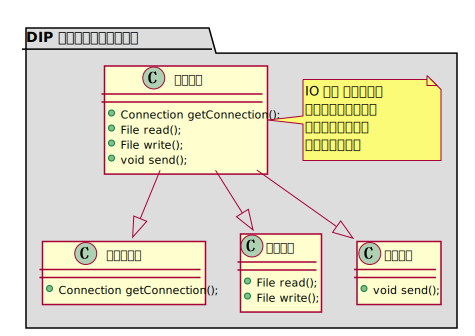
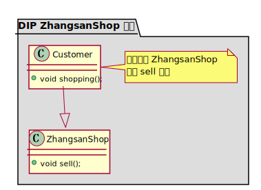
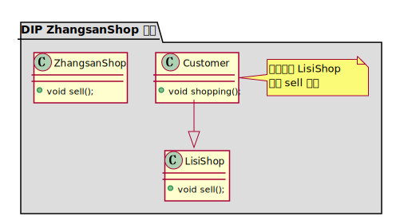
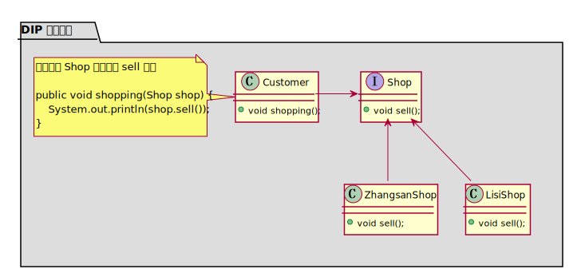

### 简介

DIP 依赖倒置原则，高层模块不要依赖低层模块。高层模块和低层模块应该通过抽象来互相依赖。除此之外，不要依赖具体实现细节，具体实现细节依赖抽象。

程序要依赖于抽象接口，不要依赖于具体实现。简单的说就是要求对抽象进行编程，不要对实现进行编程，这样就降低了客户与实现模块间的耦合。


### 如何理解倒置？

在面向过程的开发时，为了使得常用代码可以复用，一般都会把这些常用代码写成许许多多函数的函数库，这样我在做新项目时，去调用这些底层的函数就可以了。比如我们做的项目大多都要访问数据库，所以我们就把访问数据库的代码写成函数，每次新做项目时就去调用这些函数。这就交搞成模块依赖低层模块。




问题也就出现在这里，我们要做新项目时，发现业务逻辑的高层模块都是一样的，但客户却希望使用不同的数据库或存储信息方式，这时就出现麻烦了。我们希望再次利用这些高层模块，单高层模块都是与低层的访问数据库绑定在一起的，就没有办法复用高层模块。


### 依赖倒置的作用

- 依赖倒置原则可以降低类间的耦合性。
- 依赖倒置原则可以提高系统的稳定性。
- 依赖倒置原则可以减少并行开发引起的风险。
- 依赖倒置原则可以提高代码的可读性和可维护性。


### 依赖倒置原则的应用

下面以“顾客购物程序”为例来说明依赖倒置原则的应用。

本程序反映了 “顾客类”与“商店类”的关系。商店类中有 sell() 方法，顾客类通过该方法购物以下代码定义了顾客类通过张三网店 ZhangsanShop 购物：

```java
class Customer {
	public void shopping(ZhangsanShop shop) {
        // 购物
        System.out.println(shop.sell());
    }
}
```



但是，这种设计存在缺点，如果该顾客想从另外一家商店（如李四店 LisiShop）购物，就要将该顾客的代码修改如下：

```java
class Customer{
    public void shopping(LisiShop shop){
        //购物
        System.out.println(shop.sell());
    }
}
```



顾客每更换一家商店，都要修改一次代码，这明显违背了开闭原则。存在以上缺点的原因是：顾客类设计时同具体的商店类绑定了，这违背了依赖倒置原则。


### 解决方法

定义“张三网店”和“李四网店”的共同接口 Shop，顾客类面向该接口编程，其代码修改如下：

```java
class Customer{
    public void shopping(Shop shop){
        //购物
        System.out.println(shop.sell());
    }
}
```

这样，不管顾客类 Customer 访问什么商店，或者增加新的商店，都不需要修改原有代码了.

