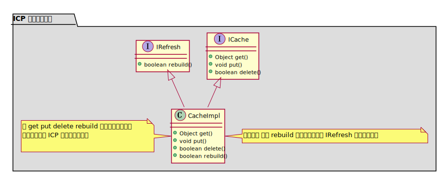

### 简介

接口隔离原则（Interface Segregation Principle，ISP）要求程序员尽量将臃肿庞大的接口拆分成更小的和更具体的接口，让接口中只包含客户感兴趣的方法。

:::warning

2002 年罗伯特·C.马丁给“接口隔离原则”的定义是：客户端不应该被迫依赖于它不使用的方法（Clients should not be forced to depend on methods they do not use）。该原则还有另外一个定义：一个类对另一个类的依赖应该建立在最小的接口上（The dependency of one class to another one should depend on the smallest possible interface）。

:::

理解**接口隔离原则**的重点是理解其中的**接口**二字。这里有三种不同的理解。

- 如果把“接口”理解为一组接口集合，可以是某个微服务的接口，也可以是某个类库的接口等。如果部分接口只被部分调用者使用，我们就需要将这部分接口隔离出来，单独给这部分调用者使用，而不强迫其他调用者也依赖这部分不会被用到的接口。

- 如果把“接口”理解为单个 API 接口或函数，部分调用者只需要函数中的部分功能，那我们就需要把函数拆分成粒度更细的多个函数，让调用者只依赖它需要的那个细粒度函数。

- 如果把“接口”理解为 OOP 中的接口，也可以理解为面向对象编程语言中的接口语法。那接口的设计要尽量单一，不要让接口的实现类和调用者，依赖不需要的接口函数。

