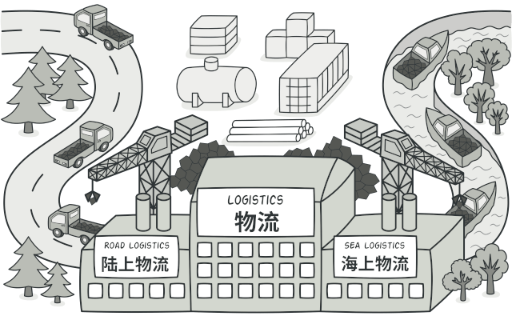

[[TOC]]




:::tip

**工厂方法模式**是一种创建型设计模式， 其在父类中提供一个创建对象的方法， 允许子类决定实例化对象的类型。

:::


**类似的场景具备以下特点**

- 访问者只需要知道产品名，就可以从工厂中获取得到对应的实例；
- 访问者不需要关心实例创建过程；


**工厂模式具有的几个概念**

- Factory：工厂，负责返回产品实例；
- Product：产品，访问者从工厂拿到产品实例；


一般情况下工厂模式细分为三种，简单工厂，工厂方法和抽象工厂。其中简单工厂，工厂方法原理比较简单在实际项目中也比较常用，这里主要记录中两种。


### 简单工厂

首先，我们来看，什么是简单工厂模式。我们通过一个例子来解释一下。

在下面这段代码中，我们根据配置文件的后缀（json、xml、yaml、properties），选择不同的解析器（JsonRuleConfigParser、XmlRuleConfigParser……），将存储在文件中的配置解析成内存对象 RuleConfig。

```java

public class RuleConfigSource {
  public RuleConfig load(String ruleConfigFilePath) {
    String ruleConfigFileExtension = getFileExtension(ruleConfigFilePath);
    IRuleConfigParser parser = null;
    if ("json".equalsIgnoreCase(ruleConfigFileExtension)) {
      parser = new JsonRuleConfigParser();
    } else if ("xml".equalsIgnoreCase(ruleConfigFileExtension)) {
      parser = new XmlRuleConfigParser();
    } else if ("yaml".equalsIgnoreCase(ruleConfigFileExtension)) {
      parser = new YamlRuleConfigParser();
    } else if ("properties".equalsIgnoreCase(ruleConfigFileExtension)) {
      parser = new PropertiesRuleConfigParser();
    } else {
      throw new InvalidRuleConfigException(
             "Rule config file format is not supported: " + ruleConfigFilePath);
    }

    String configText = "";
    //从ruleConfigFilePath文件中读取配置文本到configText中
    RuleConfig ruleConfig = parser.parse(configText);
    return ruleConfig;
  }

  private String getFileExtension(String filePath) {
    //...解析文件名获取扩展名，比如rule.json，返回json
    return "json";
  }
}	
```

**为了让代码逻辑更加清晰，可读性更好，我们要善于将功能独立的代码块封装成函数。**

按照这个设计思路，我们可以将代码中涉及 parser 创建的部分逻辑剥离出来，抽象成 createParser() 函数。重构之后的代码如下所示：

```java

  public RuleConfig load(String ruleConfigFilePath) {
    String ruleConfigFileExtension = getFileExtension(ruleConfigFilePath);
    IRuleConfigParser parser = createParser(ruleConfigFileExtension);
    if (parser == null) {
      throw new InvalidRuleConfigException(
              "Rule config file format is not supported: " + ruleConfigFilePath);
    }

    String configText = "";
    //从ruleConfigFilePath文件中读取配置文本到configText中
    RuleConfig ruleConfig = parser.parse(configText);
    return ruleConfig;
  }

  private String getFileExtension(String filePath) {
    //...解析文件名获取扩展名，比如rule.json，返回json
    return "json";
  }

  private IRuleConfigParser createParser(String configFormat) {
    IRuleConfigParser parser = null;
    if ("json".equalsIgnoreCase(configFormat)) {
      parser = new JsonRuleConfigParser();
    } else if ("xml".equalsIgnoreCase(configFormat)) {
      parser = new XmlRuleConfigParser();
    } else if ("yaml".equalsIgnoreCase(configFormat)) {
      parser = new YamlRuleConfigParser();
    } else if ("properties".equalsIgnoreCase(configFormat)) {
      parser = new PropertiesRuleConfigParser();
    }
    return parser;
  }
}
```

**为了让类的职责更加单一、代码更加清晰**，我们还可以进一步将 createParser() 函数剥离到一个独立的类中，让这个类只负责对象的创建。而这个类就是我们现在要讲的简单工厂模式类。具体的代码如下所示：

```java

public class RuleConfigSource {
  public RuleConfig load(String ruleConfigFilePath) {
    String ruleConfigFileExtension = getFileExtension(ruleConfigFilePath);
    IRuleConfigParser parser = RuleConfigParserFactory.createParser(ruleConfigFileExtension);
    if (parser == null) {
      throw new InvalidRuleConfigException(
              "Rule config file format is not supported: " + ruleConfigFilePath);
    }

    String configText = "";
    //从ruleConfigFilePath文件中读取配置文本到configText中
    RuleConfig ruleConfig = parser.parse(configText);
    return ruleConfig;
  }

  private String getFileExtension(String filePath) {
    //...解析文件名获取扩展名，比如rule.json，返回json
    return "json";
  }
}

public class RuleConfigParserFactory {
  public static IRuleConfigParser createParser(String configFormat) {
    IRuleConfigParser parser = null;
    if ("json".equalsIgnoreCase(configFormat)) {
      parser = new JsonRuleConfigParser();
    } else if ("xml".equalsIgnoreCase(configFormat)) {
      parser = new XmlRuleConfigParser();
    } else if ("yaml".equalsIgnoreCase(configFormat)) {
      parser = new YamlRuleConfigParser();
    } else if ("properties".equalsIgnoreCase(configFormat)) {
      parser = new PropertiesRuleConfigParser();
    }
    return parser;
  }
}
```


在上面的代码实现中，我们每次调用 RuleConfigParserFactory 的 createParser() 的时候，都要创建一个新的 parser。实际上，如果 parser 可以复用，为了节省内存和对象创建的时间，我们可以将 parser 事先创建好缓存起来。当调用 createParser() 函数的时候，我们从缓存中取出 parser 对象直接使用。

这有点类似单例模式和简单工厂模式的结合，具体的代码实现如下所示。在接下来的讲解中，我们把上一种实现方法叫作简单工厂模式的第一种实现方法，把下面这种实现方法叫作简单工厂模式的第二种实现方法。

```java

public class RuleConfigParserFactory {
  private static final Map<String, RuleConfigParser> cachedParsers = new HashMap<>();

  static {
    cachedParsers.put("json", new JsonRuleConfigParser());
    cachedParsers.put("xml", new XmlRuleConfigParser());
    cachedParsers.put("yaml", new YamlRuleConfigParser());
    cachedParsers.put("properties", new PropertiesRuleConfigParser());
  }

  public static IRuleConfigParser createParser(String configFormat) {
    if (configFormat == null || configFormat.isEmpty()) {
      return null;//返回null还是IllegalArgumentException全凭你自己说了算
    }
    IRuleConfigParser parser = cachedParsers.get(configFormat.toLowerCase());
    return parser;
  }
}
```


### 工厂方法

提供一个用于创建对象的接口(工厂接口)，让其实现类(工厂实现类)决定实例化哪一个类(产品类)，并且由该实现类创建对应类的实例。


按照工厂方法的定义，对上面的代码进行改造

```java

public interface IRuleConfigParserFactory {
  IRuleConfigParser createParser();
}

public class JsonRuleConfigParserFactory implements IRuleConfigParserFactory {
  @Override
  public IRuleConfigParser createParser() {
    return new JsonRuleConfigParser();
  }
}

public class XmlRuleConfigParserFactory implements IRuleConfigParserFactory {
  @Override
  public IRuleConfigParser createParser() {
    return new XmlRuleConfigParser();
  }
}

public class YamlRuleConfigParserFactory implements IRuleConfigParserFactory {
  @Override
  public IRuleConfigParser createParser() {
    return new YamlRuleConfigParser();
  }
}

public class PropertiesRuleConfigParserFactory implements IRuleConfigParserFactory {
  @Override
  public IRuleConfigParser createParser() {
    return new PropertiesRuleConfigParser();
  }
}
```

创建了工厂创建接口， 然后使其子类去实现。每个配置的创建都由子接口实现。这样当我们新增一种 parser 的时候，只需要新增一个实现了 IRuleConfigParserFactory 接口的 Factory 类即可。所以，**工厂方法模式比起简单工厂模式更加符合开闭原则。**


### JavaScript 的实现方式

```javascript
* 工厂类 */
class Factory {
    static getInstance(type) {
        switch (type) {
            case 'Product1':
                return new Product1()
            case 'Product2':
                return new Product2()
            default:
                throw new Error('当前没有这个产品')
        }
    }
}

/* 产品类1 */
class Product1 {
    constructor() { this.type = 'Product1' }
    
    operate() { console.log(this.type) }
}

/* 产品类2 */
class Product2 {
    constructor() { this.type = 'Product2' }
    
    operate() { console.log(this.type) }
}

const prod1 = Factory.getInstance('Product1')
prod1.operate()	// 输出: Product1
const prod2 = Factory.getInstance('Product3')		// 输出: Error 当前没有这个产品
```


### 工厂模式的适用场景

- **当你在编写代码的过程中**，**如果无法预知对象确切类别及其依赖关系时**，**可使用工厂方法**。
- **如果你希望用户能扩展你软件库或框架的内部组件**，**可使用工厂方法**.
- **如果你希望复用现有对象来节省系统资源**， **而不是每次都重新创建对象**，**可使用工厂方法**。