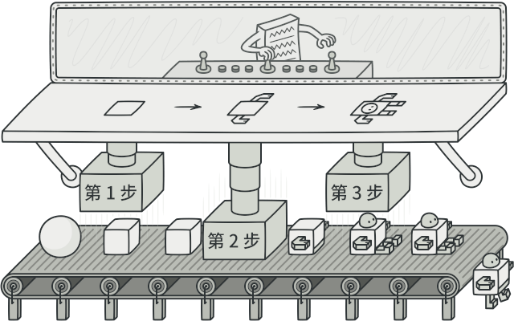
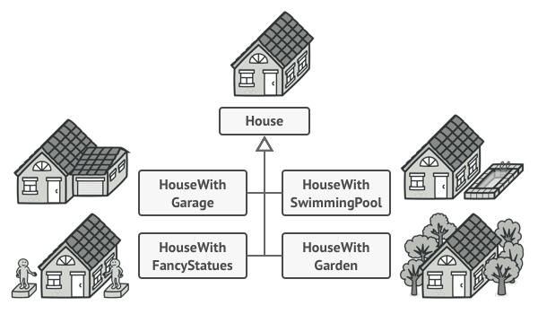
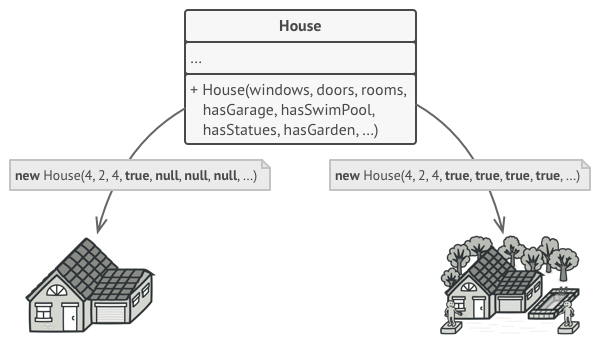
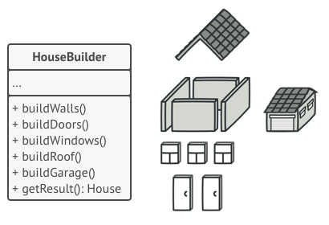
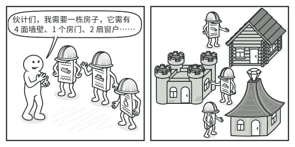
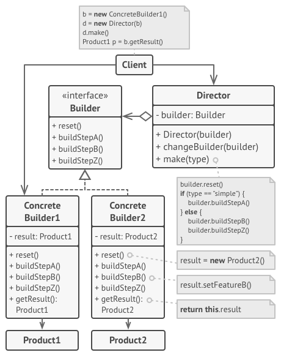

:::tip

生成器模式是一种创建型设计模式， 使你能够分步骤创建复杂对象。 该模式允许你使用相同的创建代码生成不同类型和形式的对象。

:::

假设有这样一个复杂对象， 在对其进行构造时需要对诸多成员变量和嵌套对象进行繁复的初始化工作。 这些初始化代码通常深藏于一个包含众多参数且让人基本看不懂的构造函数中； 甚至还有更糟糕的情况， 那就是这些代码散落在客户端代码的多个位置。

例如， 我们来思考如何创建一个 房屋 House 对象。 建造一栋简单的房屋， 首先你需要建造四面墙和地板， 安装房门和一套窗户， 然后再建造一个屋顶。 但是如果你想要一栋更宽敞更明亮的房屋， 还要有院子和其他设施 （例如暖气、 排水和供电设备）， 那又该怎么办呢？

最简单的方法是扩展 房屋基类， 然后创建一系列涵盖所有参数组合的子类。 但最终你将面对相当数量的子类。 任何新增的参数 （例如门廊类型） 都会让这个层次结构更加复杂。

另一种方法则无需生成子类。 你可以在 房屋基类中创建一个包括所有可能参数的超级构造函数， 并用它来控制房屋对象。 这种方法确实可以避免生成子类， 但它却会造成另外一个问题。

拥有大量输入参数的构造函数也有缺陷： 这些参数也不是每次都要全部用上的。

:::warning

通常情况下， 绝大部分的参数都没有使用， 这使得对于构造函数的调用十分不简洁。 例如， 只有很少的房子有游泳池， 因此与游泳池相关的参数十之八九是毫无用处的。

:::

生成器模式建议将对象构造代码从产品类中抽取出来， 并将其放在一个名为生成器的独立对象中。

生成器模式让你能够分步骤创建复杂对象。 生成器不允许其他对象访问正在创建中的产品。

该模式会将对象构造过程划分为一组步骤， 比如 build­Walls创建墙壁和 build­Door创建房门创建房门等。 每次创建对象时， 你都需要通过生成器对象执行一系列步骤。 重点在于你无需调用所有步骤， 而只需调用创建特定对象配置所需的那些步骤即可。

当你需要创建不同形式的产品时， 其中的一些构造步骤可能需要不同的实现。 例如， 木屋的房门可能需要使用木头制造， 而城堡的房门则必须使用石头制造。

在这种情况下， 你可以创建多个不同的生成器， 用不同方式实现一组相同的创建步骤。 然后你就可以在创建过程中使用这些生成器 （例如按顺序调用多个构造步骤） 来生成不同类型的对象。

例如， 假设第一个建造者使用木头和玻璃制造房屋， 第二个建造者使用石头和钢铁， 而第三个建造者使用黄金和钻石。 在调用同一组步骤后， 第一个建造者会给你一栋普通房屋， 第二个会给你一座小城堡， 而第三个则会给你一座宫殿。 但是， 只有在调用构造步骤的客户端代码可以通过通用接口与建造者进行交互时， 这样的调用才能返回需要的房屋。

### 生成器模式结构

- 生成器 （Builder） 接口声明在所有类型生成器中通用的产品构造步骤。

  

- 具体生成器 （Concrete Builders） 提供构造过程的不同实现。 具体生成器也可以构造不遵循通用接口的产品。

  

- 产品 （Products） 是最终生成的对象。 由不同生成器构造的产品无需属于同一类层次结构或接口。

  

- 主管 （Director） 类定义调用构造步骤的顺序， 这样你就可以创建和复用特定的产品配置。

  

- 客户端 （Client） 必须将某个生成器对象与主管类关联。 一般情况下， 你只需通过主管类构造函数的参数进行一次性关联即可。 此后主管类就能使用生成器对象完成后续所有的构造任务。 但在客户端将生成器对象传递给主管类制造方法时还有另一种方式。 在这种情况下， 你在使用主管类生产产品时每次都可以使用不同的生成器。

[参考](https://refactoringguru.cn/design-patterns/builder)