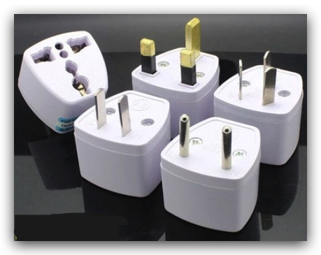
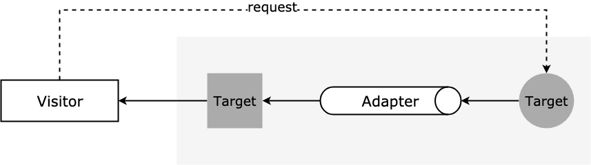

适配器模式（Adapter Design Pattern)


:::tip 极客时间 设计模式

它将不兼容的接口转换为可兼容的接口，让原本由于接口不兼容而不能一起工作的类可以一起工作。

:::

:::tip 慕课网 设计模式

**适配器模式**（Adapter Pattern）又称包装器模式，将一个类（对象）的接口（方法、属性）转化为用户需要的另一个接口，解决类（对象）之间接口不兼容的问题。

主要功能是进行**转换匹配**，目的是复用已有的功能，而不是来实现新的接口。也就是说，访问者需要的功能应该是已经实现好了的，不需要适配器模式来实现，适配器模式主要是负责把不兼容的接口转换成访问者期望的格式而已。 

:::

:::tip HeadFirst 设计模式

设配器模式 将一个类的接口，转换成客户期望的另一个接口。适配器让原本不兼容的类可以合作无间。

:::

:::tip 维基百科

在软件工程中，适配器模式是一种软件设计模式，它允许将现有类的接口用作另一个接口。它通常用于使现有的类与其他类一起工作，而不用修改它们的源代码。

:::


### 比如：

- USB 转换器

- 插头

  


适配器模式的原理图

  


### 适配器模式的两种实现方式

```java

// 类适配器: 基于继承
public interface ITarget {
  void f1();
  void f2();
  void fc();
}

public class Adaptee {
  public void fa() { //... }
  public void fb() { //... }
  public void fc() { //... }
}

public class Adaptor extends Adaptee implements ITarget {
  public void f1() {
    super.fa();
  }
  
  public void f2() {
    //...重新实现f2()...
  }
  
  // 这里fc()不需要实现，直接继承自Adaptee，这是跟对象适配器最大的不同点
}

// 对象适配器：基于组合
public interface ITarget {
  void f1();
  void f2();
  void fc();
}

public class Adaptee {
  public void fa() { //... }
  public void fb() { //... }
  public void fc() { //... }
}

public class Adaptor implements ITarget {
  private Adaptee adaptee;
  
  public Adaptor(Adaptee adaptee) {
    this.adaptee = adaptee;
  }
  
  public void f1() {
    adaptee.fa(); //委托给Adaptee
  }
  
  public void f2() {
    //...重新实现f2()...
  }
  
  public void fc() {
    adaptee.fc();
  }
}
```


##  Java 中的适配器

- [java.util.Arrays#asList()](http://docs.oracle.com/javase/8/docs/api/java/util/Arrays.html#asList(T...))
- [java.util.Collections#list()](https://docs.oracle.com/javase/8/docs/api/java/util/Collections.html#list-java.util.Enumeration-)
- [java.util.Collections#enumeration()](https://docs.oracle.com/javase/8/docs/api/java/util/Collections.html#enumeration-java.util.Collection-)
- [javax.xml.bind.annotation.adapters.XMLAdapter](http://docs.oracle.com/javase/8/docs/api/javax/xml/bind/annotation/adapters/XmlAdapter.html#marshal-BoundType-)