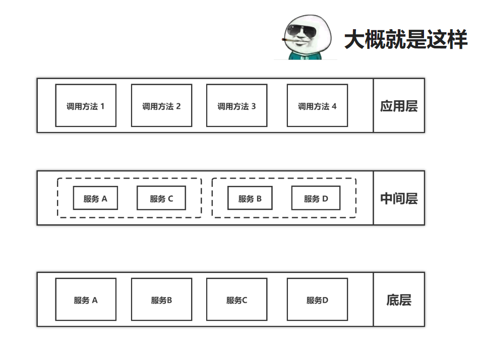
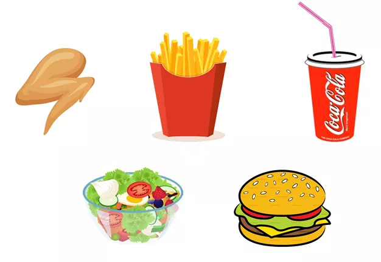
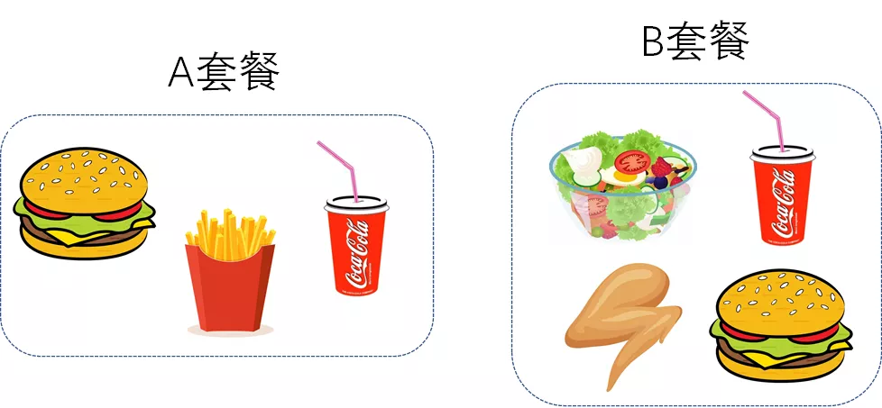

:::tip JavaScript 设计模式精讲 外观模式

门面模式为子系统提供一组统一的接口，定义一组高层接口让子系统更易用。

门面模式原理和实现都特别简单，应用场景也比较明确，主要在接口设计方面使用。

:::

### Facade Design Pattern 门店模式

其实说白了，就是在多个服务之间的接口调用的时候。

为了尽量减少网络之间的传输，尽量将多个接口封装为一个接口。

### 详细解释

假设有一个系统 A，提供了 a、b、c、d 四个接口。系统 B 完成某个业务功能，需要调用 A 系统的 a、b、d 接口。利用门面模式，我们提供一个包裹 a、b、d 接口调用的门面接口 x，给系统 B 直接使用。

不知道你会不会有这样的疑问，让系统 B 直接调用 a、b、d 感觉没有太大问题呀，为什么还要提供一个包裹 a、b、d 的接口 x 呢？

假设我们刚刚提到的系统 A 是一个后端服务器，系统 B 是 App 客户端。App 客户端通过后端服务器提供的接口来获取数据。我们知道，App 和服务器之间是通过移动网络通信的，网络通信耗时比较多，为了提高 App 的响应速度，我们要尽量减少 App 与服务器之间的网络通信次数。
假设，完成某个业务功能（比如显示某个页面信息）需要“依次”调用 a、b、d 三个接口，因自身业务的特点，不支持并发调用这三个接口。
如果我们现在发现 App 客户端的响应速度比较慢，排查之后发现，是因为过多的接口调用过多的网络通信。针对这种情况，我们就可以利用门面模式，让后端服务器提供一个包裹 a、b、d 三个接口调用的接口 x。App 客户端调用一次接口 x，来获取到所有想要的数据，将网络通信的次数从 3 次减少到 1 次，也就提高了 App 的响应速度。
这里举的例子只是应用门面模式的其中一个意图，也就是解决性能问题。

### 一个很好理解的例子 - 肯德基点餐

肯德基提供了众多基础菜品，比如鸡翅、汉堡、薯条、沙拉、可乐等等：

这些琳琅满目的菜品虽好，但有些顾客犯了选择困难症，不知道该选什么好。

于是肯德基对这些菜品做了一定的组合，推出了各种各样的套餐。

比如A套餐，包括汉堡/薯条/可乐；B套餐，包括汉堡/鸡翅/沙拉/可乐：

其实这里的各种套餐的应用 就是 **外观设计模式**了。