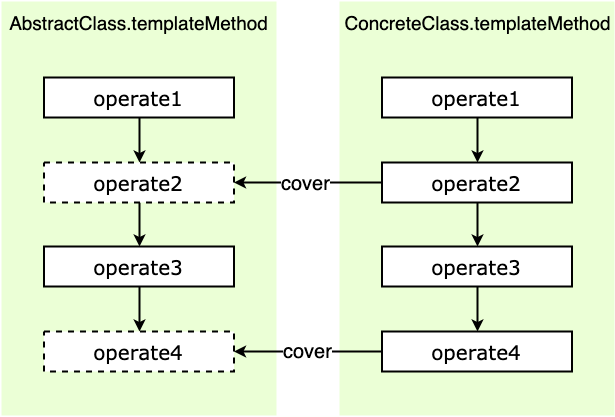

### 定义

模板方法模式在一个方法中定义一个算法骨架，并将某些步骤推迟到子类中实现。模板方法模式可以让子类在不改变算法整体结构的情况下，重新定义算法中的某些步骤。


在模板模式经典的实现中，**模板方法**定义为 **final**，可以避免被子类重写。需要子类重写的方法定义为 **abstract**，可以强迫子类去实现。不过，在实际项目开发中，模板模式的实现比较灵活，以上两点都不是必须的。


模板模式有两大作用：复用和扩展。其中，复用指的是，所有的子类可以复用父类中提供的模板方法的代码。扩展指的是，框架通过模板模式提供功能扩展点，让框架用户可以在不修改框架源码的情况下，基于扩展点定制化框架的功能。课堂讨论


**主要涉及到的概念**

- **AbstractClass**: 抽象父类，把一些公共的方法提取出来，把可变的方法作为抽象类，最重要的是把算法抽象出来的模板方法。

- **templateMethod**：模板方法，固定了希望执行的算法骨架。:key::key::key:

- **ConcreteClass**：子类，实现抽象父类中定义的抽象方法，调用集成的模板方法时，将执行模板方法中定义的算法流程。

  




### 应用场景

- Java InputStream
- Java AbstractList
- Java Servlet `doGet doPost`
- Junit TestCase


### 代码实现

```java

public class AbstractClass {
  public final void templateMethod() {
    //...
    method1();
    //...
    method2();
    //...
  }
  
  protected abstract void method1();
  protected abstract void method2();
}

public class ContreteClass1 extends AbstractClass {
  @Override
  protected void method1() {
    //...
  }
  
  @Override
  protected void method2() {
    //...
  }
}

public class ContreteClass2 extends AbstractClass {
  @Override
  protected void method1() {
    //...
  }
  
  @Override
  protected void method2() {
    //...
  }
}

AbstractClass demo = ContreteClass1();
demo.templateMethod();
```


## 在工作中的真实应用

- 敏感词过滤


