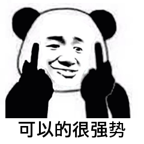

##### 避免冗长的 if-else/switch 分支判断代码

::: tip

策略模式算是接触的最多的一个模式，在 【**Head First 设计模式**】 一书中讲解的第一个设计模式便是策略模式，不过自己以前的学习中一直有一些问题，虽然策略模式大家耳熟能详的是用定义好的算法簇解决分支问题，但是就我自己看来光用策略模式是解决不了这些问题的，而是需要和其他策略模式配合才可以。

:::

##### 策略模式的定义

定义一族算法类，将每个算法分别封装起来，让它们可以互相替换。策略模式可以使算法的变化独立于使用它们的客户端（这里的客户端代指使用算法的代码）。



听了上面的定义，我也不是很懂。个人的理解是针对某类问题我们会制定很多的解决方案（基于接口实现），然后在使用的时候通过多态的特性可以便捷的使用。

策略类的定义比较简单，包含一个策略接口和一组实现这个接口的策略类。因为所有的策略类都实现相同的接口，所以，客户端代码基于接口而非实现编程，可以灵活地替换不同的策略。

示例代码如下所示：

```java

public interface Strategy {
  void algorithmInterface();
}

public class ConcreteStrategyA implements Strategy {
  @Override
  public void  algorithmInterface() {
    //具体的算法...
  }
}

public class ConcreteStrategyB implements Strategy {
  @Override
  public void  algorithmInterface() {
    //具体的算法...
  }
}
```

上面的代码就相当于自己针对某类问题制定了解决方案 `ConcreteStrategyA, ConcreteStrategyB`。

##### 策略的创建

因为策略模式会包含一组策略，在使用它们的时候，一般会通过类型（type）来判断创建哪个策略来使用。为了封装创建逻辑，我们需要对客户端代码屏蔽创建细节。我们可以把根据 type 创建策略的逻辑抽离出来，放到**工厂类**中。

示例代码如下所示：

```java

public class StrategyFactory {
  private static final Map<String, Strategy> strategies = new HashMap<>();

  static {
    strategies.put("A", new ConcreteStrategyA());
    strategies.put("B", new ConcreteStrategyB());
  }

  public static Strategy getStrategy(String type) {
    if (type == null || type.isEmpty()) {
      throw new IllegalArgumentException("type should not be empty.");
    }
    return strategies.get(type);
  }
}
```

##### 策略模式的使用

使用策略模式创建算法簇，将算法簇根据类型添加进策略工厂中，工厂中以 Hash 表进行存储，Hash 表中存储的 Key， 就是以前 if / else 逻辑中的条件。

没有引入策略模式的代码

```java

public class OrderService {
  public double discount(Order order) {
    double discount = 0.0;
    OrderType type = order.getType();
    if (type.equals(OrderType.NORMAL)) { // 普通订单
      //...省略折扣计算算法代码
    } else if (type.equals(OrderType.GROUPON)) { // 团购订单
      //...省略折扣计算算法代码
    } else if (type.equals(OrderType.PROMOTION)) { // 促销订单
      //...省略折扣计算算法代码
    }
    return discount;
  }
}
```

引入策略模式后

```java

// 策略的定义
public interface DiscountStrategy {
  double calDiscount(Order order);
}
// 省略NormalDiscountStrategy、GrouponDiscountStrategy、PromotionDiscountStrategy类代码...

// 策略的创建
public class DiscountStrategyFactory {
  private static final Map<OrderType, DiscountStrategy> strategies = new HashMap<>();

  static {
    strategies.put(OrderType.NORMAL, new NormalDiscountStrategy());
    strategies.put(OrderType.GROUPON, new GrouponDiscountStrategy());
    strategies.put(OrderType.PROMOTION, new PromotionDiscountStrategy());
  }

  public static DiscountStrategy getDiscountStrategy(OrderType type) {
    return strategies.get(type);
  }
}

// 策略的使用
public class OrderService {
  public double discount(Order order) {
    OrderType type = order.getType();
    DiscountStrategy discountStrategy = DiscountStrategyFactory.getDiscountStrategy(type);
    return discountStrategy.calDiscount(order);
  }
}
```


实际上讲到这，还没怎么讲清楚，下次再整理吧。
