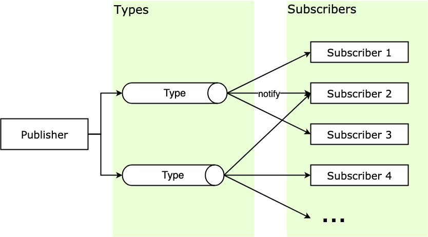

### 定义 :books:

**发布 - 订阅模式** （Publish-Subscribe Pattern, pub-sub）又叫观察者模式（Observer Pattern），它定义了一种一对多的关系，让多个订阅者对象同时监听某一个发布者，或者叫主题对象，这个主题对象的状态发生变化时就会通知所有订阅自己的订阅者对象，使得它们能够自动更新自己。


**主要涉及下面几个概念**

- **Publisher** 发布者，当消息发正时负责通知对应订阅者。
- **SubScriber** 订阅者，当消息发生被通知的对象。
- **SubscriberMap** 持有不同 type 的数组，存储有所有订阅者的数组。
- **type** 消息类型，订阅者可以订阅不同的消息类型。
- **subscribe** 该方法将订阅者添加到 SubscriberMap 中对应的数组中。
- **unSubscribe** 该方法为在 SubscriberMap 中删除订阅者
- **notify** 该方法遍历通知 SubscriberMap 中对应 type 的每个订阅者


**结构图**




### 你曾见过的观察者模式:eye_speech_bubble:

- 聊天室/群 :family:

  如果有人在聊天室发言，那么这个聊天室里的所有人都会受到发言。当我们进入这个群，相当于**订阅**了在这个聊天室发送的消息，当有新的消息产生，聊天室会负责将消息**发布**给所有的聊天室的订阅者。

- 邮件订阅 :mailbox:

- RSS Feeds 

- Js Window 中的 addEventListener 

- Vue 中的 [EventBus](https://juejin.im/post/5bb355dae51d450ea4020b42)

- Vue 的双重绑定原理

  组件渲染函数（Component Rander Function）被执行前，会对数据层的数据进行响应化。响应大致使用 [Object.defineProperty](https://developer.mozilla.org/en-US/docs/Web/JavaScript/Reference/Global_Objects/Object/defineProperty) 把数据转换为 getter/setter，并为每个数据条件一个订阅者列表的过程。这个列表是 `getter` 闭包中的属性，将会记录所有依赖这个数据的组件。也就是说，响应式化后的数据相当于**发布者**。

  每个组件都对应一个 Watcher **订阅者**。当每个组件的渲染函数被执行时，都会将本组件的 Watcher 放到自己所依赖的响应式数据的订阅者列表里，这就相当于完成了**订阅**，一般这个过程被称为依赖收集（Dependency Collect）。


### 编程实现 👨‍💻


#### Java

```java

public interface Subject {
  void registerObserver(Observer observer);
  void removeObserver(Observer observer);
  void notifyObservers(Message message);
}

public interface Observer {
  void update(Message message);
}

public class ConcreteSubject implements Subject {
  private List<Observer> observers = new ArrayList<Observer>();

  @Override
  public void registerObserver(Observer observer) {
    observers.add(observer);
  }

  @Override
  public void removeObserver(Observer observer) {
    observers.remove(observer);
  }

  @Override
  public void notifyObservers(Message message) {
    for (Observer observer : observers) {
      observer.update(message);
    }
  }

}

public class ConcreteObserverOne implements Observer {
  @Override
  public void update(Message message) {
    //TODO: 获取消息通知，执行自己的逻辑...
    System.out.println("ConcreteObserverOne is notified.");
  }
}

public class ConcreteObserverTwo implements Observer {
  @Override
  public void update(Message message) {
    //TODO: 获取消息通知，执行自己的逻辑...
    System.out.println("ConcreteObserverTwo is notified.");
  }
}

public class Demo {
  public static void main(String[] args) {
    ConcreteSubject subject = new ConcreteSubject();
    subject.registerObserver(new ConcreteObserverOne());
    subject.registerObserver(new ConcreteObserverTwo());
    subject.notifyObservers(new Message());
  }
}
```


JavaScript 

```javascript
class Publisher {
    constructor() {
        this._subsMap = {}
    }
    
    /* 消息订阅 */
    subscribe(type, cb) {
        if (this._subsMap[type]) {
            if (!this._subsMap[type].includes(cb))
                this._subsMap[type].push(cb)
        } else this._subsMap[type] = [cb]
    }
    
    /* 消息退订 */
    unsubscribe(type, cb) {
        if (!this._subsMap[type] ||
            !this._subsMap[type].includes(cb)) return
        const idx = this._subsMap[type].indexOf(cb)
        this._subsMap[type].splice(idx, 1)
    }
    
    /* 消息发布 */
    notify(type, ...payload) {
        if (!this._subsMap[type]) return
        this._subsMap[type].forEach(cb => cb(...payload))
    }
}

const adadis = new Publisher()

adadis.subscribe('运动鞋', message => console.log('152xxx' + message))    // 订阅运动鞋
adadis.subscribe('运动鞋', message => console.log('138yyy' + message))
adadis.subscribe('帆布鞋', message => console.log('139zzz' + message))    // 订阅帆布鞋

adadis.notify('运动鞋', ' 运动鞋到货了 ~')   // 打电话通知买家运动鞋消息
adadis.notify('帆布鞋', ' 帆布鞋售罄了 T.T') // 打电话通知买家帆布鞋消息

// 输出:  152xxx 运动鞋到货了 ~
// 输出:  138yyy 运动鞋到货了 ~
// 输出:  139zzz 帆布鞋售罄了 T.T
```


### 总结 :shit:

个人观点，观察者消费者模式核心也是为了 **高内聚低耦合** 而服务的。将观察者和被观察者解耦。不用的应用场景会有不同的实现 :shit: