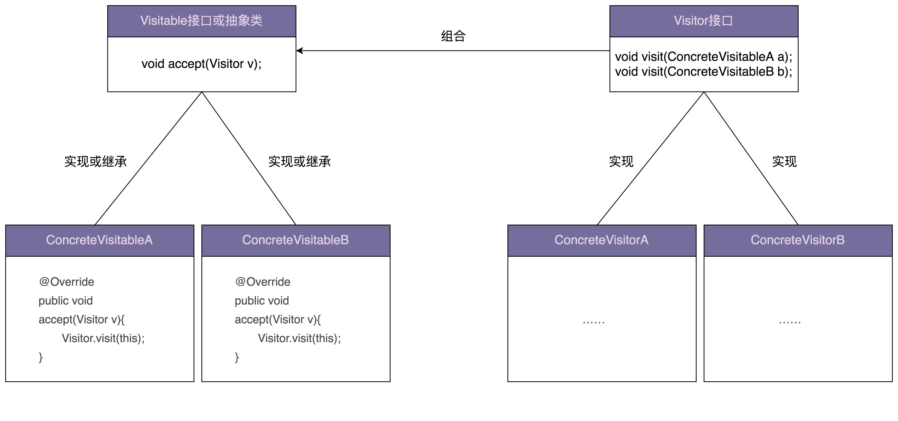

:::tip

允许一个或者多个操作应用到一组对象上，解耦操作和对象本身

:::



一般来说，访问者模式针对的是一组类型不同的对象（PdfFile、PPTFile、WordFile）。不过，尽管这组对象的类型是不同的，但是，它们继承相同的父类（ResourceFile）或者实现相同的接口。在不同的应用场景下，我们需要对这组对象进行一系列不相关的业务操作（抽取文本、压缩等），但为了避免不断添加功能导致类（PdfFile、PPTFile、WordFile）不断膨胀，职责越来越不单一，以及避免频繁地添加功能导致的频繁代码修改，我们使用访问者模式，将对象与操作解耦，将这些业务操作抽离出来，定义在独立细分的访问者类（Extractor、Compressor）中。


### Double Dispatch or Single Dispatch

```java
public class ParentClass {
  public void f() {
    System.out.println("I am ParentClass's f().");
  }
}
public class ChildClass extends ParentClass {
  public void f() {
    System.out.println("I am ChildClass's f().");
  }
}
public class SingleDispatchClass {
  public void polymorphismFunction(ParentClass p) {
    p.f();
  }
  public void overloadFunction(ParentClass p) {
    System.out.println("I am overloadFunction(ParentClass p).");
  }
  public void overloadFunction(ChildClass c) {
    System.out.println("I am overloadFunction(ChildClass c).");
  }
}
public class DemoMain {
  public static void main(String[] args) {
    SingleDispatchClass demo = new SingleDispatchClass();
    ParentClass p = new ChildClass();
    // 执行哪个对象的方法，由对象的实际类型决定
    demo.polymorphismFunction(p);
    // 执行对象的哪个方法，由参数对象的声明类型决定
    demo.overloadFunction(p);
  }
}
//代码执行结果:
// I am ChildClass's f().
// I am overloadFunction(ParentClass p).
```

