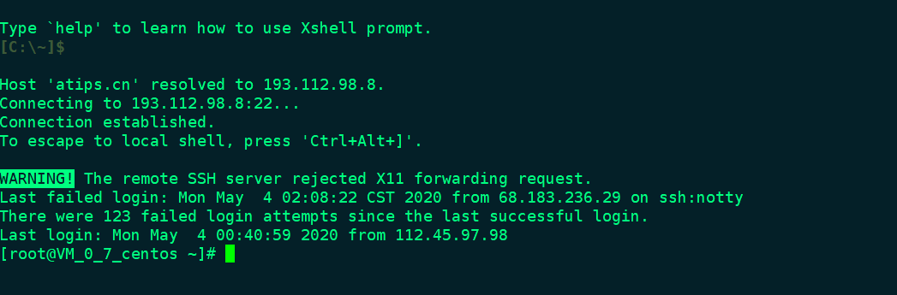
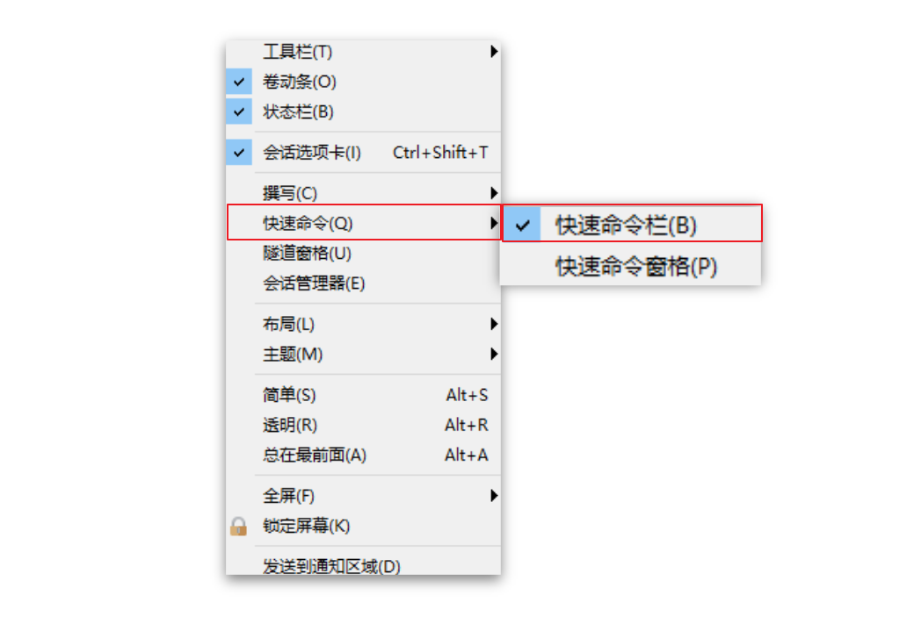
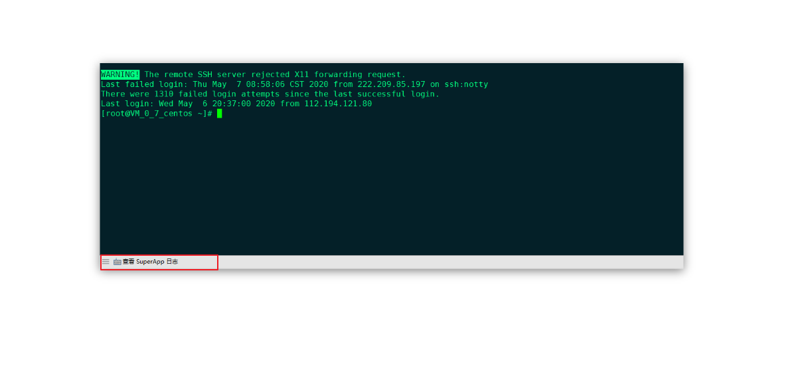

### 编辑器配色



保存文件名位 `skycolor.xcs`

```shell
[skycolor]
text=00ff80
cyan(bold)=00ffff
text(bold)=e9e9e9
magenta=c000c0
green=80ff00
green(bold)=3c5a38
background=042028
cyan=00c0c0
red(bold)=ff0000
yellow=c0c000
magenta(bold)=ff00ff
yellow(bold)=ffff00
red=ff4500
white=c0c0c0
blue(bold)=1e90ff
white(bold)=fdf6e3
black=000000
blue=00bfff
black(bold)=808080
[Names]
name0=skycolor
count=1
```


### 打开快速命令集



配置好后，就是这个样子，点击可以执行相应的命令

