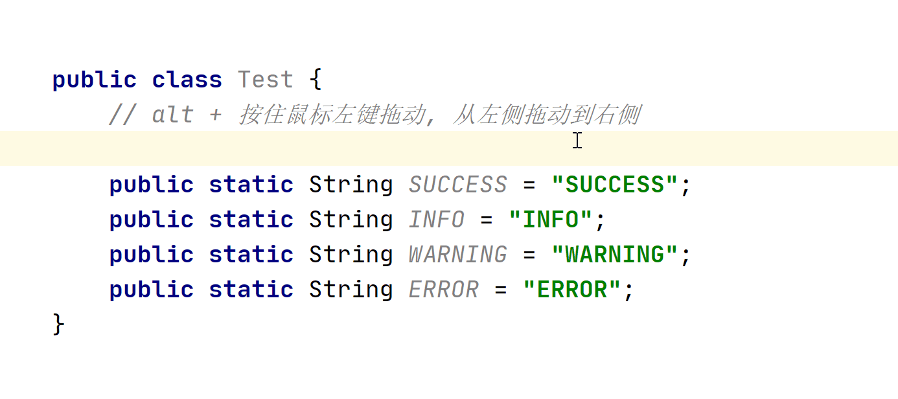
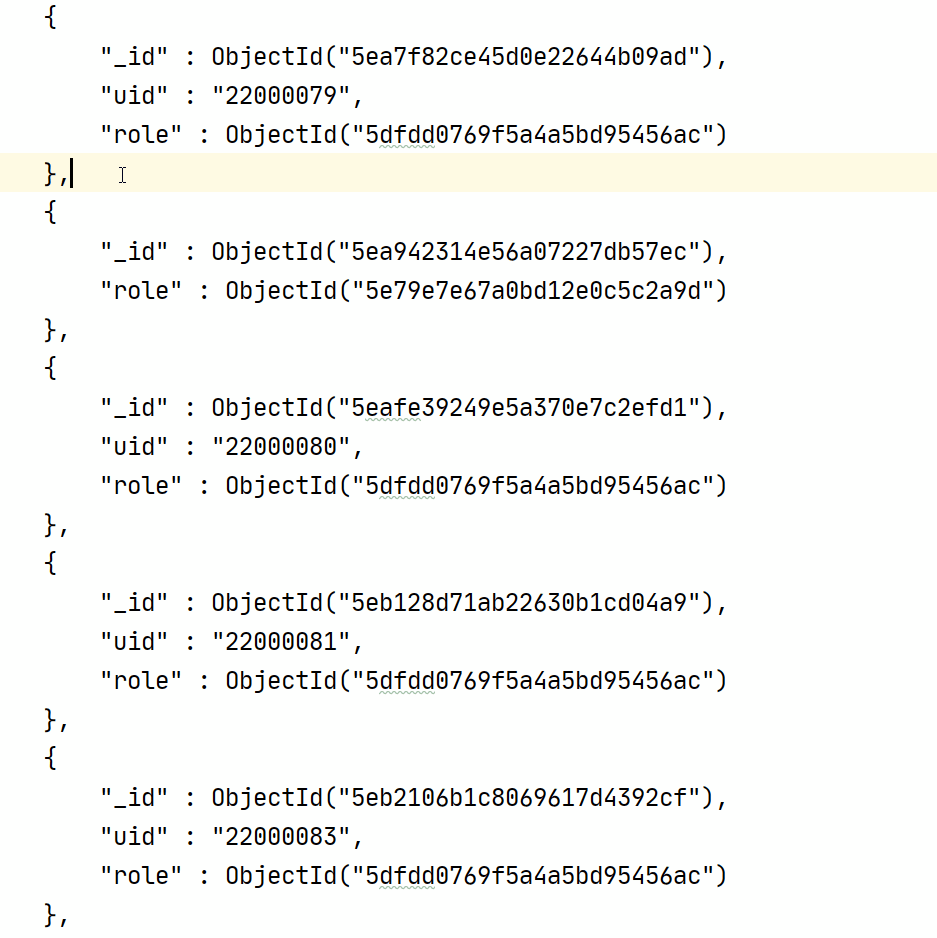

### 操作基础

**在相同内容后生成光标，一个一个选择**  [点击图片可放大]

**在所有的相同的内容后添加光标，一步到位**   [点击图片可放大]

**数列光标**   [点击图片可放大]

**行尾添加光标**   [点击图片可放大]

**在指定位置添加光标操作**   [点击图片可放大]

## 格式批量调整

将上访左侧的代码批量变为右侧代码

> ctrl + alt + enter 将光标移动到当前行的上一行

## 批量添加 Swagger 属性注释

将上图左侧只有注释的类，添加上 swagger 信息

## 在多个相同结构 Json 中提取某字段信息

## 提取左侧 Json 中所有的 role 字段

