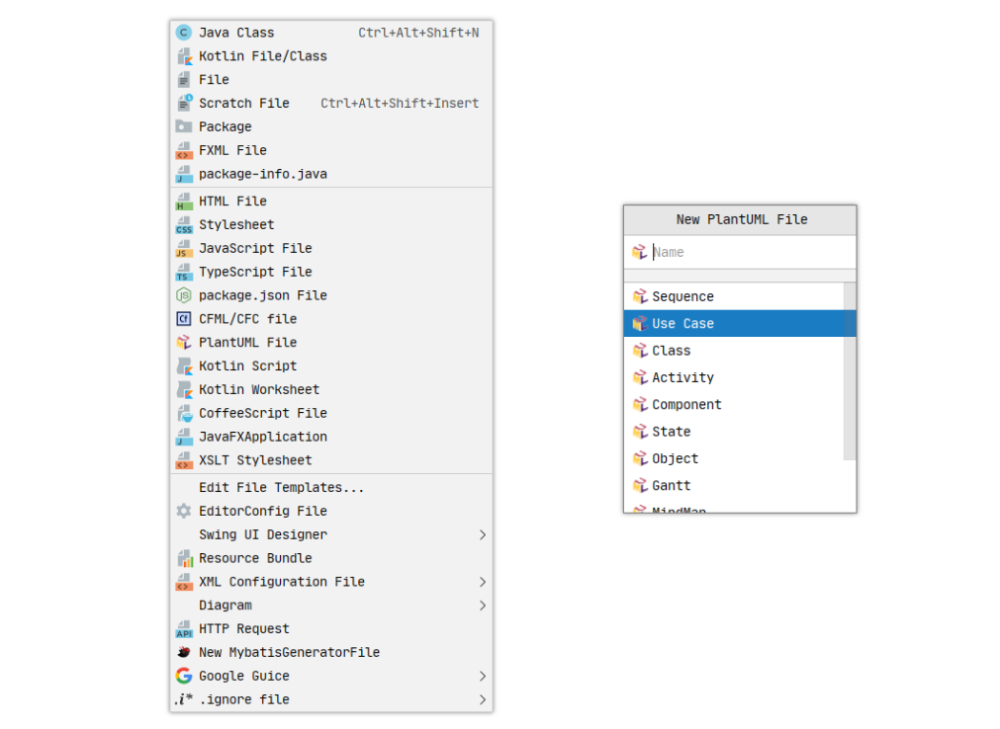
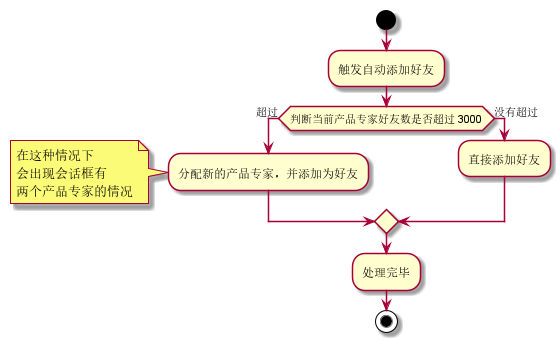
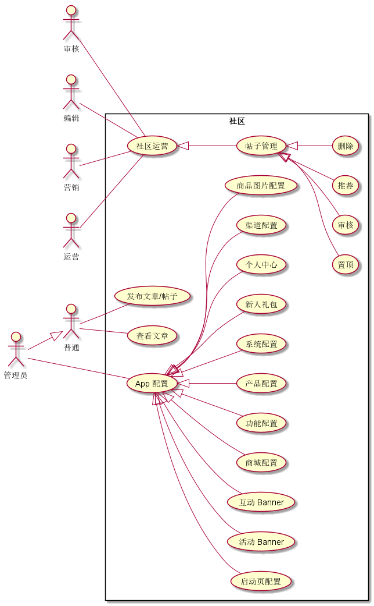

### 背景

之前介绍过 使用 Vscode 画 UML，实际上 idea 中也有类似的插件 可以画 UML 图。

[PlantUML语法](https://plantuml.com/zh/component-diagram)


### 安装

[插件安装地址](https://plugins.jetbrains.com/plugin/7017-plantuml-integration)

在安装完官方的插件之后，还需要额外安装一个 [graphviz](https://graphviz.org/download/) ，不然有的复杂的用例图就没办法展示了。


windows 安装

```bash
choco install graphviz
```


使用

> 新建文件 - PlantUML File - 选择想要创建的类型 




### 流程图




::: details 流程图 CODE

@startuml
start
:触发自动添加好友;
if (判断当前产品专家好友数是否超过 3000) then (超过)
    :分配新的产品专家，并添加为好友;
    note left
     在这种情况下
     会出现会话框有
     两个产品专家的情况
    end note
else (没有超过)
    :直接添加好友;
endif
:处理完毕;
stop
@enduml

:::


### 用例图



::: details 用例图 Code

```
@startuml
left to right direction

actor 普通 as User
actor 审核 as Aduitor
actor 编辑 as Editor
actor 营销 as Marketing
actor 运营 as Operator
actor 管理员 as Admin


Admin --|> User

rectangle 社区 {
  User -- (查看文章)
  User -- (发布文章/帖子)

  (帖子管理) <|-- (置顶)
  (帖子管理) <|-- (审核)
  (帖子管理) <|-- (推荐)
  (帖子管理) <|-- (删除)

  (社区运营) <|-- (帖子管理)
   Operator -- (社区运营)
   Aduitor -- (社区运营)
   Editor -- (社区运营)
   Marketing -- (社区运营)

  (App 配置) <|-- (商品图片配置)
  (App 配置) <|-- (启动页配置)
  (App 配置) <|-- (活动 Banner)
  (App 配置) <|-- (互动 Banner)
  (App 配置) <|-- (商城配置)
  (App 配置) <|-- (功能配置)
  (App 配置) <|-- (产品配置)
  (App 配置) <|-- (系统配置)
  (App 配置) <|-- (新人礼包)
  (App 配置) <|-- (个人中心)
  (App 配置) <|-- (渠道配置)
  Admin -- (App 配置)
}
@enduml
```

:::