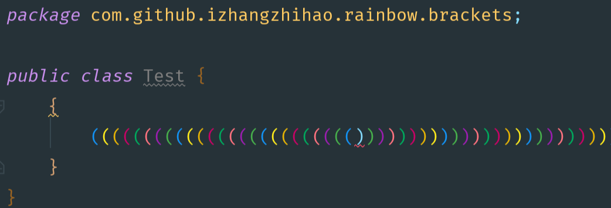
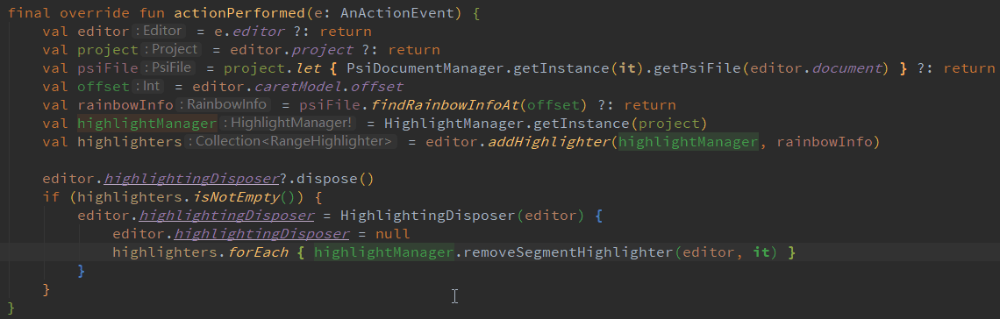

[插件地址](https://github.com/izhangzhihao/intellij-rainbow-brackets)

## 彩虹括号 :rainbow: Rainbow Brackets 

由于很多人没有养成好的编码风格，没有随手 format 代码的习惯，甚至有些同事会写代码超过几百行，阅读起来将非常痛苦。

痛苦的原因之一就是找到上下文，由于括号太多，不确定当前代码行是否属于某个代码块，此时这个插件就会帮上大忙.

### 界面效果 

### 动图

