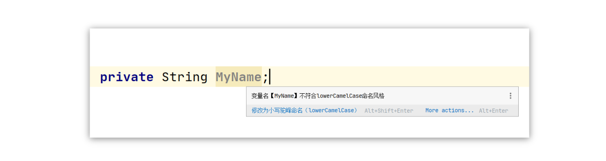
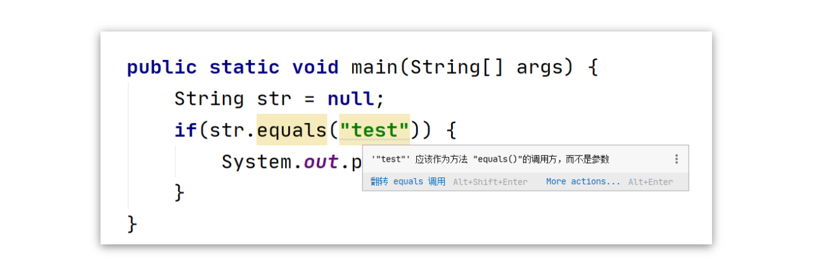
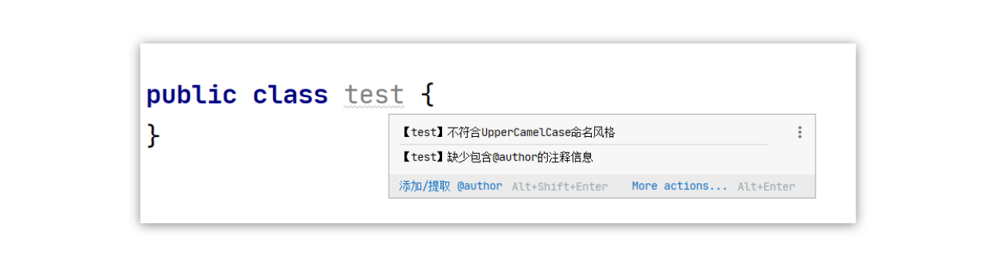

## 阿里巴巴编码规范

Alibaba Java Coding Guidelines


:::tip

实时监测代码的规范性, 从代码层面减少空指针等异常的出现

阿里巴巴出品的`Java代码`规范插件, 可以扫描整个项目找到不规范的地方 并且大部分可以自动修复

虽说检测功能没有 `findbugs` 强大，但是可以自动修复, 阿里巴巴 Java 编码指南插件支持。

让代码变得更规范， 是我们每一位程序员都应该记在心中的事。

:::


### 变量驼峰命名规范



当鼠标移到变量上时, 就会自动提示 不符合 `lowerCamelCase`命名风格


### 字符串比较提示 `equals`


```java
public static void main(String[] args) {
    String str = null;

    if (str.equals("test")) {
    	System.out.println("success");
    }
}
```

:::warning

当我们初学 `Java`时, 很有可能会犯这样的错误, 这里很明显会报空指针异常, 而在编辑器中

:::




安装插件之后, 编辑器已经给出详细提示,`"test“` 应该做为 `equals`方法的调用方, 并给出了原因, 应为这样很容易导致空指针异常, 并给出了例子


### 当你的类命名不规范时

比如我创建了一个测试类 `test.java`，就会出现如下提示



类名，首字母需要大写。缺少作者注释。