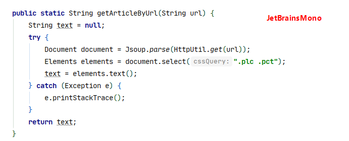
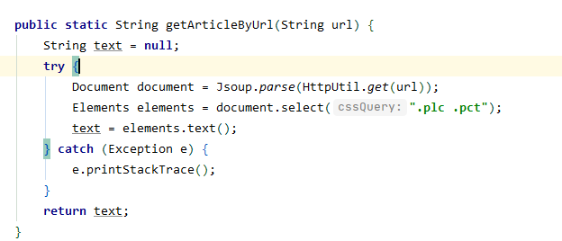
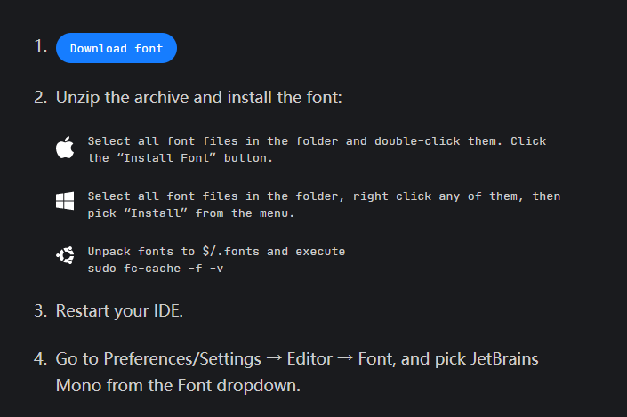
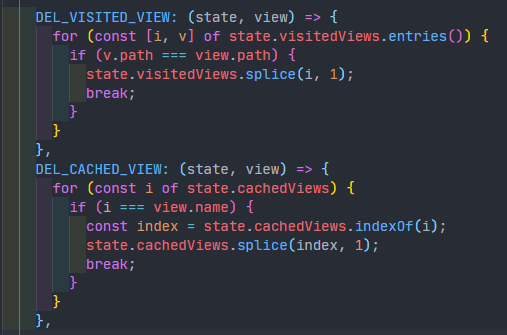

最近JetBrains公司推出了一款优雅美观的字体——JetBrainsMono。

### 对比 Consolas

对比之前一直在使用  `Consolas` 字体

### 下载字体

- [官网下载](https://www.jetbrains.com/lp/mono/)

- [坚果云下载](https://www.jianguoyun.com/p/DRPh-GkQ_7eJCBiv2uMC )

### Windows 安装

- 下载后，解压文件
- 直接双击扩展名为 `tff` 后缀的文件
- 重启 `IDEA`
- `Perferences/Setting -> Editor -> Font`，选择 **JetBrains Mono** 确认即可

### 其他软件

完成上述过程后，其他软件也可以使用 比如 `VsCode，DataGrid` 等

